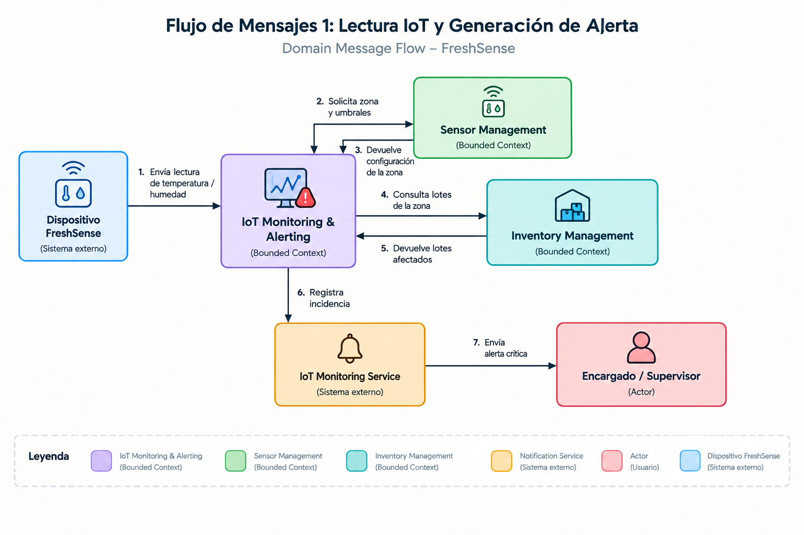

# Universidad Peruana de Ciencias Aplicadas

### Facultad de Ingeniería
### Carrera: Ingeniería de Software

**9.º ciclo**

**Nombre del curso:** Arquitecturas de Software Emergentes
**Sección:** 9075
**Código del curso:** : 1ASI0728 
**Periodo:** 202620  

**Nombre del profesor:** Wilder Aurelio Vega Calero

 

# *Informe de Trabajo Final*

 

**Nombre del Startup:** FreshEat  
**Nombre del Producto:** FreshSense

 

### Relación de Integrantes

| Apellidos y Nombres | Código |
|:-------------------:|:------:|
| Tuesta Marin, Romina Alejandra | U202211706 |

 

**Septiembre 2026**

# Registro de Versiones del Informe

| Versión | Fecha | Autor | Descripción de modificación |
|:------:|:-----:|:-----|:----------------------------|
| 1.0 | 08/09/2026 | Romina Tuesta Marin | Cargó archivos y actualizó la descripción de la Startup |

# Project Report Collaboration Insights

**AV1:**

# Tabla de contenidos

- [Student Outcome](#student-outcome)

- [Capítulo I: Introducción](#capítulo-i-introducción)
  - [1.1. Startup Profile](#11-startup-profile)
    - [1.1.1. Descripción de la Startup](#111-descripción-de-la-startup)
    - [1.1.2. Perfiles de integrantes del equipo](#112-perfiles-de-integrantes-del-equipo)
  - [1.2. Solution Profile](#12-solution-profile)
    - [1.2.1. Antecedentes y problemática](#121-antecedentes-y-problemática)
    - [1.2.2. Lean UX Process](#122-lean-ux-process)
      - [1.2.2.1. Lean UX Problem Statements](#1221-lean-ux-problem-statements)
      - [1.2.2.2. Lean UX Assumptions](#1222-lean-ux-assumptions)
      - [1.2.2.3. Lean UX Hypothesis Statements](#1223-lean-ux-hypothesis-statements)
      - [1.2.2.4. Lean UX Canvas](#1224-lean-ux-canvas)
  - [1.3. Segmentos objetivo](#13-segmentos-objetivo)

- [Capítulo II: Requirements Elicitation & Analysis](#capítulo-ii-requirements-elicitation--analysis)
  - [2.1. Competidores](#21-competidores)
    - [2.1.1. Análisis competitivo](#211-análisis-competitivo)
    - [2.1.2. Estrategias y tácticas frente a competidores](#212-estrategias-y-tácticas-frente-a-competidores)
  - [2.2. Entrevistas](#22-entrevistas)
    - [2.2.1. Diseño de entrevistas](#221-diseño-de-entrevistas)
    - [2.2.2. Registro de entrevistas](#222-registro-de-entrevistas)
    - [2.2.3. Análisis de entrevistas](#223-análisis-de-entrevistas)
  - [2.3. Needfinding](#23-needfinding)
    - [2.3.1. User Personas](#231-user-personas)
    - [2.3.2. User Task Matrix](#232-user-task-matrix)
    - [2.3.3. Empathy Mapping](#233-empathy-mapping)
    - [2.3.4. As-is Scenario Mapping](#234-as-is-scenario-mapping)
  - [2.4. Ubiquitous Language](#24-ubiquitous-language)

- [Capítulo III: Requirements Specification](#capítulo-iii-requirements-specification)
  - [3.1. To-Be Scenario Mapping](#31-to-be-scenario-mapping)
  - [3.2. User Stories](#32-user-stories)
  - [3.3. Impact Mapping](#33-impact-mapping)
  - [3.4. Product Backlog](#34-product-backlog)

- [Capítulo IV: Strategic-Level Software Design](#capítulo-iv-strategic-level-software-design)
  - [4.1. Strategic-Level Attribute-Driven Design](#41-strategic-level-attribute-driven-design)
    - [4.1.1. Design Purpose](#411-design-purpose)
    - [4.1.2. Attribute-Driven Design Inputs](#412-attribute-driven-design-inputs)
      - [4.1.2.1. Primary Functionality (Primary User Stories)](#4121-primary-functionality-primary-user-stories)
      - [4.1.2.2. Quality Attribute Scenarios](#4122-quality-attribute-scenarios)
      - [4.1.2.3. Constraints](#4123-constraints)
    - [4.1.3. Architectural Drivers Backlog](#413-architectural-drivers-backlog)
    - [4.1.4. Architectural Design Decisions](#414-architectural-design-decisions)
    - [4.1.5. Quality Attribute Scenario Refinements](#415-quality-attribute-scenario-refinements)
  - [4.2. Strategic-Level Domain-Driven Design](#42-strategic-level-domain-driven-design)
    - [4.2.1. EventStorming](#421-eventstorming)
    - [4.2.2. Candidate Context Discovery](#422-candidate-context-discovery)
    - [4.2.3. Domain Message Flows Modeling](#423-domain-message-flows-modeling)
    - [4.2.4. Bounded Context Canvases](#424-bounded-context-canvases)
    - [4.2.5. Context Mapping](#425-context-mapping)
  - [4.3. Software Architecture](#43-software-architecture)
    - [4.3.1. Software Architecture System Landscape Diagram](#431-software-architecture-system-landscape-diagram)
    - [4.3.2. Software Architecture Context Level Diagrams](#432-software-architecture-context-level-diagrams)
    - [4.3.3. Software Architecture Container Level Diagrams](#433-software-architecture-container-level-diagrams)
    - [4.3.4. Software Architecture Deployment Diagrams](#434-software-architecture-deployment-diagrams)

- [Capítulo V: Tactical-Level Software Design](#capítulo-v-tactical-level-software-design)
  - [5.X. Bounded Context: &lt;Bounded Context Name&gt;](#5x-bounded-context-bounded-context-name)
    - [5.X.1. Domain Layer](#5x1-domain-layer)
    - [5.X.2. Interface Layer](#5x2-interface-layer)
    - [5.X.3. Application Layer](#5x3-application-layer)
    - [5.X.4. Infrastructure Layer](#5x4-infrastructure-layer)
    - [5.X.6. Bounded Context Software Architecture Component Level Diagrams](#5x6-bounded-context-software-architecture-component-level-diagrams)
    - [5.X.7. Bounded Context Software Architecture Code Level Diagrams](#5x7-bounded-context-software-architecture-code-level-diagrams)
      - [5.X.7.1. Bounded Context Domain Layer Class Diagrams](#5x71-bounded-context-domain-layer-class-diagrams)
      - [5.X.7.2. Bounded Context Database Design Diagram](#5x72-bounded-context-database-design-diagram)

- [Capítulo VI: Solution UX Design](#capítulo-vi-solution-ux-design)
  - [6.1. Style Guidelines](#61-style-guidelines)
    - [6.1.1. General Style Guidelines](#611-general-style-guidelines)
    - [6.1.2. Web, Mobile & Devices Style Guidelines](#612-web-mobile--devices-style-guidelines)
  - [6.2. Information Architecture](#62-information-architecture)
    - [6.2.2. Labeling Systems](#622-labeling-systems)
    - [6.2.3. Searching Systems](#623-searching-systems)
    - [6.2.4. SEO Tags and Meta Tags](#624-seo-tags-and-meta-tags)
    - [6.2.5. Navigation Systems](#625-navigation-systems)
  - [6.3. Landing Page UI Design](#63-landing-page-ui-design)
    - [6.3.1. Landing Page Wireframe](#631-landing-page-wireframe)
    - [6.3.2. Landing Page Mock-up](#632-landing-page-mock-up)
  - [6.4. Applications UX/UI Design](#64-applications-uxui-design)
    - [6.4.1. Applications Wireframes](#641-applications-wireframes)
    - [6.4.2. Applications Wireflow Diagrams](#642-applications-wireflow-diagrams)
    - [6.4.3. Applications Mock-ups](#643-applications-mock-ups)
    - [6.4.4. Applications User Flow Diagrams](#644-applications-user-flow-diagrams)
  - [6.5. Applications Prototyping](#65-applications-prototyping)

- [Capítulo VII: Product Implementation, Validation & Deployment](#capítulo-vii-product-implementation-validation--deployment)
  - [7.1. Software Configuration Management](#71-software-configuration-management)
    - [7.1.1. Software Development Environment Configuration](#711-software-development-environment-configuration)
    - [7.1.2. Source Code Management](#712-source-code-management)
    - [7.1.3. Source Code Style Guide & Conventions](#713-source-code-style-guide--conventions)
    - [7.1.4. Software Deployment Configuration](#714-software-deployment-configuration)
  - [7.2. Solution Implementation](#72-solution-implementation)
    - [7.2.X. Sprint n](#72x-sprint-n)
      - [7.2.X.1. Sprint Planning n](#72x1-sprint-planning-n)
      - [7.2.X.2. Sprint Backlog n](#72x2-sprint-backlog-n)
      - [7.2.X.3. Development Evidence for Sprint Review](#72x3-development-evidence-for-sprint-review)
      - [7.2.X.4. Testing Suite Evidence for Sprint Review](#72x4-testing-suite-evidence-for-sprint-review)
      - [7.2.X.5. Execution Evidence for Sprint Review](#72x5-execution-evidence-for-sprint-review)
      - [7.2.X.6. Services Documentation Evidence for Sprint Review](#72x6-services-documentation-evidence-for-sprint-review)
      - [7.2.X.7. Software Deployment Evidence for Sprint Review](#72x7-software-deployment-evidence-for-sprint-review)
      - [7.2.X.8. Team Collaboration Insights during Sprint](#72x8-team-collaboration-insights-during-sprint)
  - [7.3. Validation Interviews](#73-validation-interviews)
    - [7.3.1. Diseño de Entrevistas](#731-diseño-de-entrevistas)
    - [7.3.2. Registro de Entrevistas](#732-registro-de-entrevistas)
    - [7.3.3. Evaluaciones según heurísticas](#733-evaluaciones-según-heurísticas)
  - [7.4. Video About-the-Product](#74-video-about-the-product)

- [Conclusiones](#conclusiones)
- [Conclusiones y recomendaciones](#conclusiones-y-recomendaciones)
- [Video About-the-Team](#video-about-the-team)
- [Bibliografía](#bibliografía)
- [Anexos](#anexos)

# Student Outcome

El curso contribuye al cumplimiento del Student Outcome ABET.

**ABET – EAC - Student Outcome 3**

Criterio: Capacidad de comunicarse efectivamente con un rango de audiencias.

| Criterio específico | Acciones realizadas | Conclusiones |
|:--------------------|:--------------------|:-------------|
| Comunica oralmente sus ideas y/o resultados con objetividad a público de diferentes especialidades y niveles jerarquicos, en el marco del desarrollo de un proyecto en ingeniería. | | |
| Comunica en forma escrita ideas y/o resultados con objetividad a público de diferentes especialidades y niveles jerarquicos, en el marco del desarrollo de un proyecto en ingeniería | | |

# Capítulo I: Introducción

## 1.1. Startup Profile

### 1.1.1. Descripción de la Startup

### 1.1.2. Perfiles de integrantes del equipo

## 1.2. Solution Profile

### 1.2.1. Antecedentes y problemática

### 1.2.2. Lean UX Process

#### 1.2.2.1. Lean UX Problem Statements

#### 1.2.2.2. Lean UX Assumptions

#### 1.2.2.3. Lean UX Hypothesis Statements

#### 1.2.2.4. Lean UX Canvas

## 1.3. Segmentos objetivo

# Capítulo II: Requirements Elicitation & Analysis

## 2.1. Competidores

### 2.1.1. Análisis competitivo

### 2.1.2. Estrategias y tácticas frente a competidores

## 2.2. Entrevistas

### 2.2.1. Diseño de entrevistas

### 2.2.2. Registro de entrevistas

### 2.2.3. Análisis de entrevistas

## 2.3. Needfinding

### 2.3.1. User Personas

### 2.3.2. User Task Matrix

### 2.3.3. Empathy Mapping

### 2.3.4. As-is Scenario Mapping

## 2.4. Ubiquitous Language

# Capítulo III: Requirements Specification

## 3.1. To-Be Scenario Mapping

## 3.2. User Stories

## 3.3. Impact Mapping

## 3.4. Product Backlog

# Capítulo IV: Strategic-Level Software Design

## 4.1. Strategic-Level Attribute-Driven Design

### 4.1.1. Design Purpose

### 4.1.2. Attribute-Driven Design Inputs

#### 4.1.2.1. Primary Functionality (Primary User Stories)

#### 4.1.2.2. Quality Attribute Scenarios

#### 4.1.2.3. Constraints

### 4.1.3. Architectural Drivers Backlog

### 4.1.4. Architectural Design Decisions

### 4.1.5. Quality Attribute Scenario Refinements

## 4.2. Strategic-Level Domain-Driven Design

### 4.2.1. EventStorming

El EventStorming de FreshSense permite representar el comportamiento del sistema a partir de los eventos que ocurren dentro del dominio, las acciones que los generan y las reglas de negocio que conectan dichos eventos.

El análisis se encuentra orientado a los dos segmentos objetivo de FreshSense: **Propietarios y Gerentes de Restaurantes Pequeños** y **Propietarios y Encargados de Negocios de Alimentos Fríos**. En ambos casos, la solución busca facilitar la gestión de productos perecibles, el monitoreo de sus condiciones de conservación, la detección de situaciones de riesgo y la reducción de mermas y pérdidas económicas.

Durante el EventStorming se identificaron eventos de dominio, comandos, actores, read models, sistemas externos, políticas y aggregates relacionados con la gestión de usuarios y organizaciones, suscripciones empresariales, dispositivos IoT, inventario y lotes, operaciones sobre los productos, monitoreo de condiciones ambientales, alertas y generación de reportes.

El resultado del EventStorming sirve como base para identificar las principales responsabilidades del dominio y establecer las fronteras entre los bounded contexts definidos posteriormente en la sección 4.2.2.

A continuación, se presentan los artefactos obtenidos durante las diferentes etapas del EventStorming de FreshSense.

<figure id="fig-eslegend" style="margin:1.5em 0;text-align:center">

<figcaption style="font-size:0.9em;color:#555;margin-top:0.4em"><em>Legend — notación de colores empleada en el Event Storming.</em></figcaption>
</figure>

**Step 1 — Unstructured Exploration.** En esta primera etapa se realizó una exploración libre de los principales eventos que pueden ocurrir dentro del dominio de FreshSense. Se identificaron conceptos relacionados con el registro de usuarios y negocios, configuración de dispositivos, ingreso y actualización de productos y lotes, recepción de telemetría, detección de desviaciones, generación de alertas, registro de mermas y elaboración de reportes.

<figure id="fig-step1" style="margin:1.5em 0;text-align:center">

<figcaption style="font-size:0.9em;color:#555;margin-top:0.4em"><em>Step 1: Unstructured Exploration — lluvia inicial de eventos de dominio.</em></figcaption>
</figure>

**Step 2 — Timelines.** Los eventos identificados se organizaron cronológicamente para representar los principales flujos de operación de FreshSense. Estos flujos abarcan desde el registro del usuario y de la organización, la configuración de zonas y dispositivos, y el registro de productos o lotes, hasta el monitoreo continuo de las condiciones de conservación, la generación de alertas y la consulta de reportes.

<figure id="fig-step2" style="margin:1.5em 0;text-align:center">

<figcaption style="font-size:0.9em;color:#555;margin-top:0.4em"><em>Step 2: Timelines — eventos ordenados cronológicamente.</em></figcaption>
</figure>

**Steps 3–5 — Actors, Commands y Aggregates preliminares.** Estas etapas se desarrollaron de manera iterativa. Se identificaron los actores que participan en los procesos de FreshSense, como propietarios, gerentes, encargados, supervisores y colaboradores del negocio; los comandos ejecutados por dichos actores o por los dispositivos IoT; y los aggregates preliminares responsables de mantener la consistencia de las principales reglas del dominio. El resultado consolidado de estas etapas se refleja en los siguientes pasos.

**Step 6 — Policies.** Se identificaron las políticas de dominio que permiten reaccionar automáticamente ante determinados eventos. Estas políticas siguen relaciones del tipo *“cuando ocurre X, entonces se ejecuta Y”*. Por ejemplo, cuando una lectura recibida desde un dispositivo supera los umbrales configurados para una zona de conservación, el sistema evalúa la desviación y, si corresponde, genera una alerta dirigida al personal responsable.

<figure id="fig-step6" style="margin:1.5em 0;text-align:center">

<figcaption style="font-size:0.9em;color:#555;margin-top:0.4em"><em>Step 6: Policies del dominio FreshSense.</em></figcaption>
</figure>

**Step 7 — Read Models.** Se identificaron las vistas de consulta necesarias para que los diferentes usuarios puedan supervisar la operación del negocio. Entre los principales read models se encuentran el inventario y sus lotes, el estado de las zonas y dispositivos, el historial de lecturas de temperatura y humedad, las alertas e incidencias registradas, las mermas y los reportes operativos y económicos.

<figure id="fig-step7" style="margin:1.5em 0;text-align:center">

<figcaption style="font-size:0.9em;color:#555;margin-top:0.4em"><em>Step 7: Read Models identificados.</em></figcaption>
</figure>

**Step 8 — External Systems.** Se identificaron los sistemas externos que interactúan con FreshSense. El principal sistema externo es el **Dispositivo FreshSense**, encargado de recopilar y transmitir las condiciones ambientales de las zonas de conservación. También se consideran los servicios externos de notificaciones utilizados para enviar alertas y el sistema de pagos encargado de procesar las suscripciones empresariales.

<figure id="fig-step8" style="margin:1.5em 0;text-align:center">

<figcaption style="font-size:0.9em;color:#555;margin-top:0.4em"><em>Step 8: External Systems del dominio.</em></figcaption>
</figure>

**Step 9 — Aggregates.** A partir de los comandos, eventos y reglas identificados, se establecieron ocho aggregates candidatos que representan las principales unidades de consistencia del dominio: `User`, `Organization`, `Subscription`, `SensorDevice`, `Inventory/Lot`, `Operation/Waste`, `Monitoring/Alert` y `Report`.

Estos aggregates concentran las reglas de negocio relacionadas con el acceso de los usuarios, la estructura de las organizaciones, las suscripciones empresariales, la configuración de los dispositivos, el inventario y sus lotes, las operaciones y mermas, el procesamiento de la telemetría y las alertas, y la generación de información consolidada para la toma de decisiones.

<figure id="fig-step9" style="margin:1.5em 0;text-align:center">

<figcaption style="font-size:0.9em;color:#555;margin-top:0.4em"><em>Step 9: Aggregates — agrupación de comandos y eventos.</em></figcaption>
</figure>

**Step 10 — Bounded Contexts.** Finalmente, los aggregates y capacidades identificadas se agruparon en ocho bounded contexts candidatos: **User Management**, **Organization Management**, **Subscription Management**, **Sensor Management**, **Inventory Management**, **Operations & Waste Management**, **IoT Monitoring & Alerting** y **Report Management**.

La separación de estas responsabilidades permite mantener límites claros entre las diferentes capacidades del dominio. Por ejemplo, la administración del hardware permanece separada del procesamiento de la telemetría, mientras que la gestión del inventario se diferencia de las operaciones que generan movimientos, consumo, rotación o merma.

Los bounded contexts obtenidos mediante este proceso constituyen la base para el Candidate Context Discovery desarrollado en la sección 4.2.2.

<figure id="fig-step10" style="margin:1.5em 0;text-align:center">

<figcaption style="font-size:0.9em;color:#555;margin-top:0.4em"><em>Step 10: Bounded Context — fronteras candidatas del dominio.</em></figcaption>
</figure>

### 4.2.2. Candidate Context Discovery

La identificación de contextos candidatos permite organizar el dominio de FreshSense en capacidades de negocio claramente delimitadas, reduciendo el acoplamiento entre responsabilidades y facilitando la evolución independiente de cada parte de la solución.

Los bounded contexts propuestos se obtienen a partir de las necesidades identificadas para los dos segmentos objetivo de FreshSense: **Propietarios y Gerentes de Restaurantes Pequeños** y **Propietarios y Encargados de Negocios de Alimentos Fríos**. Ambos segmentos requieren gestionar productos perecibles, controlar sus condiciones de conservación, recibir alertas ante situaciones de riesgo y disponer de información que permita reducir mermas y pérdidas económicas.

Asimismo, se consideran las funcionalidades definidas en las User Stories del proyecto, especialmente aquellas relacionadas con autenticación y roles, gestión de colaboradores, dispositivos IoT, inventario y lotes, monitoreo de condiciones ambientales, alertas, operaciones sobre el stock, suscripciones y generación de reportes.

A partir de este análisis, se identificaron los siguientes ocho bounded contexts candidatos:

| Bounded Context candidato | Responsabilidad principal |
|---|---|
| **User Management** | Gestiona el registro, autenticación, recuperación de credenciales y control de acceso de los usuarios de FreshSense mediante roles y permisos. |
| **Organization Management** | Gestiona la información del negocio, sus locales o sucursales, colaboradores y la relación de los usuarios con la organización a la que pertenecen. |
| **Subscription Management** | Administra las suscripciones empresariales de FreshSense, su vigencia, facturación y acceso a funcionalidades de acuerdo con el plan comercial contratado. |
| **Sensor Management** | Gestiona el ciclo de vida de los dispositivos FreshSense, incluyendo registro, vinculación mediante QR, calibración, estado de conexión y asociación con las zonas de conservación del negocio. |
| **Inventory Management** | Gestiona productos e insumos perecibles, lotes, cantidades disponibles, categorías, fechas de vencimiento y ubicación dentro de las zonas de conservación. |
| **Operations & Waste Management** | Gestiona los movimientos y utilización del inventario, incluyendo consumo de insumos, salida de productos, rotación FIFO, fichas técnicas para restaurantes y registro de productos descartados o considerados merma. |
| **IoT Monitoring & Alerting** | Procesa las lecturas recibidas desde los dispositivos IoT, evalúa temperatura, humedad y otras variables frente a los umbrales configurados, identifica desviaciones y genera alertas para los responsables del negocio. |
| **Report Management** | Consolida información histórica de inventario, monitoreo, incidencias y mermas para generar reportes operativos, económicos, de rotación y sostenibilidad que apoyen la toma de decisiones. |

La separación propuesta permite distinguir las responsabilidades relacionadas con la administración del negocio de aquellas directamente vinculadas con el monitoreo y conservación de productos perecibles.

**User Management** mantiene exclusivamente la identidad, autenticación y autorización de los usuarios, mientras que **Organization Management** representa la estructura empresarial sobre la cual opera FreshSense. De esta manera, un restaurante o negocio de alimentos fríos puede contar con diferentes colaboradores, roles, locales o sucursales sin mezclar esta información con las credenciales de acceso.

**Sensor Management** administra los dispositivos físicos y su configuración, mientras que **IoT Monitoring & Alerting** interpreta la telemetría generada por dichos dispositivos. Esta separación permite que el hardware pueda evolucionar o ser reemplazado sin afectar directamente las reglas utilizadas para evaluar las condiciones de conservación y generar alertas.

Por otro lado, **Inventory Management** mantiene el estado estructural del inventario y de los lotes, mientras que **Operations & Waste Management** representa las acciones que modifican dicho inventario durante la operación diaria. Esta distinción permite soportar las particularidades de ambos segmentos: los restaurantes pueden registrar el uso de ingredientes mediante fichas técnicas, mientras que los negocios de alimentos fríos pueden priorizar la rotación y salida de productos mediante criterios como FIFO.

Finalmente, **Report Management** utiliza la información generada por los contextos operativos para elaborar indicadores y reportes relacionados con rotación, mermas, pérdidas económicas, historial de condiciones de conservación y sostenibilidad. **Subscription Management**, por su parte, controla el acceso a las funcionalidades comerciales de FreshSense sin introducir reglas de suscripción dentro de los contextos principales del dominio.

Con esta distribución, FreshSense mantiene ocho bounded contexts con responsabilidades claramente diferenciadas y alineadas con las necesidades de los segmentos objetivo, proporcionando una base consistente para el modelado de flujos de mensajes, los Bounded Context Canvases y el Context Mapping desarrollados en las siguientes secciones.

### 4.2.3. Domain Message Flows Modeling

El Domain Message Flows Modeling de FreshSense permite visualizar cómo colaboran los bounded contexts definidos en la sección anterior para resolver situaciones representativas del negocio. Para ello se utiliza la técnica de Domain Storytelling, representando mediante actores, sistemas, objetos de trabajo y actividades numeradas la secuencia de interacciones que atraviesa los límites del dominio.

Los escenarios seleccionados corresponden a procesos centrales para los dos segmentos objetivo de FreshSense: propietarios y gerentes de restaurantes pequeños, y propietarios y encargados de negocios de alimentos fríos. Los flujos permiten validar las responsabilidades asignadas a cada bounded context y verificar que la comunicación entre ellos mantenga una separación clara de responsabilidades.

<figure id="fig-notation" style="margin:1.5em 0;text-align:center">

<figcaption style="font-size:0.9em;color:#555;margin-top:0.4em"><em>Notación utilizada en los Domain Message Flows.</em></figcaption>
</figure>

**Escenario 1 — Registro de usuario y organización empresarial.**

El flujo inicia cuando un propietario o gerente registra sus credenciales y los datos básicos de su negocio en FreshSense. **User Management** valida la información y crea la cuenta del usuario. Posteriormente, comunica el registro a **Organization Management**, que crea la organización correspondiente y vincula al usuario como responsable de la misma. Finalmente, **Subscription Management** registra el estado de la suscripción empresarial asociada a la organización, permitiendo posteriormente habilitar las funcionalidades correspondientes al plan contratado.

Este flujo mantiene separadas las responsabilidades de autenticación, estructura organizacional y suscripción comercial.

<figure id="fig-dmfm1" style="margin:1.5em 0;text-align:center">

<figcaption style="font-size:0.9em;color:#555;margin-top:0.4em"><em>Domain Storytelling — Registro de usuario, organización y suscripción empresarial.</em></figcaption>
</figure>

**Escenario 2 — Lectura del dispositivo IoT y generación de una alerta.**

El flujo comienza cuando el **Dispositivo FreshSense** obtiene una lectura de temperatura, humedad u otra variable monitoreada y la transmite al sistema. **IoT Monitoring & Alerting** recibe la telemetría y consulta a **Sensor Management** para validar el dispositivo, identificar la zona de conservación donde se encuentra instalado y obtener su configuración.

Con esta información, **IoT Monitoring & Alerting** evalúa la lectura frente a los umbrales definidos. Cuando se detecta una desviación, consulta a **Inventory Management** para identificar los productos o lotes almacenados en la zona afectada. A continuación, registra la incidencia y genera una alerta que es enviada mediante el servicio externo de notificaciones al encargado o supervisor correspondiente.

Este flujo permite detectar oportunamente condiciones que puedan comprometer productos perecibles y relacionar una incidencia ambiental con el inventario potencialmente afectado.

<figure id="fig-dmfm2" style="margin:1.5em 0;text-align:center">

<figcaption style="font-size:0.9em;color:#555;margin-top:0.4em"><em>Domain Storytelling — Lectura IoT, evaluación de condiciones y generación de alerta.</em></figcaption>
</figure>

**Escenario 3 — Registro de merma y generación de reporte.**

El flujo inicia cuando un colaborador identifica que un producto o lote debe ser retirado del inventario debido a una causa como vencimiento, deterioro o falla en las condiciones de conservación. **Inventory Management** registra la baja y actualiza la cantidad disponible del lote.

La información de la baja es comunicada a **Operations & Waste Management**, que registra la merma junto con su causa y la información necesaria para estimar su impacto económico. Posteriormente, **Report Management** utiliza los datos de inventario, mermas y, cuando corresponde, el historial de monitoreo para consolidar indicadores sobre pérdidas, rotación e incidencias.

Finalmente, el propietario o gerente puede solicitar y consultar el reporte generado para apoyar la toma de decisiones relacionadas con conservación, compras, rotación y reducción de pérdidas.

<figure id="fig-dmfm3" style="margin:1.5em 0;text-align:center">

<figcaption style="font-size:0.9em;color:#555;margin-top:0.4em"><em>Domain Storytelling — Registro de merma y generación de reporte.</em></figcaption>
</figure>

Los tres escenarios permiten comprobar que los bounded contexts colaboran mediante responsabilidades claramente diferenciadas. **User Management**, **Organization Management** y **Subscription Management** gestionan el acceso y la estructura empresarial; **Sensor Management** e **IoT Monitoring & Alerting** administran el hardware y la interpretación de la telemetría; mientras que **Inventory Management**, **Operations & Waste Management** y **Report Management** gestionan el inventario, las pérdidas y la información necesaria para la toma de decisiones.

De esta manera, los Domain Message Flows permiten validar los límites definidos durante el Candidate Context Discovery y sirven como entrada para el diseño detallado de los Bounded Context Canvases y el Context Mapping.

### 4.2.4. Bounded Context Canvases

A partir de los bounded contexts identificados durante el Candidate Context Discovery y validados mediante los Domain Message Flows, se desarrollaron los Bounded Context Canvases de FreshSense.

Cada canvas permite detallar el propósito del contexto, su clasificación estratégica, los roles de dominio involucrados, las principales reglas de negocio, el lenguaje ubicuo, sus capabilities y las dependencias que mantiene con otros bounded contexts o sistemas externos.

El análisis se realizó de forma iterativa considerando los límites y responsabilidades de cada contexto, con el objetivo de reducir el acoplamiento, evitar la duplicación de reglas de negocio y mantener una separación clara entre las diferentes capacidades del dominio.

#### User Management

El bounded context **User Management** concentra las responsabilidades relacionadas con identidad y acceso a FreshSense, manteniendo separadas las credenciales y permisos de los usuarios de las reglas propias de la organización y de la operación del negocio.

<figure id="fig-canvas-user-management" style="margin:1.5em 0;text-align:center">

<figcaption style="font-size:0.9em;color:#555;margin-top:0.4em"><em>Bounded Context Canvas — User Management.</em></figcaption>
</figure>

#### Organization Management

El bounded context **Organization Management** representa la estructura empresarial sobre la cual opera FreshSense, incluyendo organizaciones, sucursales, colaboradores y la relación de los usuarios con cada negocio.

<figure id="fig-canvas-organization-management" style="margin:1.5em 0;text-align:center">

<figcaption style="font-size:0.9em;color:#555;margin-top:0.4em"><em>Bounded Context Canvas — Organization Management.</em></figcaption>
</figure>

#### Subscription Management

El bounded context **Subscription Management** administra las suscripciones empresariales de FreshSense, su vigencia, los procesos de facturación y las funcionalidades disponibles de acuerdo con el plan comercial contratado por cada organización.

<figure id="fig-canvas-subscription-management" style="margin:1.5em 0;text-align:center">

<figcaption style="font-size:0.9em;color:#555;margin-top:0.4em"><em>Bounded Context Canvas — Subscription Management.</em></figcaption>
</figure>

#### Sensor Management

El bounded context **Sensor Management** gestiona el ciclo de vida de los dispositivos FreshSense, incluyendo su registro, vinculación, calibración, estado de conectividad y asociación con las diferentes zonas de conservación de una organización.

<figure id="fig-canvas-sensor-management" style="margin:1.5em 0;text-align:center">

<figcaption style="font-size:0.9em;color:#555;margin-top:0.4em"><em>Bounded Context Canvas — Sensor Management.</em></figcaption>
</figure>

#### Inventory Management

El bounded context **Inventory Management** administra los productos e insumos perecibles, sus lotes, cantidades disponibles, categorías, vencimientos y ubicación dentro de las zonas de conservación del negocio.

<figure id="fig-canvas-inventory-management" style="margin:1.5em 0;text-align:center">

<figcaption style="font-size:0.9em;color:#555;margin-top:0.4em"><em>Bounded Context Canvas — Inventory Management.</em></figcaption>
</figure>

#### Operations & Waste Management

El bounded context **Operations & Waste Management** representa las operaciones que afectan al inventario durante la actividad diaria del negocio, incluyendo consumo, salida de productos, rotación FIFO, aplicación de fichas técnicas y registro de mermas o descartes.

<figure id="fig-canvas-operations-waste-management" style="margin:1.5em 0;text-align:center">

<figcaption style="font-size:0.9em;color:#555;margin-top:0.4em"><em>Bounded Context Canvas — Operations & Waste Management.</em></figcaption>
</figure>

#### IoT Monitoring & Alerting

El bounded context **IoT Monitoring & Alerting** procesa las lecturas provenientes de los dispositivos FreshSense, evalúa las condiciones ambientales frente a los umbrales configurados, identifica incidencias y genera alertas cuando existe un riesgo para la conservación de los productos.

<figure id="fig-canvas-iot-monitoring-alerting" style="margin:1.5em 0;text-align:center">

<figcaption style="font-size:0.9em;color:#555;margin-top:0.4em"><em>Bounded Context Canvas — IoT Monitoring & Alerting.</em></figcaption>
</figure>

#### Report Management

El bounded context **Report Management** consolida la información histórica generada por los diferentes contextos de FreshSense para elaborar reportes operativos, económicos y de sostenibilidad relacionados con inventario, rotación, condiciones de conservación, incidencias y mermas.

<figure id="fig-canvas-report-management" style="margin:1.5em 0;text-align:center">

<figcaption style="font-size:0.9em;color:#555;margin-top:0.4em"><em>Bounded Context Canvas — Report Management.</em></figcaption>
</figure>

En conjunto, los Bounded Context Canvases permiten precisar las responsabilidades internas de cada contexto y visualizar las dependencias necesarias para la colaboración entre ellos. Esta definición sirve como base para establecer posteriormente las relaciones estructurales que se representan en el Context Mapping de FreshSense.

### 4.2.5. Context Mapping

En esta sección se analiza la relación entre los bounded contexts identificados para FreshSense y se proponen distintas alternativas de Context Mapping. El objetivo es evaluar diferentes formas de distribuir las responsabilidades del dominio, reducir dependencias innecesarias y mantener aisladas las capacidades principales de la solución.

Para el análisis se consideran los ocho bounded contexts definidos previamente: **User Management**, **Organization Management**, **Subscription Management**, **Sensor Management**, **Inventory Management**, **Operations & Waste Management**, **IoT Monitoring & Alerting** y **Report Management**.

Durante el proceso se evaluaron alternativas relacionadas con la agrupación o separación de responsabilidades, especialmente en aquellas áreas donde existe una colaboración estrecha, como la gestión de dispositivos y el monitoreo IoT, así como la gestión del inventario y las operaciones que modifican el stock.

Asimismo, se consideraron patrones de relación de Domain-Driven Design como **Customer/Supplier**, **Anti-corruption Layer**, **Conformist** y **Shared Kernel**, buscando mantener una comunicación clara entre bounded contexts sin introducir dependencias innecesarias.

#### Opción 1 — Contextos completamente separados

La primera alternativa mantiene los ocho bounded contexts como unidades independientes, estableciendo relaciones explícitas entre ellos.

En esta propuesta:

- **User Management** proporciona la identidad autenticada de los usuarios a **Organization Management** y a los demás contextos que necesitan validar permisos.
- **Organization Management** proporciona la estructura del negocio, sucursales y colaboradores a **Sensor Management**, **Inventory Management** y **Report Management**.
- **Subscription Management** controla el acceso a funcionalidades comerciales y es consultado por los contextos que requieren verificar las capacidades disponibles para una organización.
- **Sensor Management** administra los dispositivos y proporciona su configuración a **IoT Monitoring & Alerting**.
- **Inventory Management** mantiene la información de productos y lotes utilizada por **Operations & Waste Management** e **IoT Monitoring & Alerting**.
- **Operations & Waste Management** registra consumos, salidas y mermas, proporcionando esta información a **Report Management**.
- **IoT Monitoring & Alerting** proporciona el historial de condiciones e incidencias a **Report Management**.
- **Report Management** consolida la información proveniente de los diferentes contextos para generar reportes.

Esta alternativa presenta como principal ventaja una separación clara de responsabilidades y una alta independencia entre los contextos. Sin embargo, incrementa la cantidad de comunicaciones necesarias y puede generar mayor complejidad de integración entre módulos que colaboran frecuentemente.

<figure id="fig-cmo1" style="margin:1.5em 0;text-align:center">

<figcaption style="font-size:0.9em;color:#555;margin-top:0.4em"><em>Opción 1 — ocho bounded contexts completamente separados.</em></figcaption>
</figure>

#### Opción 2 — Integración de gestión de sensores y monitoreo IoT

La segunda alternativa propone fusionar **Sensor Management** e **IoT Monitoring & Alerting** en un único bounded context.

Esta decisión permitiría concentrar en un solo contexto el registro y configuración del dispositivo, la recepción de telemetría, la evaluación de umbrales y la generación de alertas. De esta manera, se reduciría la comunicación entre ambos módulos y se simplificaría el flujo de procesamiento de las lecturas.

Sin embargo, esta alternativa combina dos responsabilidades diferentes: por un lado, la administración del ciclo de vida del hardware y, por otro, la interpretación de las lecturas y aplicación de reglas relacionadas con la conservación de productos.

La principal desventaja es que el contexto resultante tendría una responsabilidad demasiado amplia. Además, cambios relacionados con dispositivos, conectividad o nuevos modelos de sensores podrían afectar directamente la lógica de monitoreo y alertamiento.

Por esta razón, aunque la alternativa reduce la cantidad de comunicaciones entre contextos, incrementa el acoplamiento entre la infraestructura IoT y las reglas centrales del dominio.

<figure id="fig-cmo2" style="margin:1.5em 0;text-align:center">

<figcaption style="font-size:0.9em;color:#555;margin-top:0.4em"><em>Opción 2 — Sensor Management e IoT Monitoring & Alerting integrados.</em></figcaption>
</figure>

#### Opción 3 — Separación de Core Domains y relaciones controladas

La tercera alternativa mantiene los ocho bounded contexts separados, pero define relaciones explícitas utilizando patrones de Domain-Driven Design para reducir el acoplamiento entre ellos.

En esta propuesta se establecen las siguientes relaciones principales:

- **User Management → Organization Management — Customer/Supplier:** User Management actúa como proveedor de la identidad del usuario, mientras Organization Management utiliza esta información para asociarlo a una organización y asignarle responsabilidades dentro del negocio.

- **Organization Management → Sensor Management — Customer/Supplier:** Organization Management proporciona la información de la organización, sucursal y zonas necesarias para registrar y asociar los dispositivos FreshSense.

- **Organization Management → Inventory Management — Customer/Supplier:** Inventory Management utiliza la estructura de la organización y sus sucursales para determinar dónde se encuentran almacenados los productos y lotes.

- **Organization Management → Subscription Management — Customer/Supplier:** Subscription Management utiliza la identidad de la organización para administrar el plan comercial, su vigencia y su facturación.

- **Sensor Management → IoT Monitoring & Alerting — Anti-corruption Layer:** IoT Monitoring & Alerting utiliza una capa de traducción para recibir la configuración y estado de los dispositivos sin depender directamente de los detalles internos del modelo utilizado por Sensor Management. De esta forma, los cambios en el hardware no afectan directamente las reglas de monitoreo.

- **Inventory Management ↔ Operations & Waste Management — Shared Kernel:** ambos contextos comparten un conjunto reducido de conceptos fundamentales, como `ProductId`, `LotId`, `Quantity` y referencias de stock. Este kernel compartido permite mantener consistencia cuando una operación genera consumo, salida o merma sobre un lote.

- **Inventory Management → IoT Monitoring & Alerting — Customer/Supplier:** IoT Monitoring & Alerting utiliza la información de los lotes y su ubicación para determinar qué productos podrían verse afectados cuando se detecta una desviación en una zona de conservación.

- **Inventory Management → Report Management — Conformist:** Report Management consume la información histórica del inventario utilizando el modelo publicado por Inventory Management sin modificar sus reglas internas.

- **Operations & Waste Management → Report Management — Conformist:** Report Management utiliza el historial de operaciones y mermas generado por Operations & Waste Management para calcular indicadores económicos y operativos.

- **IoT Monitoring & Alerting → Report Management — Conformist:** Report Management consume el historial de lecturas, incidencias y alertas para incorporarlo a los reportes de condiciones de conservación.

- **Subscription Management → Report Management — Customer/Supplier:** Subscription Management proporciona la información necesaria para determinar qué funcionalidades de reportes se encuentran habilitadas para cada organización.

Esta alternativa mantiene separados los contextos principales de FreshSense, pero establece mecanismos controlados de colaboración. De esta manera, las capacidades centrales de inventario, monitoreo y reducción de mermas pueden evolucionar sin quedar fuertemente acopladas a las funciones de autenticación, organización o facturación.

<figure id="fig-cmo3" style="margin:1.5em 0;text-align:center">

<figcaption style="font-size:0.9em;color:#555;margin-top:0.4em"><em>Opción 3 — bounded contexts separados mediante patrones DDD.</em></figcaption>
</figure>

#### Elección de la alternativa

Se seleccionó la **Opción 3**, ya que proporciona el mejor equilibrio entre separación de responsabilidades, mantenibilidad y capacidad de evolución del sistema.

La solución mantiene como capacidades centrales **Inventory Management**, **Operations & Waste Management** e **IoT Monitoring & Alerting**, ya que estos contextos concentran las funcionalidades directamente relacionadas con la propuesta de valor de FreshSense: controlar productos perecibles, monitorear sus condiciones de conservación y reducir las pérdidas producidas por deterioro o merma.

Asimismo, mantener **Sensor Management** separado de **IoT Monitoring & Alerting** permite desacoplar el ciclo de vida del hardware de las reglas encargadas de interpretar la telemetría. El uso de una **Anti-corruption Layer** evita que cambios en los dispositivos o protocolos utilizados se propaguen hacia las reglas centrales del dominio.

La relación de **Shared Kernel** entre Inventory Management y Operations & Waste Management se limita a conceptos esenciales asociados a productos, lotes y cantidades, evitando compartir reglas de negocio completas entre ambos contextos.

Por otro lado, **Report Management** se mantiene como un contexto independiente que consume información generada por los contextos operativos, evitando incorporar responsabilidades analíticas dentro de los módulos transaccionales.

Finalmente, **User Management**, **Organization Management** y **Subscription Management** proporcionan capacidades de soporte necesarias para el funcionamiento empresarial de FreshSense, sin introducir sus reglas dentro de los contextos centrales del dominio.

El siguiente Context Map consolidado representa la estructura seleccionada y las relaciones existentes entre los ocho bounded contexts de FreshSense.

<figure id="fig-cmap" style="margin:1.5em 0;text-align:center">

<figcaption style="font-size:0.9em;color:#555;margin-top:0.4em"><em>Context Map consolidado — ocho bounded contexts de FreshSense.</em></figcaption>
</figure>

## 4.3. Software Architecture

### 4.3.1. Software Architecture System Landscape Diagram

### 4.3.2. Software Architecture Context Level Diagrams

### 4.3.3. Software Architecture Container Level Diagrams

### 4.3.4. Software Architecture Deployment Diagrams

Este diagrama muestra que el sistema FreshSense se despliega en tres entornos principales: los **dispositivos cliente** (navegador web y móvil), el **refrigerador o cámara fría del usuario**, donde el dispositivo FreshSense mide temperatura, humedad y gas etileno y transmite por la red Wi-Fi local, y la **nube**, que aloja el frontend estático, el contenedor de la API (Spring Boot + Java 24), la base de datos MySQL administrada, la caché Redis exigida por la **TS45** y la documentación Swagger/OpenAPI. Todas las comunicaciones utilizan HTTPS, y la ingesta de telemetría se autentica con token de dispositivo (**TS41**).

<figure id="fig-c4d" style="margin:1.5em 0;text-align:center">

<figcaption style="font-size:0.9em;color:#555;margin-top:0.4em"><em>Software Architecture Deployment Diagram.</em></figcaption>
</figure>

# Capítulo V: Tactical-Level Software Design

## 5.X. Bounded Context: <Bounded Context Name>

### 5.X.1. Domain Layer

### 5.X.2. Interface Layer

### 5.X.3. Application Layer

### 5.X.4. Infrastructure Layer

### 5.X.6. Bounded Context Software Architecture Component Level Diagrams

### 5.X.7. Bounded Context Software Architecture Code Level Diagrams

#### 5.X.7.1. Bounded Context Domain Layer Class Diagrams

#### 5.X.7.2. Bounded Context Database Design Diagram

# Capítulo VI: Solution UX Design

## 6.1. Style Guidelines

### 6.1.1. General Style Guidelines

### 6.1.2. Web, Mobile & Devices Style Guidelines

## 6.2. Information Architecture

### 6.2.2. Labeling Systems

### 6.2.3. Searching Systems

### 6.2.4. SEO Tags and Meta Tags

### 6.2.5. Navigation Systems

## 6.3. Landing Page UI Design

### 6.3.1. Landing Page Wireframe

### 6.3.2. Landing Page Mock-up

## 6.4. Applications UX/UI Design

### 6.4.1. Applications Wireframes

### 6.4.2. Applications Wireflow Diagrams

### 6.4.3. Applications Mock-ups

### 6.4.4. Applications User Flow Diagrams

## 6.5. Applications Prototyping

# Capítulo VII: Product Implementation, Validation & Deployment

## 7.1. Software Configuration Management

### 7.1.1. Software Development Environment Configuration

### 7.1.2. Source Code Management

### 7.1.3. Source Code Style Guide & Conventions

### 7.1.4. Software Deployment Configuration

## 7.2. Solution Implementation

### 7.2.X. Sprint n

#### 7.2.X.1. Sprint Planning n

#### 7.2.X.2. Sprint Backlog n

#### 7.2.X.3. Development Evidence for Sprint Review

#### 7.2.X.4. Testing Suite Evidence for Sprint Review

#### 7.2.X.5. Execution Evidence for Sprint Review

#### 7.2.X.6. Services Documentation Evidence for Sprint Review

#### 7.2.X.7. Software Deployment Evidence for Sprint Review

#### 7.2.X.8. Team Collaboration Insights during Sprint

## 7.3. Validation Interviews

### 7.3.1. Diseño de Entrevistas

### 7.3.2. Registro de Entrevistas

### 7.3.3. Evaluaciones según heurísticas

## 7.4. Video About-the-Product

# Conclusiones

# Conclusiones y recomendaciones

# Video About-the-Team

# Bibliografía

# Anexos
