

  

# Universidad Peruana de Ciencias Aplicadas

### Facultad de Ingeniería
### Carrera: Ingeniería de Software

**9.º ciclo**

**Nombre del curso:** Arquitecturas de Software Emergentes

**Sección:** 9075

**Código del curso:** : 1ASI0728 

**Periodo:** 202620  

**Nombre del profesor:** Wilder Aurelio Vega Calero

 

# *Informe de Trabajo Final*

 

**Nombre del Startup:** FreshEat  
**Nombre del Producto:** FreshSense

 

### Relación de Integrantes

| Apellidos y Nombres | Código |
|:-------------------:|:------:|
| Tuesta Marin, Romina Alejandra | U202211706 |
| Cossar Sánchez, Eduardo Jose | U202312109 |
| Mostajo Orosco, Maria Fernanda | U202312874 |
| Gonzáles Valverde, Carlos Matthew | u202314130 |
 

**Septiembre 2026**

# Registro de Versiones del Informe

| Versión | Fecha | Autor | Descripción de modificación |
|:------:|:-----:|:-----|:----------------------------|
| 1.0 | 08/09/2026 | Todos los integrantes | Se realizó los capitulos del 1-4 |

# Project Report Collaboration Insights

**AV1:**

# Tabla de contenidos

- [Student Outcome](#student-outcome)

- [Capítulo I: Introducción](#capítulo-i-introducción)
  - [1.1. Startup Profile](#11-startup-profile)
    - [1.1.1. Descripción de la Startup](#111-descripción-de-la-startup)
    - [1.1.2. Perfiles de integrantes del equipo](#112-perfiles-de-integrantes-del-equipo)
  - [1.2. Solution Profile](#12-solution-profile)
    - [1.2.1. Antecedentes y problemática](#121-antecedentes-y-problemática)
    - [1.2.2. Lean UX Process](#122-lean-ux-process)
      - [1.2.2.1. Lean UX Problem Statements](#1221-lean-ux-problem-statements)
      - [1.2.2.2. Lean UX Assumptions](#1222-lean-ux-assumptions)
      - [1.2.2.3. Lean UX Hypothesis Statements](#1223-lean-ux-hypothesis-statements)
      - [1.2.2.4. Lean UX Canvas](#1224-lean-ux-canvas)
  - [1.3. Segmentos objetivo](#13-segmentos-objetivo)

- [Capítulo II: Requirements Elicitation & Analysis](#capítulo-ii-requirements-elicitation--analysis)
  - [2.1. Competidores](#21-competidores)
    - [2.1.1. Análisis competitivo](#211-análisis-competitivo)
    - [2.1.2. Estrategias y tácticas frente a competidores](#212-estrategias-y-tácticas-frente-a-competidores)
  - [2.2. Entrevistas](#22-entrevistas)
    - [2.2.1. Diseño de entrevistas](#221-diseño-de-entrevistas)
    - [2.2.2. Registro de entrevistas](#222-registro-de-entrevistas)
    - [2.2.3. Análisis de entrevistas](#223-análisis-de-entrevistas)
  - [2.3. Needfinding](#23-needfinding)
    - [2.3.1. User Personas](#231-user-personas)
    - [2.3.2. User Task Matrix](#232-user-task-matrix)
    - [2.3.3. Empathy Mapping](#233-empathy-mapping)
    - [2.3.4. As-is Scenario Mapping](#234-as-is-scenario-mapping)
  - [2.4. Ubiquitous Language](#24-ubiquitous-language)

- [Capítulo III: Requirements Specification](#capítulo-iii-requirements-specification)
  - [3.1. To-Be Scenario Mapping](#31-to-be-scenario-mapping)
  - [3.2. User Stories](#32-user-stories)
  - [3.3. Impact Mapping](#33-impact-mapping)
  - [3.4. Product Backlog](#34-product-backlog)

- [Capítulo IV: Strategic-Level Software Design](#capítulo-iv-strategic-level-software-design)
  - [4.1. Strategic-Level Attribute-Driven Design](#41-strategic-level-attribute-driven-design)
    - [4.1.1. Design Purpose](#411-design-purpose)
    - [4.1.2. Attribute-Driven Design Inputs](#412-attribute-driven-design-inputs)
      - [4.1.2.1. Primary Functionality (Primary User Stories)](#4121-primary-functionality-primary-user-stories)
      - [4.1.2.2. Quality Attribute Scenarios](#4122-quality-attribute-scenarios)
      - [4.1.2.3. Constraints](#4123-constraints)
    - [4.1.3. Architectural Drivers Backlog](#413-architectural-drivers-backlog)
    - [4.1.4. Architectural Design Decisions](#414-architectural-design-decisions)
    - [4.1.5. Quality Attribute Scenario Refinements](#415-quality-attribute-scenario-refinements)
  - [4.2. Strategic-Level Domain-Driven Design](#42-strategic-level-domain-driven-design)
    - [4.2.1. EventStorming](#421-eventstorming)
    - [4.2.2. Candidate Context Discovery](#422-candidate-context-discovery)
    - [4.2.3. Domain Message Flows Modeling](#423-domain-message-flows-modeling)
    - [4.2.4. Bounded Context Canvases](#424-bounded-context-canvases)
    - [4.2.5. Context Mapping](#425-context-mapping)
  - [4.3. Software Architecture](#43-software-architecture)
    - [4.3.1. Software Architecture System Landscape Diagram](#431-software-architecture-system-landscape-diagram)
    - [4.3.2. Software Architecture Context Level Diagrams](#432-software-architecture-context-level-diagrams)
    - [4.3.3. Software Architecture Container Level Diagrams](#433-software-architecture-container-level-diagrams)
    - [4.3.4. Software Architecture Deployment Diagrams](#434-software-architecture-deployment-diagrams)

- [Capítulo V: Tactical-Level Software Design](#capítulo-v-tactical-level-software-design)
  - [5.X. Bounded Context: &lt;Bounded Context Name&gt;](#5x-bounded-context-bounded-context-name)
    - [5.X.1. Domain Layer](#5x1-domain-layer)
    - [5.X.2. Interface Layer](#5x2-interface-layer)
    - [5.X.3. Application Layer](#5x3-application-layer)
    - [5.X.4. Infrastructure Layer](#5x4-infrastructure-layer)
    - [5.X.6. Bounded Context Software Architecture Component Level Diagrams](#5x6-bounded-context-software-architecture-component-level-diagrams)
    - [5.X.7. Bounded Context Software Architecture Code Level Diagrams](#5x7-bounded-context-software-architecture-code-level-diagrams)
      - [5.X.7.1. Bounded Context Domain Layer Class Diagrams](#5x71-bounded-context-domain-layer-class-diagrams)
      - [5.X.7.2. Bounded Context Database Design Diagram](#5x72-bounded-context-database-design-diagram)

- [Capítulo VI: Solution UX Design](#capítulo-vi-solution-ux-design)
  - [6.1. Style Guidelines](#61-style-guidelines)
    - [6.1.1. General Style Guidelines](#611-general-style-guidelines)
    - [6.1.2. Web, Mobile & Devices Style Guidelines](#612-web-mobile--devices-style-guidelines)
  - [6.2. Information Architecture](#62-information-architecture)
    - [6.2.2. Labeling Systems](#622-labeling-systems)
    - [6.2.3. Searching Systems](#623-searching-systems)
    - [6.2.4. SEO Tags and Meta Tags](#624-seo-tags-and-meta-tags)
    - [6.2.5. Navigation Systems](#625-navigation-systems)
  - [6.3. Landing Page UI Design](#63-landing-page-ui-design)
    - [6.3.1. Landing Page Wireframe](#631-landing-page-wireframe)
    - [6.3.2. Landing Page Mock-up](#632-landing-page-mock-up)
  - [6.4. Applications UX/UI Design](#64-applications-uxui-design)
    - [6.4.1. Applications Wireframes](#641-applications-wireframes)
    - [6.4.2. Applications Wireflow Diagrams](#642-applications-wireflow-diagrams)
    - [6.4.3. Applications Mock-ups](#643-applications-mock-ups)
    - [6.4.4. Applications User Flow Diagrams](#644-applications-user-flow-diagrams)
  - [6.5. Applications Prototyping](#65-applications-prototyping)

- [Capítulo VII: Product Implementation, Validation & Deployment](#capítulo-vii-product-implementation-validation--deployment)
  - [7.1. Software Configuration Management](#71-software-configuration-management)
    - [7.1.1. Software Development Environment Configuration](#711-software-development-environment-configuration)
    - [7.1.2. Source Code Management](#712-source-code-management)
    - [7.1.3. Source Code Style Guide & Conventions](#713-source-code-style-guide--conventions)
    - [7.1.4. Software Deployment Configuration](#714-software-deployment-configuration)
  - [7.2. Solution Implementation](#72-solution-implementation)
    - [7.2.X. Sprint n](#72x-sprint-n)
      - [7.2.X.1. Sprint Planning n](#72x1-sprint-planning-n)
      - [7.2.X.2. Sprint Backlog n](#72x2-sprint-backlog-n)
      - [7.2.X.3. Development Evidence for Sprint Review](#72x3-development-evidence-for-sprint-review)
      - [7.2.X.4. Testing Suite Evidence for Sprint Review](#72x4-testing-suite-evidence-for-sprint-review)
      - [7.2.X.5. Execution Evidence for Sprint Review](#72x5-execution-evidence-for-sprint-review)
      - [7.2.X.6. Services Documentation Evidence for Sprint Review](#72x6-services-documentation-evidence-for-sprint-review)
      - [7.2.X.7. Software Deployment Evidence for Sprint Review](#72x7-software-deployment-evidence-for-sprint-review)
      - [7.2.X.8. Team Collaboration Insights during Sprint](#72x8-team-collaboration-insights-during-sprint)
  - [7.3. Validation Interviews](#73-validation-interviews)
    - [7.3.1. Diseño de Entrevistas](#731-diseño-de-entrevistas)
    - [7.3.2. Registro de Entrevistas](#732-registro-de-entrevistas)
    - [7.3.3. Evaluaciones según heurísticas](#733-evaluaciones-según-heurísticas)
  - [7.4. Video About-the-Product](#74-video-about-the-product)

- [Conclusiones](#conclusiones)
- [Conclusiones y recomendaciones](#conclusiones-y-recomendaciones)
- [Video About-the-Team](#video-about-the-team)
- [Bibliografía](#bibliografía)
- [Anexos](#anexos)

# Student Outcome

El curso contribuye al cumplimiento del Student Outcome ABET.

**ABET – EAC - Student Outcome 3**

Criterio: Capacidad de comunicarse efectivamente con un rango de audiencias.

| Criterio especifico | Acciones realizadas | Conclusiones |
|---|---|---|
| **Comunica oralmente sus ideas y/o resultados con objetividad a publico de diferentes especialidades y niveles jerarquicos, en el marco del desarrollo de un proyecto en ingeniera.** | **Maria Fernanda Mostajo Orosco**   *AV1*   Presenta los hallazgos del analisis competitivo con claridad y precision tecnica, adaptando el lenguaje a la audiencia multidisciplinaria del proyecto.    **Eduardo Jose Cossar Sanchez**   *AV1*   Comunica efectivamente los conceptos de Domain-Driven Design y arquitectura C4, explicando la estrategia de bounded contexts de manera comprensible para stakeholders sin experiencia en DDD.    **Romina Tuesta Marin**   *AV1*   Expuso el diseño tactico de los bounded contexts, demostrando capacidad para sintetizar informacion compleja en presentaciones accesibles a diferentes niveles tecnicos.    **Carlos Matthew Gonzales Valverde**   *AV1*   Participó activamente en la organización y distribución de las responsabilidades del equipo, apoyando en las actividades de análisis, diseño y documentación del proyecto. Asimismo, coordinó con los demás integrantes para revisar los avances.  | Los cuatro integrantes demostraron capacidad de comunicacion oral efectiva adaptando el contenido tecnico a la audiencia, cumpliendo con el objetivo de transmitir ideas de manera clara y objetiva en un contexto de ingenieria. |
| **Comunica en forma escrita ideas y/o resultados con objetividad a público de diferentes especialidades y niveles jerarquicos, en el marco del desarrollo de un proyecto en ingenieria.** | **Maria Fernanda Mostajo Orosco**   *AV1*   Redacta el analisis competitivo con estructura clara, utilizando tablas comparativas y un lenguaje tecnico preciso, facilitando la comprensi√≥n de estrategias diferenciadas.    **Eduardo Jose Cossar Sanchez**   *AV1*   Documentó exhaustivamente el diseño estrategico con diagramas EventStorming y Context Maps, proporcionando explicaciones complementarias que justifican cada decisi√≥n arquitectonica.    **Romina Tuesta Marin**   *AV1*   Escribia especificaciones técnicas detalladas de los bounded contexts tacticos, manteniendo coherencia terminologica y estructura jerarquica que facilita la lectura y referencia posterior.    **Carlos Matthew Gonzales Valverde**   *AV1*   Se establecieron objetivos y tareas para cada integrante, organizando las actividades de acuerdo con las prioridades del proyecto. Se mantuvo una comunicación constante para resolver dudas, compartir avances y realizar ajustes cuando fue necesario.  | Los cuatro miembros cumplieron con el estandar de comunicacion escrita en ingenieria, produciendo documentacion tecnica clara, estructurada y accesible a diferentes niveles de especializacion. |

---

# Capítulo I: Introducción

## 1.1. Startup Profile

### 1.1.1. Descripción de la Startup

FreshSense es una startup de tecnología orientada a ayudar a restaurantes y negocios de alimentos fríos a reducir las pérdidas económicas ocasionadas por el deterioro y desperdicio de productos perecibles. La solución combina una aplicación de gestión de inventario con dispositivos de monitoreo para supervisar las condiciones de conservación de los alimentos y generar alertas oportunas ante situaciones que puedan afectar su calidad.

FreshSense permite a los negocios conocer el estado de sus productos, gestionar su inventario y recibir información que facilite la toma de decisiones sobre conservación, rotación y aprovechamiento de los alimentos. De esta manera, busca reducir las mermas, disminuir costos innecesarios y contribuir a mejorar la rentabilidad de los negocios.

La startup plantea un modelo de negocio basado en la comercialización de los dispositivos de monitoreo y una suscripción para acceder a funcionalidades avanzadas de la plataforma, como reportes, análisis del inventario y seguimiento de pérdidas.

### 1.1.2. Perfiles de integrantes del equipo

<table border="1">
  <tr>
      <td style="text-align:center;">
        
      </td>
      <td>
        <strong>Romina Alejandra Tuesta Marin - u202211706</strong> 
        Mi nombre es Romina Alejandra Tuesta Marin. Soy estudiante de la carrera de Ingeniería de Software en la UPC. Me considero una persona responsable, organizada y comprometida con el desarrollo de los proyectos en los que participo. Como integrante del equipo, busco aportar activamente mediante el trabajo colaborativo, la comunicación y el cumplimiento de los objetivos establecidos.
      </td>
  </tr>

  <tr>
      <td style="text-align:center;">
        
      </td>
      <td>
        <strong>Eduardo Cossar - u202312109</strong> 
        Mi nombre es Eduardo Cossar. Soy estudiante de la carrera de Ingeniería de Software, tengo 20 años y actualmente estoy cursando el septimo ciclo en la UPC. Me considero una persona responsable y comprometida con un gran interés por la tecnología. Como integrante de este equipo, me comprometo a brindar todo mi apoyo y participación activa para afrontar los desafíos que se presenten y dar lo mejor de mí para lograr el éxito de este proyecto.
      </td>
  </tr>

  <tr>
      <td style="text-align:center;">
        
      </td>
      <td>
        <strong>Maria Fernanda Mostajo - u202312874</strong> 
        Mi nombre es Maria Fernanda Mostajo, estoy estudiando la carrera de Ingeniería de Software en la UPC, tengo conocimientos en los lenguajes de programación C++, Python, HTML, CSS, JavaScript y SQL. Además, cuento con habilidades de trabajo en equipo, el cual me permitira realizar un buen trabajo y cumplir con los objetivos planteados en el tiempo establecido.
      </td>
  </tr>

  <tr>
      <td style="text-align:center;">
        
      </td>
      <td>
        <strong>-</strong> 
        
      </td>
  </tr>

  <tr>
      <td style="text-align:center;">
        
      </td>
      <td>
        <strong>-8</strong> 
        
      </td>
  </tr>

</table>

## 1.2. Solution Profile

### 1.2.1. Antecedentes y problemática

El desperdicio de alimentos es un problema grave en el Perú tanto a nivel económico como ambiental. Según la información explicada en el II Foro Nacional de la Recuperación de Alimentos y Conmemoración del Día de Concienciación sobre la Pérdida y el Desperdicio de Alimentos en el Perú, realizado por la FOA (Organización de la Naciones Unidas para la Alimentación y la Agricultura) junto con MIDAGRI (Ministerio de Desarrollo Agrario y Riego) y PMA (Programa Mundial de Alimentos), en el país, 12.8 millones de toneladas de alimentos se pierden en la cadena de producción (FOA, 2024). Es un número muy preocupante considerando que el 51% de las familias peruanas está en situación de inseguridad alimentaria (Blas, 2022). A partir de ello, es claro que hay una relaciónestrecha entre el desperdicio de alimentos y la inseguridad alimentaria; el gobierno se está encargando de mitigar tal desperdicio mediante foros, proyectos, etc. Teniendo en cuenta este contexto, Enrique Román, representante asistente de FAO en Perú señala que los hogares peruanos representan el 16% en el desperdicio de alimentos (FAO, 2024), un porcentaje alarmante. Más aún, acorde a Alberto Huiman, doctor en Ciencias Ambientales, cada peruano genera un desperdicio de 67 kilogramos por año y los restaurantes es alrededor de 500 kilogramos por día. Esto complica gravemente la situación del país respecto a las pérdidas en el aspecto de alimentos.  

Para analizar con más detalle los antecedentes y problemáticas, se realizó con anticipación la técnica 5 ‘W’s & 2 ‘H’s:

## What? (¿Qué es?)

FreshSense es una aplicación web orientada a restaurantes y negocios de alimentos fríos que permite monitorear y gestionar el inventario de productos perecibles. Mediante alertas y notificaciones, ayuda a detectar oportunamente condiciones que pueden ocasionar el deterioro de los alimentos, facilitando decisiones para reducir mermas y pérdidas económicas.

#### Why? (¿Por qué?)

La falta de información precisa y oportuna sobre las condiciones de conservación de los alimentos dificulta detectar su deterioro antes de que se convierta en una pérdida. Esto puede generar desperdicio de productos, costos de reposición y una reducción de la rentabilidad del negocio.

#### Where? (¿Dónde?)

FreshSense está orientada a restaurantes y negocios de alimentos fríos, principalmente en espacios donde se almacenan productos perecibles, como refrigeradores, congeladores, cámaras de frío y almacenes.

#### When? (¿Cuándo?)

El problema ocurre durante el almacenamiento y conservación de los productos, especialmente cuando permanecen durante periodos prolongados sin un monitoreo adecuado de sus condiciones. FreshSense permite realizar un seguimiento continuo y recibir alertas para tomar decisiones oportunas.

#### Who? (¿Quién?)

Los principales usuarios de FreshSense son los propietarios, administradores y encargados de restaurantes, así como los responsables de negocios de alimentos fríos que necesitan controlar la conservación de sus productos, reducir mermas y proteger la rentabilidad del negocio.

#### How? (¿Cómo?)

FreshSense busca facilitar la gestión y conservación de los productos mediante:

* Registro y gestión del inventario de alimentos.
* Monitoreo de condiciones de conservación mediante sensores.
* Alertas ante condiciones que puedan afectar los productos.
* Notificaciones sobre productos próximos a deteriorarse o vencer.
* Reportes sobre pérdidas, rotación y estado del inventario.
* Sugerencias para aprovechar productos antes de que representen una pérdida económica.
* Acceso a la información desde diferentes dispositivos.

#### How much? (¿Cuánto?)

El desperdicio y deterioro de alimentos representa una pérdida económica para los negocios, ya que implica desechar productos que fueron adquiridos para su comercialización o utilización. FreshSense busca reducir estas pérdidas mediante el monitoreo y gestión preventiva del inventario.

El modelo de negocio considera:

* Suscripción mensual o anual para acceder a funcionalidades avanzadas.
* Venta del dispositivo sensor como pago único.
* Funcionalidades premium orientadas al análisis del inventario y las pérdidas económicas.

### 1.2.2. Lean UX Process

#### 1.2.2.1. Lean UX Problem Statements

Los restaurantes y negocios de alimentos fríos pueden sufrir pérdidas económicas debido al deterioro de productos perecibles que no es detectado oportunamente. La falta de monitoreo continuo de las condiciones de conservación dificulta tomar decisiones preventivas sobre el inventario, generando mermas, costos de reposición y reducción de la rentabilidad.

La gestión manual del inventario y las condiciones de conservación también dificulta conocer en tiempo real qué productos presentan mayor riesgo de deterioro y cuáles requieren atención prioritaria.

**Creemos que** reducir el desperdicio de alimentos permitirá a los negocios disminuir sus pérdidas económicas y mejorar su rentabilidad. **Sabremos que esto es cierto cuando** se observe una reducción medible de las pérdidas asociadas al deterioro de productos durante el periodo de evaluación.

**Creemos que** las alertas sobre condiciones de conservación y productos próximos a deteriorarse ayudarán a los usuarios a tomar decisiones oportunas. **Sabremos que esto es cierto cuando** los usuarios utilicen las alertas para realizar acciones preventivas sobre los productos identificados.

**Creemos que** permitir el acceso a la aplicación desde diferentes dispositivos facilitará el monitoreo del inventario durante la operación diaria. **Sabremos que esto es cierto cuando** los usuarios consulten regularmente el estado de sus productos desde al menos dos tipos de dispositivos.

**Creemos que** los reportes de pérdidas y rotación de inventario ayudarán a los administradores a identificar oportunidades para reducir mermas. **Sabremos que esto es cierto cuando** los usuarios consulten estos reportes para tomar decisiones relacionadas con su inventario.

#### 1.2.2.2. Lean UX Assumptions

##### Business Assumptions

* Creemos que nuestros usuarios necesitan una solución que les permita monitorear las condiciones de conservación de sus productos y gestionar su inventario para reducir pérdidas económicas. 

*  Estas necesidades pueden resolverse mediante una aplicación que centralice el inventario, las alertas de conservación y los reportes de pérdidas en una interfaz sencilla y accesible.

*  Nuestros clientes iniciales son restaurantes y negocios de alimentos fríos que manejan productos perecibles y buscan reducir mermas y proteger la rentabilidad de sus operaciones.

* El principal valor que el cliente requiere de FreshSense es conocer oportunamente el estado de sus productos para tomar decisiones antes de que estos representen una pérdida económica.

* Como beneficios adicionales, el cliente podrá acceder a reportes de inventario, análisis de pérdidas, alertas preventivas y recomendaciones para aprovechar productos próximos a deteriorarse.

* Adquiriremos clientes mediante una landing page, demostraciones del producto, marketing digital y estrategias de venta directa orientadas a los segmentos objetivo.

* Generaremos ingresos mediante la venta del dispositivo sensor y suscripciones para acceder a funcionalidades avanzadas.

* Nuestra competencia incluye métodos manuales de control de inventario, hojas de cálculo y sistemas genéricos de gestión de inventario.
  
* Nos diferenciaremos mediante una solución especializada en la conservación de productos perecibles, que combine monitoreo, alertas y gestión del inventario.

* Nuestros principales riesgos son la resistencia al cambio tecnológico, la preferencia por métodos manuales, el costo percibido de la solución y la dificultad para incorporar el sistema en las actividades diarias del negocio.

* Reduciremos estos riesgos mediante una interfaz sencilla, procesos de registro rápidos, funcionalidades enfocadas en las necesidades principales del usuario y una implementación que requiera la menor cantidad posible de cambios en su rutina.

* Sabremos que hemos tenido éxito cuando los negocios usuarios reduzcan sus pérdidas asociadas al deterioro de alimentos y utilicen regularmente la aplicación para gestionar su inventario.

##### Business Outcomes

* Reducir las pérdidas económicas ocasionadas por el deterioro de alimentos.
* Disminuir la merma de productos perecibles.
* Mejorar la rentabilidad de los negocios mediante una gestión eficiente del inventario.
* Lograr la adopción y retención de usuarios mediante una solución simple y útil.
* Generar ingresos recurrentes mediante la venta del dispositivo y suscripción premium.
* Validar un modelo de negocio escalable para restaurantes y negocios de alimentos fríos.

##### User Assumptions

###### ¿Quiénes serán nuestros usuarios?

**Nuestros usuarios principales son:**

* Propietarios y administradores de restaurantes que necesitan controlar sus insumos perecibles y reducir pérdidas económicas.
* Propietarios y encargados de negocios de alimentos fríos que necesitan monitorear la conservación de sus productos y reducir mermas.

###### ¿Dónde encaja nuestro producto en su vida o trabajo?

Para los restaurantes, FreshSense se integra en la gestión diaria de insumos, permitiendo conocer el estado de los productos, recibir alertas y tomar decisiones para evitar pérdidas.

Para los negocios de alimentos fríos, FreshSense se integra en el proceso de almacenamiento y conservación, proporcionando información sobre las condiciones de los productos y alertando ante situaciones que puedan generar pérdidas.

###### ¿Qué problemas tiene nuestro producto y cómo se pueden resolver?

**Problemas:**

* El control del inventario y conservación puede realizarse mediante inspecciones manuales o registros poco actualizados.
* Los usuarios pueden no detectar oportunamente condiciones que afectan la conservación de sus productos.
* El deterioro de alimentos genera merma, costos de reposición y reducción de la rentabilidad.
* El monitoreo manual consume tiempo durante las actividades operativas del negocio.

**Soluciones:**

* Implementar monitoreo de las condiciones de conservación.
* Generar alertas ante condiciones que puedan afectar los productos.
* Mostrar información del inventario de forma clara y accesible.
* Generar reportes que permitan identificar pérdidas y oportunidades de mejora.
* Facilitar decisiones preventivas para reducir la merma.

###### ¿Cómo y cuándo es usado nuestro producto?

FreshSense es utilizada por propietarios, administradores y encargados durante las actividades de almacenamiento, conservación y gestión del inventario. Los usuarios pueden consultar el estado de sus productos, recibir alertas y revisar información sobre pérdidas y rotación durante la jornada operativa.

###### ¿Qué características son importantes?

* Interfaz clara, sencilla y fácil de utilizar.
* Monitoreo de las condiciones de conservación.
* Alertas oportunas ante situaciones de riesgo.
* Gestión rápida del inventario.
* Reportes de pérdidas y rotación.
* Acceso desde diferentes dispositivos.

###### ¿Cómo debe verse y comportarse nuestro producto?

FreshSense debe presentar una interfaz profesional, clara y orientada a la consulta rápida de información crítica. La navegación debe permitir acceder fácilmente al estado del inventario, alertas y reportes sin requerir múltiples pasos.

La aplicación debe estar disponible durante la jornada operativa del negocio y permitir consultas desde dispositivos móviles y computadoras.

##### User Outcomes

* Reducción de pérdidas económicas por deterioro de alimentos.
* Reducción de productos desperdiciados o descartados.
* Mayor frecuencia de monitoreo del inventario.
* Identificación oportuna de productos en riesgo.
* Mejor planificación de compras y reposición.
* Mayor control sobre las condiciones de conservación.
* Mejora de la rentabilidad mediante la reducción de mermas.

##### Features Assumptions

**Desde la cuenta de un restaurante:**

* Registrar alimentos e ingredientes, incluyendo cantidad, fecha de vencimiento y costo.
* Recibir alertas sobre productos próximos a deteriorarse.
* Consultar las condiciones de conservación de los productos.
* Recibir sugerencias para aprovechar productos próximos a deteriorarse.
* Generar reportes de rotación y pérdidas.

**Desde la cuenta de un negocio de alimentos fríos:**

* Registrar productos y cantidades disponibles.
* Monitorear las condiciones de conservación.
* Recibir alertas ante cambios que puedan afectar los productos.
* Identificar productos próximos a deteriorarse o vencer.
* Consultar reportes sobre pérdidas, rotación y estado del inventario.

#### 1.2.2.3. Lean UX Hypothesis Statements

**Creemos que** los restaurantes y negocios de alimentos fríos necesitan una solución que les permita monitorear sus productos y detectar oportunamente condiciones que puedan generar pérdidas económicas.

**Creemos que** las alertas de deterioro y las sugerencias de comercialización ayudarán a los negocios a reducir la merma de productos.

**Creemos que** la carga rápida del inventario facilitará la adopción de la aplicación sin alterar significativamente las actividades diarias de los usuarios.

**Creemos que** los reportes de pérdidas y rotación ayudarán a los administradores a identificar oportunidades para reducir costos y mejorar la rentabilidad.

**Creemos que** una aplicación accesible desde diferentes dispositivos facilitará el monitoreo del inventario durante la operación diaria.

**Sabremos que estas hipótesis son válidas cuando** los usuarios utilicen regularmente las funcionalidades de monitoreo, alertas y reportes, y se observe una reducción medible de las pérdidas económicas asociadas al deterioro de alimentos.

#### 1.2.2.4. Lean UX Canvas

A continuación se presenta el Lean UX Canvas:

## 1.3. Segmentos objetivo

Para el proyecto FreshSense se han seleccionado dos segmentos principales de usuarios a los cuales la solución aporta un valor adaptado a sus necesidades específicas:

##### Propietarios y Gerentes de Restaurantes Pequeños

**Edad:** 28 a 50 años

**Perfil:** Emprendedores que administran restaurantes pequeños y gestionan insumos perecibles para la preparación de alimentos.

**Estilo de vida:** Dinámico y enfocado en las operaciones diarias, atención al cliente y control del negocio.

**Uso de tecnología:** Frecuente, principalmente mediante dispositivos móviles y computadoras para realizar consultas rápidas.

**Necesidad principal:** Controlar y conservar adecuadamente los insumos perecibles para reducir desperdicios, pérdidas económicas y costos innecesarios.

**Beneficios buscados:** Alertas sobre productos en riesgo de deterioro, monitoreo de las condiciones de conservación, gestión del inventario y reportes que permitan identificar pérdidas y mejorar la rentabilidad.

##### Propietarios y Encargados de Negocios de Alimentos Fríos

**Edad:** 30 a 55 años

**Perfil:** Emprendedores y encargados de negocios dedicados al almacenamiento, conservación y comercialización de productos que requieren cadena de frío.

**Estilo de vida:** Ocupado y enfocado en la operación diaria, supervisión de productos, atención al cliente y gestión del inventario.

**Uso de tecnología:** Moderado a frecuente, con disposición a utilizar herramientas que faciliten el monitoreo y control de sus productos.

**Necesidad principal:** Mantener las condiciones adecuadas de conservación para reducir el deterioro de productos, las mermas y las pérdidas económicas.

**Beneficios buscados:** Monitoreo de las condiciones de conservación, alertas ante posibles riesgos, información sobre el estado del inventario y reportes que permitan identificar pérdidas y mejorar la rentabilidad del negocio.

# Capítulo II: Requirements Elicitation & Analysis

## 2.1. Competidores

### 2.1.1. Análisis competitivo

### 2.1.2. Estrategias y tácticas frente a competidores

## 2.2. Entrevistas

### 2.2.1. Diseño de entrevistas

### 2.2.2. Registro de entrevistas

### 2.2.3. Análisis de entrevistas

## 2.3. Needfinding

### 2.3.1. User Personas

### 2.3.2. User Task Matrix

### 2.3.3. Empathy Mapping

### 2.3.4. As-is Scenario Mapping

## 2.4. Ubiquitous Language

# Capítulo III: Requirements Specification

## 3.1. To-Be Scenario Mapping

## 3.2. User Stories

## 3.3. Impact Mapping

## 3.4. Product Backlog

# Capítulo IV: Strategic-Level Software Design

## 4.1. Strategic-Level Attribute-Driven Design

El diseño arquitectónico de FreshSense se desarrolla mediante el enfoque **Attribute-Driven Design (ADD)**, con el objetivo de definir una arquitectura guiada por las funcionalidades que poseen mayor impacto técnico, los atributos de calidad relevantes para la solución y las restricciones establecidas mediante las Technical Stories.

FreshSense combina gestión de inventario, monitoreo mediante dispositivos IoT, generación de alertas preventivas, análisis de mermas, administración de usuarios y procesamiento de suscripciones. Estas capacidades requieren la colaboración de diferentes componentes y bounded contexts, por lo que las decisiones arquitectónicas deben facilitar la separación de responsabilidades, la comunicación entre módulos, la protección de la información y la evolución progresiva de la solución.

El proceso de ADD toma como entrada las Primary User Stories, los Quality Attribute Scenarios y los Constraints. A partir de ellos se establecen los Architectural Drivers y se evalúan distintas alternativas arquitectónicas antes de seleccionar las decisiones que orientarán la arquitectura de FreshSense.

### 4.1.1. Design Purpose

El propósito del diseño arquitectónico de FreshSense es definir una estructura de software capaz de soportar las funcionalidades necesarias para reducir las pérdidas ocasionadas por el deterioro de productos perecibles en restaurantes pequeños y negocios de alimentos fríos.

La solución debe permitir que los encargados monitoreen continuamente las condiciones de temperatura y humedad de las zonas de conservación, relacionen dichas condiciones con los productos almacenados y reciban alertas cuando se detecten desviaciones respecto a los rangos definidos.

Además, FreshSense debe mantener información confiable sobre productos, lotes, cantidades, vencimientos y mermas, permitiendo posteriormente utilizar el historial generado para elaborar reportes, analizar la rotación del inventario y generar sugerencias de reposición.

Debido a que diferentes colaboradores pueden utilizar la plataforma, la arquitectura también debe proporcionar mecanismos adecuados de autenticación y autorización, permitiendo controlar las operaciones disponibles según los roles y permisos asignados dentro del negocio.

La solución debe considerar además la integración con dispositivos físicos, servicios de notificación y proveedores externos de pagos. Estas integraciones deben mantenerse separadas de las reglas centrales del dominio para reducir el acoplamiento y facilitar futuras modificaciones.

Por lo tanto, el diseño arquitectónico busca alcanzar una solución que proporcione un balance adecuado entre **rendimiento, disponibilidad, confiabilidad, seguridad, escalabilidad y modificabilidad**, manteniendo al mismo tiempo los límites definidos mediante Domain-Driven Design.

### 4.1.2. Attribute-Driven Design Inputs

El proceso de Attribute-Driven Design de FreshSense considera tres tipos principales de entradas: **Primary Functionality**, **Quality Attribute Scenarios** y **Constraints**.

La Primary Functionality identifica aquellas User Stories cuyo cumplimiento produce un impacto significativo en la arquitectura. Los Quality Attribute Scenarios representan condiciones de calidad que deben ser consideradas durante el diseño. Finalmente, los Constraints representan las Technical Stories que establecen capacidades técnicas obligatorias para la solución.

#### 4.1.2.1. Primary Functionality (Primary User Stories)

Para el proceso de diseño arquitectónico no se consideran todas las User Stories del Product Backlog, sino aquellas que requieren colaboración entre varios componentes, integración con dispositivos o servicios externos, procesamiento continuo de información, control de acceso o capacidades analíticas relevantes.

| User Story ID | Título | Descripción | Criterios de Aceptación relevantes para arquitectura | Relacionado con (Epic ID) |
|---|---|---|---|---|
| **US06** | Monitoreo IoT de condiciones de conservación | Permitir el monitoreo continuo de temperatura y humedad mediante dispositivos FreshSense asociados con zonas de conservación. | Una medición válida debe almacenarse asociada con su dispositivo y zona; posteriormente debe actualizarse el estado de las condiciones de conservación. | **EP02** |
| **US07** | Estado de conservación de productos | Determinar el nivel de riesgo de los productos utilizando información de conservación y vencimiento. | El sistema debe relacionar productos con zonas monitoreadas y proporcionar identificación, lote, vencimiento, ubicación y condiciones registradas. | **EP02** |
| **US08** | Alertas preventivas de conservación | Generar alertas cuando las condiciones de una zona se encuentren fuera de los rangos establecidos. | Cuando una medición supere los límites configurados, debe generarse una alerta asociada con la zona afectada. | **EP03** |
| **US10** | Registro de productos e insumos | Mantener actualizado el inventario mediante el registro de productos, insumos y lotes. | El sistema debe almacenar identificación, cantidad, categoría, lote y vencimiento cuando corresponda, rechazando registros incompletos. | **EP04** |
| **US12** | Reporte de mermas y pérdidas | Consolidar información de productos descartados y su impacto económico. | Para un periodo seleccionado, el sistema debe consolidar las cantidades descartadas y su valor económico registrado. | **EP06** |
| **US17** | Análisis de rotación de inventario | Analizar información histórica para apoyar decisiones de compra, reposición y utilización del inventario. | El sistema debe calcular indicadores de entradas, salidas, rotación y mermas utilizando la información histórica disponible. | **EP06** |
| **US22** | Sugerencias de reposición de inventario | Generar sugerencias de reposición a partir del comportamiento histórico de los productos. | Cuando exista suficiente información histórica, el sistema debe generar una sugerencia de reposición basada en los patrones registrados. | **EP06** |
| **US23** | Vinculación de dispositivos FreshSense | Asociar cada dispositivo FreshSense con una zona de conservación determinada. | El sistema debe mantener una relación válida entre dispositivo y zona y evitar asociaciones simultáneas incompatibles. | **EP02** |
| **US27** | Administración de usuarios y roles | Controlar las funcionalidades disponibles para cada colaborador mediante roles y permisos. | Un usuario que no posea los permisos requeridos no debe poder ejecutar una operación restringida. | **EP08** |
| **US29** | Consulta de facturación | Permitir consultar los comprobantes asociados con la suscripción de FreshSense. | Los pagos procesados deben asociarse con el negocio y permitir recuperar el comprobante correspondiente. | **EP07** |

#### 4.1.2.2. Quality Attribute Scenarios

Los Quality Attribute Scenarios representan condiciones que tienen influencia directa sobre las decisiones arquitectónicas de FreshSense.

Se priorizaron escenarios relacionados con **Performance, Reliability, Security, Availability, Scalability y Modifiability**, debido a la naturaleza distribuida de la solución y a la integración existente entre dispositivos IoT, backend, almacenamiento y servicios externos.

Las medidas cuantitativas utilizadas en los siguientes escenarios representan **objetivos arquitectónicos propuestos por el equipo** para evaluar posteriormente la solución, dado que las User Stories y Technical Stories actuales no establecen SLA o tiempos de respuesta específicos.

| ID | Atributo | Fuente | Estímulo | Artefacto | Entorno | Respuesta | Medida |
|---|---|---|---|---|---|---|---|
| **QAS-01** | Performance | Dispositivo FreshSense | Se recibe una medición que supera los límites configurados de una zona. | Servicio de ingesta e IoT Monitoring & Alerting | Operación normal | El sistema procesa la medición, identifica la desviación y genera el evento de alerta. | El **95%** de las alertas debe quedar disponibles para su distribución en un tiempo máximo de **2 segundos** desde la aceptación de la medición. |
| **QAS-02** | Reliability | Servicio externo de notificaciones | El proveedor utilizado para entregar una notificación se encuentra temporalmente indisponible. | Servicio de procesamiento de notificaciones | Falla externa | La notificación pendiente se conserva y se programa un nuevo intento sin perder la alerta. | El **100% de las notificaciones aceptadas** debe conservarse hasta ser enviada o quedar registrada explícitamente como fallida. |
| **QAS-03** | Security | Usuario autenticado | Un usuario intenta ejecutar una operación para la cual no posee permisos. | Servicio de autenticación y autorización / Backend | Operación normal | El sistema verifica los permisos asociados al usuario y rechaza la operación. | El **100% de las operaciones no autorizadas** debe ser rechazado sin modificar información protegida. |
| **QAS-04** | Availability | Dispositivo FreshSense | Los dispositivos continúan enviando mediciones mientras un componente interno de procesamiento presenta una interrupción temporal. | Servicio de ingesta y mecanismo de mensajería | Operación degradada | Las mediciones aceptadas se conservan hasta que el componente consumidor pueda procesarlas. | El servicio de ingesta debe mantener una disponibilidad mensual objetivo de **99.5%** y evitar pérdida de mediciones aceptadas durante interrupciones internas de hasta **5 minutos**. |
| **QAS-05** | Scalability | Conjunto de dispositivos FreshSense | Múltiples dispositivos transmiten mediciones simultáneamente. | Servicio de ingesta | Alta demanda | El sistema distribuye el procesamiento sin bloquear las demás funcionalidades. | El sistema debe poder aceptar al menos **100 mediciones por segundo**, manteniendo un tiempo de aceptación menor a **1 segundo en el percentil 95**. |
| **QAS-06** | Performance | Usuario de FreshSense | El usuario realiza una consulta frecuente de inventario cuya información se encuentra disponible en almacenamiento temporal. | Backend / mecanismo de almacenamiento temporal | Operación normal | El sistema utiliza la información almacenada temporalmente evitando repetir el procesamiento completo. | El **95% de las consultas con información disponible temporalmente** debe responder en menos de **200 ms**. |
| **QAS-07** | Modifiability | Equipo de desarrollo | Se incorpora una nueva integración o variante de dispositivo compatible con FreshSense. | Capa de integración / Sensor Management | Evolución del sistema | Se incorpora un adaptador que transforma la información externa al modelo interno utilizado por FreshSense. | La incorporación no debe requerir modificaciones en **Inventory Management**, **Operations & Waste Management** ni **Report Management**. |

#### 4.1.2.3. Constraints

Las restricciones consideradas para el diseño de FreshSense corresponden a las Technical Stories definidas para la solución.

Estas historias establecen capacidades técnicas que deben encontrarse presentes en la arquitectura, pero no obligan a utilizar una tecnología o producto específico. Las tecnologías concretas serán seleccionadas posteriormente como parte de las Architectural Design Decisions.

| Technical Story ID | Título | Descripción | Criterios de Aceptación relevantes | Relacionado con (Epic ID) |
|---|---|---|---|---|
| **TS41** | API de ingesta de telemetría IoT | Proporcionar un servicio seguro para recibir mediciones de temperatura y humedad enviadas por los dispositivos FreshSense. | Las mediciones válidas de dispositivos autenticados deben almacenarse y asociarse con el dispositivo correspondiente. Las solicitudes no autorizadas o inválidas deben ser rechazadas. | **EP02** |
| **TS42** | Servicio de procesamiento de notificaciones | Procesar y distribuir las alertas generadas por FreshSense hacia los responsables configurados. | El servicio debe identificar responsables, conservar alertas pendientes cuando falle un proveedor externo y registrar los casos en los que no exista un responsable válido. | **EP03** |
| **TS43** | Servicio de autenticación y autorización basada en roles | Proteger los recursos de FreshSense mediante autenticación y permisos asociados con los roles de los usuarios. | Las operaciones protegidas solo deben ejecutarse cuando el usuario se encuentre autenticado y posea los permisos correspondientes. | **EP08** |
| **TS44** | Integración de pagos y suscripciones | Integrar un servicio externo de pagos recurrentes con la gestión de suscripciones de FreshSense. | Los pagos confirmados deben actualizar la suscripción; los pagos rechazados deben conservar el estado anterior y las notificaciones duplicadas no deben generar transacciones duplicadas. | **EP07** |
| **TS45** | Optimización de consultas frecuentes | Implementar almacenamiento temporal para reducir el procesamiento requerido por consultas frecuentes. | Cuando la información se encuentre disponible debe reutilizarse; cuando expire debe recuperarse de la fuente principal y, ante modificaciones, debe invalidarse o actualizarse la información temporal relacionada. | **EP04** |

### 4.1.3. Architectural Drivers Backlog

A partir de las Primary User Stories, los Quality Attribute Scenarios y los Constraints se construyó el Architectural Drivers Backlog.

Los drivers fueron priorizados utilizando dos dimensiones: **Importance for Stakeholders** y **Impact on Architecture Technical Complexity**. En primer lugar se consideran aquellos elementos con alta importancia para los stakeholders y alto impacto sobre la arquitectura.

El backlog incluye Functional Drivers, Quality Attribute Drivers y todas las restricciones derivadas de las Technical Stories.

| Driver ID | Título del Driver | Descripción | Importancia para Stakeholders | Impacto en Architecture Technical Complexity |
|---|---|---|---|---|
| **FD-01** | Monitoreo continuo de condiciones | Recibir y procesar las mediciones de temperatura y humedad generadas por los dispositivos FreshSense. | High | High |
| **FD-02** | Generación de alertas preventivas | Detectar desviaciones respecto a los rangos configurados y generar alertas asociadas con la zona afectada. | High | High |
| **QAD-01** | Baja latencia de procesamiento | Las alertas deben generarse oportunamente después de recibir una medición fuera de rango. | High | High |
| **QAD-02** | Confiabilidad de notificaciones | Las alertas no deben perderse cuando falle temporalmente un proveedor externo. | High | High |
| **QAD-03** | Seguridad y autorización | Los usuarios únicamente deben ejecutar las operaciones permitidas para su rol. | High | High |
| **QAD-04** | Disponibilidad de la ingesta | Las interrupciones parciales no deben provocar pérdida de mediciones previamente aceptadas. | High | High |
| **QAD-05** | Escalabilidad de telemetría | La solución debe soportar múltiples dispositivos transmitiendo mediciones simultáneamente. | High | High |
| **C-01 / TS41** | Servicio seguro de ingesta IoT | La arquitectura debe proporcionar un mecanismo autenticado de recepción y almacenamiento de telemetría. | High | High |
| **C-02 / TS42** | Servicio de procesamiento de notificaciones | Debe existir una capacidad responsable de procesar y distribuir las alertas, incluyendo el manejo de fallos externos. | High | High |
| **C-03 / TS43** | Autenticación y autorización basada en roles | Los recursos protegidos deben validar la identidad y los permisos del usuario. | High | High |
| **FD-03** | Determinación del estado de conservación | Relacionar condiciones ambientales, ubicación y vencimiento para determinar el riesgo de los productos. | High | Medium |
| **FD-04** | Gestión de inventario y lotes | Mantener información confiable de productos, cantidades, categorías, lotes y vencimientos. | High | Medium |
| **FD-05** | Vinculación de dispositivo y zona | Mantener una relación consistente entre cada dispositivo FreshSense y su zona de conservación. | High | Medium |
| **FD-06** | Analítica de inventario y mermas | Consolidar información histórica para reportes de pérdidas, análisis de rotación y sugerencias de reposición. | High | Medium |
| **FD-07** | Administración de usuarios y roles | Gestionar permisos de los colaboradores asociados con el negocio. | High | Medium |
| **QAD-06** | Rendimiento de consultas frecuentes | Reducir el tiempo requerido para recuperar información utilizada repetidamente por los usuarios. | Medium | Medium |
| **QAD-07** | Modificabilidad de integraciones | Los cambios relacionados con dispositivos o proveedores externos deben mantenerse aislados del dominio principal. | Medium | High |
| **C-04 / TS44** | Integración de pagos y suscripciones | La solución debe procesar confirmaciones, rechazos y notificaciones duplicadas provenientes del proveedor de pagos. | Medium | High |
| **C-05 / TS45** | Almacenamiento temporal de consultas | La arquitectura debe incluir un mecanismo de almacenamiento temporal con estrategias de recuperación e invalidación. | Medium | Medium |
| **FD-08** | Gestión de suscripción y facturación | Mantener información consistente sobre pagos, vigencia de suscripciones y comprobantes. | Medium | Medium |

### 4.1.4. Architectural Design Decisions

Las Architectural Design Decisions se obtuvieron mediante un proceso iterativo de evaluación de los drivers definidos anteriormente.

#### Iteración 1 — Procesamiento de telemetría y alertas

Los drivers **FD-01**, **FD-02**, **QAD-01**, **QAD-04**, **QAD-05**, **C-01** y **C-02** indican que la recepción de telemetría constituye una de las capacidades con mayor impacto sobre la arquitectura.

Se determinó que el dispositivo debe comunicarse inicialmente con un servicio de ingesta responsable de autenticar el origen, validar la medición y confirmar su recepción.

Una vez aceptada, la medición puede ser publicada mediante un mecanismo de mensajería para que **IoT Monitoring & Alerting** la procese sin mantener al dispositivo bloqueado durante todo el flujo.

Cuando se detecte una condición fuera de rango, se generará un nuevo evento de alerta que podrá ser consumido por el servicio de procesamiento de notificaciones.

Esta decisión introduce un estilo **Event-Driven** en los flujos donde se requiere desacoplamiento y procesamiento asíncrono, mientras que las operaciones tradicionales de consulta y administración pueden continuar utilizando comunicación request/response.

#### Iteración 2 — Organización interna del backend

Los bounded contexts definidos mediante Domain-Driven Design representan responsabilidades claramente diferenciadas, pero no todos requieren inicialmente ser desplegados como aplicaciones independientes.

Se selecciona un **Modular Monolith** para el backend principal, donde cada bounded context se implementa como un módulo con límites explícitos y dependencias controladas.

Esta alternativa permite mantener la separación conceptual definida mediante DDD sin introducir desde la primera versión toda la complejidad operacional de una arquitectura completamente basada en microservicios.

Aquellos componentes que presentan características técnicas particulares, como el procesamiento de notificaciones o trabajos asíncronos, pueden ejecutarse mediante workers independientes sin obligar a distribuir todo el dominio.

#### Iteración 3 — Seguridad y control de acceso

Los drivers **FD-07**, **QAD-03** y **C-03** requieren que FreshSense controle el acceso a los recursos dependiendo de la identidad y los permisos del usuario.

Se selecciona un esquema de **Token-Based Authentication combinado con Role-Based Access Control (RBAC)** para los usuarios de la plataforma.

Las credenciales de los dispositivos IoT se administran de manera independiente de las credenciales de usuarios humanos, evitando utilizar el mismo mecanismo de identidad para ambos tipos de actor.

Esta decisión permite validar los permisos antes de ejecutar las operaciones protegidas y mantiene la lógica de autorización centralizada.

#### Iteración 4 — Procesamiento confiable de notificaciones

TS42 establece que una falla del proveedor externo no debe ocasionar que una alerta sea descartada silenciosamente.

Por esta razón, se selecciona un patrón de **Asynchronous Queue + Worker**, donde las alertas generadas son colocadas en un canal de procesamiento y posteriormente consumidas por el servicio encargado de distribuir las notificaciones.

En caso de fallo temporal del proveedor, la notificación puede conservarse y utilizar políticas de reintento sin bloquear el procesamiento de nuevas mediciones.

#### Iteración 5 — Optimización de consultas frecuentes

TS45 requiere reutilizar información procesada previamente y evitar devolver datos desactualizados cuando el inventario sea modificado.

Para satisfacer este constraint se selecciona un **Distributed Cache** como mecanismo de almacenamiento temporal para las consultas que presenten mayor frecuencia.

La fuente persistente continúa siendo la autoridad sobre la información del dominio. Cuando un registro relacionado se modifica, la aplicación debe invalidar o actualizar la entrada correspondiente del caché.

La tecnología específica utilizada para implementar este mecanismo se definirá en la arquitectura tecnológica de la solución.

#### Iteración 6 — Integraciones externas

FreshSense debe comunicarse con dispositivos físicos, proveedores de notificaciones y servicios de pagos.

Para evitar que los modelos externos se propaguen hacia los bounded contexts del dominio se utilizarán **Adapters y Anti-corruption Layers**.

En la integración con pagos se aplicará además **Idempotency**, debido a que TS44 establece explícitamente que una notificación duplicada de una transacción no debe producir un segundo registro ni extender incorrectamente una suscripción.

#### Candidate Pattern Evaluation Matrix

| Driver | Pattern / Alternativa 1 | Pro | Con | Pattern / Alternativa 2 | Pro | Con | Pattern / Alternativa 3 | Pro | Con |
|---|---|---|---|---|---|---|---|---|---|
| **FD-01 / FD-02 / QAD-01 / QAD-05** | **Event-Driven Architecture** | Desacopla la recepción de telemetría de su procesamiento y permite absorber incrementos de carga. | Introduce mensajería y consistencia eventual. | Comunicación completamente síncrona | Flujo sencillo de implementar inicialmente. | Los componentes permanecen acoplados y una falla puede propagarse por toda la operación. | Procesamiento por lotes | Simplifica algunos procesos de análisis. | No resulta apropiado para alertas que requieren respuesta oportuna. |
| **Bounded Contexts / QAD-07** | **Modular Monolith** | Conserva límites DDD y reduce la complejidad operacional inicial. | Los módulos comparten el mismo proceso de aplicación. | Microservices | Permite despliegues y escalamiento totalmente independientes. | Introduce mayor complejidad de red, despliegue y observabilidad. | Layered Monolith | Estructura inicial sencilla. | Facilita que las responsabilidades de diferentes dominios terminen acopladas. |
| **C-02 / QAD-02** | **Asynchronous Queue + Worker** | Permite reintentos y evita bloquear el procesamiento de alertas. | Requiere gestionar mensajes pendientes y fallidos. | Envío síncrono | Flujo directo y fácil de seguir. | Una falla del proveedor afecta directamente la solicitud. | Scheduled Batch | Fácil de implementar para procesos no urgentes. | Introduce una demora inadecuada para alertas preventivas. |
| **C-03 / QAD-03** | **Token Authentication + RBAC** | Adecuado para APIs y permite representar permisos por rol. | Requiere gestionar correctamente expiración y revocación. | Server Sessions | Modelo conocido para aplicaciones web tradicionales. | Requiere administrar el estado de sesión del lado del servidor. | API Keys para todos los actores | Implementación sencilla. | No resulta adecuada para representar roles y permisos de usuarios humanos. |
| **C-05 / QAD-06** | **Distributed Cache** | Permite compartir la información temporal entre múltiples instancias de la aplicación. | Añade un componente adicional de infraestructura. | In-Memory Cache | Muy rápido y sencillo en una sola instancia. | La información no se comparte entre instancias y puede volverse inconsistente. | Sin caché | Reduce componentes técnicos. | Todas las consultas impactan directamente sobre la fuente persistente. |
| **QAD-07 / Integraciones externas** | **Adapters + Anti-corruption Layer** | Aísla el dominio respecto a cambios de proveedores y formatos externos. | Requiere componentes adicionales de traducción. | Integración directa | Menor cantidad inicial de código. | Produce fuerte acoplamiento con contratos externos. | Shared Domain Model | Reduce algunas transformaciones. | Obliga a adaptar el dominio interno a conceptos externos. |
| **C-04 / TS44** | **Idempotent Event/Webhook Processing** | Evita duplicar transacciones ante mensajes repetidos. | Requiere mantener identificadores o registros de operaciones procesadas. | Procesamiento directo sin control | Implementación más simple. | Puede registrar una misma operación varias veces. | Deduplicación manual posterior | Permite corregir inconsistencias después. | El sistema puede permanecer temporalmente en un estado incorrecto. |

Como resultado del proceso de evaluación se adoptan las siguientes decisiones arquitectónicas:

- Backend principal organizado como **Modular Monolith** siguiendo los bounded contexts definidos mediante DDD.
- Procesamiento **Event-Driven** para telemetría y generación de alertas.
- Uso de un mecanismo de mensajería para desacoplar productores y consumidores en los procesos asíncronos.
- Servicio de notificaciones procesado mediante **Queue + Worker** con capacidad de reintento.
- Autenticación basada en tokens y autorización **RBAC** para usuarios.
- Credenciales independientes para dispositivos IoT.
- Uso de un **Distributed Cache** para optimizar consultas frecuentes.
- Integraciones externas implementadas mediante **Adapters y Anti-corruption Layers**.
- Procesamiento idempotente de los eventos provenientes del proveedor de pagos.
- Comunicación request/response para las operaciones administrativas y consultas que no requieren procesamiento asíncrono.

### 4.1.5. Quality Attribute Scenario Refinements

Luego de evaluar las alternativas arquitectónicas se refinan los escenarios de atributos de calidad considerados prioritarios para FreshSense.

Los escenarios finales permiten relacionar explícitamente los objetivos del negocio con las respuestas esperadas de la arquitectura y servirán posteriormente como referencia para validar las decisiones representadas en los diagramas de Software Architecture.

#### Scenario Refinement for Scenario 1

| Campo | Definición |
|---|---|
| **Scenario(s)** | QAS-01 — Procesamiento oportuno de alertas. |
| **Business Goals** | Detectar oportunamente desviaciones en las condiciones de conservación para permitir que el personal actúe antes de que los productos resulten afectados. |
| **Relevant Quality Attributes** | Performance, Reliability. |
| **Stimulus** | Una medición de temperatura o humedad supera los límites configurados para una zona. |
| **Stimulus Source** | Dispositivo FreshSense. |
| **Environment** | Operación normal con múltiples dispositivos transmitiendo información. |
| **Artifact (if Known)** | Servicio de ingesta, mecanismo de mensajería e IoT Monitoring & Alerting. |
| **Response** | El sistema valida la medición, la procesa, identifica la desviación y genera un evento de alerta. |
| **Response Measure** | El **95%** de los eventos de alerta debe encontrarse disponible para distribución en un máximo de **2 segundos** desde la aceptación de la medición. |
| **Questions** | ¿Cómo deben priorizarse múltiples alertas generadas simultáneamente? |
| **Issues** | Una demora o falla del proveedor de notificaciones no debe bloquear el procesamiento de nuevas mediciones. |

#### Scenario Refinement for Scenario 2

| Campo | Definición |
|---|---|
| **Scenario(s)** | QAS-02 — Confiabilidad del procesamiento de notificaciones. |
| **Business Goals** | Evitar que una incidencia relevante deje de ser comunicada debido a una interrupción temporal de un proveedor externo. |
| **Relevant Quality Attributes** | Reliability, Availability. |
| **Stimulus** | El proveedor utilizado para entregar una notificación no se encuentra disponible. |
| **Stimulus Source** | Servicio externo de notificaciones. |
| **Environment** | Operación degradada por una falla externa. |
| **Artifact (if Known)** | Servicio de procesamiento de notificaciones y cola de mensajes. |
| **Response** | La notificación se conserva como pendiente, el fallo queda registrado y se programa un nuevo intento. |
| **Response Measure** | El **100% de las notificaciones aceptadas** debe permanecer registrado hasta completar el envío o finalizar explícitamente como fallido. |
| **Questions** | ¿Cuántos reintentos deben realizarse y durante cuánto tiempo debe conservarse una notificación pendiente? |
| **Issues** | Debe evitarse el envío duplicado cuando un reintento ocurre después de una recuperación parcial del proveedor. |

#### Scenario Refinement for Scenario 3

| Campo | Definición |
|---|---|
| **Scenario(s)** | QAS-03 — Autorización basada en roles. |
| **Business Goals** | Proteger la información del negocio y limitar las operaciones disponibles de acuerdo con las responsabilidades de cada colaborador. |
| **Relevant Quality Attributes** | Security. |
| **Stimulus** | Un usuario autenticado intenta ejecutar una operación para la cual no posee permisos. |
| **Stimulus Source** | Usuario de FreshSense. |
| **Environment** | Operación normal. |
| **Artifact (if Known)** | Servicio de autenticación y autorización / Backend. |
| **Response** | El sistema valida los permisos del usuario y rechaza la operación antes de modificar el dominio. |
| **Response Measure** | El **100% de las operaciones no autorizadas** debe ser rechazado sin producir modificaciones en la información protegida. |
| **Questions** | ¿Cómo se gestionará la revocación de permisos cuando cambie el rol de un colaborador? |
| **Issues** | Los mecanismos de autenticación deben contemplar expiración y revocación de credenciales. |

#### Scenario Refinement for Scenario 4

| Campo | Definición |
|---|---|
| **Scenario(s)** | QAS-04 — Disponibilidad y confiabilidad de la ingesta. |
| **Business Goals** | Evitar vacíos en el historial de monitoreo debido a interrupciones temporales de los componentes internos. |
| **Relevant Quality Attributes** | Availability, Reliability. |
| **Stimulus** | Un componente encargado de procesar las mediciones presenta una interrupción temporal mientras los dispositivos continúan enviando información. |
| **Stimulus Source** | Falla de un componente interno. |
| **Environment** | Operación degradada. |
| **Artifact (if Known)** | Servicio de ingesta y mecanismo de mensajería. |
| **Response** | Las mediciones aceptadas permanecen disponibles para su procesamiento cuando el consumidor vuelva a encontrarse operativo. |
| **Response Measure** | Disponibilidad mensual objetivo de **99.5%** para la ingesta y ausencia de pérdida de mediciones aceptadas durante interrupciones internas de hasta **5 minutos**. |
| **Questions** | ¿Durante cuánto tiempo deben mantenerse las mediciones pendientes? |
| **Issues** | Deben definirse políticas para mensajes que no puedan procesarse después de múltiples intentos. |

#### Scenario Refinement for Scenario 5

| Campo | Definición |
|---|---|
| **Scenario(s)** | QAS-05 — Escalabilidad de telemetría. |
| **Business Goals** | Permitir que FreshSense soporte un crecimiento progresivo en la cantidad de dispositivos utilizados por sus clientes. |
| **Relevant Quality Attributes** | Scalability, Performance. |
| **Stimulus** | Un conjunto elevado de dispositivos transmite mediciones simultáneamente. |
| **Stimulus Source** | Dispositivos FreshSense. |
| **Environment** | Periodo de alta demanda. |
| **Artifact (if Known)** | Servicio de ingesta y mecanismo de mensajería. |
| **Response** | Las mediciones son aceptadas y distribuidas para su posterior procesamiento sin bloquear las demás funcionalidades de FreshSense. |
| **Response Measure** | El sistema debe aceptar al menos **100 mediciones por segundo** manteniendo un tiempo de aceptación inferior a **1 segundo en el percentil 95**. |
| **Questions** | ¿Cuál será el número máximo esperado de dispositivos activos durante la primera etapa del producto? |
| **Issues** | El crecimiento de la cantidad de dispositivos incrementará también el volumen histórico de mediciones almacenadas. |

#### Scenario Refinement for Scenario 6

| Campo | Definición |
|---|---|
| **Scenario(s)** | QAS-06 — Rendimiento de consultas frecuentes. |
| **Business Goals** | Permitir que los encargados consulten rápidamente información utilizada constantemente durante la operación diaria. |
| **Relevant Quality Attributes** | Performance. |
| **Stimulus** | Un usuario solicita información de inventario previamente almacenada temporalmente. |
| **Stimulus Source** | Usuario de FreshSense. |
| **Environment** | Operación normal. |
| **Artifact (if Known)** | Backend y mecanismo de almacenamiento temporal. |
| **Response** | El sistema devuelve la información disponible sin ejecutar nuevamente todo el procesamiento contra la fuente persistente. |
| **Response Measure** | El **95%** de las consultas con información disponible temporalmente debe responder en menos de **200 ms**. |
| **Questions** | ¿Qué consultas deben ser almacenadas temporalmente y cuál será su tiempo de expiración? |
| **Issues** | Las modificaciones sobre el inventario deben invalidar o actualizar inmediatamente la información temporal relacionada. |

#### Scenario Refinement for Scenario 7

| Campo | Definición |
|---|---|
| **Scenario(s)** | QAS-07 — Modificabilidad de integraciones. |
| **Business Goals** | Permitir que FreshSense evolucione hacia nuevas integraciones sin afectar las funcionalidades centrales de inventario, mermas y reportes. |
| **Relevant Quality Attributes** | Modifiability. |
| **Stimulus** | Se incorpora una nueva variante de dispositivo o proveedor externo compatible con FreshSense. |
| **Stimulus Source** | Equipo de desarrollo. |
| **Environment** | Evolución de la solución. |
| **Artifact (if Known)** | Capa de integración, Adapters y Anti-corruption Layer. |
| **Response** | La nueva integración transforma su contrato externo al modelo utilizado internamente por FreshSense. |
| **Response Measure** | La incorporación no debe requerir modificaciones en **Inventory Management**, **Operations & Waste Management** ni **Report Management**. |
| **Questions** | ¿Qué contrato mínimo deben respetar los dispositivos y proveedores integrados? |
| **Issues** | Los formatos externos pueden evolucionar independientemente del dominio de FreshSense. |

## 4.2. Strategic-Level Domain-Driven Design

### 4.2.1. EventStorming

El EventStorming de FreshSense permite representar el comportamiento del sistema a partir de los eventos que ocurren dentro del dominio, las acciones que los generan y las reglas de negocio que conectan dichos eventos.

El análisis se encuentra orientado a los dos segmentos objetivo de FreshSense: **Propietarios y Gerentes de Restaurantes Pequeños** y **Propietarios y Encargados de Negocios de Alimentos Fríos**. En ambos casos, la solución busca facilitar la gestión de productos perecibles, el monitoreo de sus condiciones de conservación, la detección de situaciones de riesgo y la reducción de mermas y pérdidas económicas.

Durante el EventStorming se identificaron eventos de dominio, comandos, actores, read models, sistemas externos, políticas y aggregates relacionados con la gestión de usuarios y organizaciones, suscripciones empresariales, dispositivos IoT, inventario y lotes, operaciones sobre los productos, monitoreo de condiciones ambientales, alertas y generación de reportes.

El resultado del EventStorming sirve como base para identificar las principales responsabilidades del dominio y establecer las fronteras entre los bounded contexts definidos posteriormente en la sección 4.2.2.

A continuación, se presentan los artefactos obtenidos durante las diferentes etapas del EventStorming de FreshSense.

<figure id="fig-eslegend" style="margin:1.5em 0;text-align:center">

<figcaption style="font-size:0.9em;color:#555;margin-top:0.4em"><em>Legend — notación de colores empleada en el Event Storming.</em></figcaption>
</figure>

**Step 1 — Unstructured Exploration.** En esta primera etapa se realizó una exploración libre de los principales eventos que pueden ocurrir dentro del dominio de FreshSense. Se identificaron conceptos relacionados con el registro de usuarios y negocios, configuración de dispositivos, ingreso y actualización de productos y lotes, recepción de telemetría, detección de desviaciones, generación de alertas, registro de mermas y elaboración de reportes.

<figure id="fig-step1" style="margin:1.5em 0;text-align:center">

<figcaption style="font-size:0.9em;color:#555;margin-top:0.4em"><em>Step 1: Unstructured Exploration — lluvia inicial de eventos de dominio.</em></figcaption>
</figure>

**Step 2 — Timelines.** Los eventos identificados se organizaron cronológicamente para representar los principales flujos de operación de FreshSense. Estos flujos abarcan desde la configuración de usuarios, zonas y dispositivos, y el registro de productos o lotes, hasta el monitoreo continuo de temperatura y humedad, la identificación de desviaciones, la generación de alertas, el registro de mermas y la consulta de reportes.

<figure id="fig-step2" style="margin:1.5em 0;text-align:center">
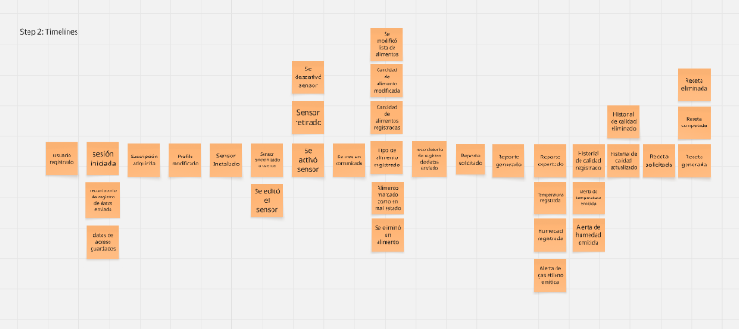
<figcaption style="font-size:0.9em;color:#555;margin-top:0.4em"><em>Step 2: Timelines — eventos ordenados cronológicamente.</em></figcaption>
</figure>

**Steps 3–5 — Actors, Commands y Aggregates preliminares.** Estas etapas se desarrollaron de manera iterativa. Se identificaron los actores que participan en los procesos de FreshSense, como propietarios, gerentes, encargados, supervisores y colaboradores del negocio; los comandos ejecutados por dichos actores o por los dispositivos IoT; y los aggregates preliminares responsables de mantener la consistencia de las principales reglas del dominio. El resultado consolidado de estas etapas se refleja en los siguientes pasos.

**Step 6 — Policies.** Se identificaron las políticas de dominio que permiten reaccionar automáticamente ante determinados eventos. Estas políticas siguen relaciones del tipo *“cuando ocurre X, entonces se ejecuta Y”*. Por ejemplo, cuando una lectura recibida desde un dispositivo supera los umbrales configurados para una zona de conservación, el sistema evalúa la desviación y, si corresponde, genera una alerta dirigida al personal responsable.

<figure id="fig-step6" style="margin:1.5em 0;text-align:center">
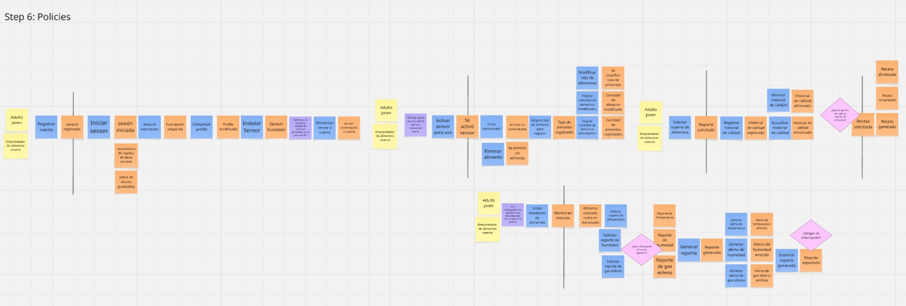
<figcaption style="font-size:0.9em;color:#555;margin-top:0.4em"><em>Step 6: Policies del dominio FreshSense.</em></figcaption>
</figure>

**Step 7 — Read Models.** Se identificaron las vistas de consulta necesarias para que los diferentes usuarios puedan supervisar la operación del negocio. Entre los principales read models se encuentran el inventario y sus lotes, el estado de las zonas y dispositivos, el historial de lecturas de temperatura y humedad, las alertas e incidencias registradas, las mermas y los reportes operativos y económicos.

<figure id="fig-step7" style="margin:1.5em 0;text-align:center">

<figcaption style="font-size:0.9em;color:#555;margin-top:0.4em"><em>Step 7: Read Models identificados.</em></figcaption>
</figure>

**Step 8 — External Systems.** Se identificaron los sistemas externos que interactúan con FreshSense. El principal sistema externo es el **Dispositivo FreshSense**, encargado de recopilar y transmitir las condiciones ambientales de las zonas de conservación. También se consideran los servicios externos de notificaciones utilizados para enviar alertas y el sistema de pagos encargado de procesar las suscripciones empresariales.

<figure id="fig-step8" style="margin:1.5em 0;text-align:center">
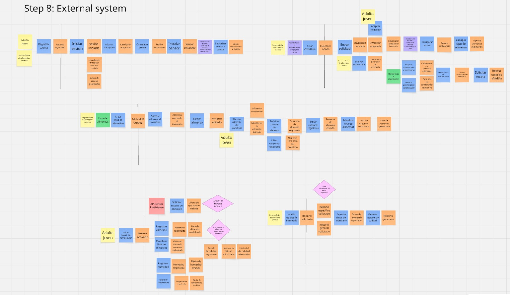
<figcaption style="font-size:0.9em;color:#555;margin-top:0.4em"><em>Step 8: External Systems del dominio.</em></figcaption>
</figure>

**Step 9 — Aggregates.** A partir de los comandos, eventos y reglas identificados, se establecieron ocho aggregates candidatos que representan las principales unidades de consistencia del dominio: `User`, `Organization`, `Subscription`, `SensorDevice`, `Inventory/Lot`, `Operation/Waste`, `Monitoring/Alert` y `Report`.

Estos aggregates concentran las reglas de negocio relacionadas con el acceso de los usuarios, la estructura de las organizaciones, las suscripciones empresariales, la configuración de los dispositivos, el inventario y sus lotes, las operaciones y mermas, el procesamiento de la telemetría y las alertas, y la generación de información consolidada para la toma de decisiones.

<figure id="fig-step9" style="margin:1.5em 0;text-align:center">

<figcaption style="font-size:0.9em;color:#555;margin-top:0.4em"><em>Step 9: Aggregates — agrupación de comandos y eventos.</em></figcaption>
</figure>

**Step 10 — Bounded Contexts.** Finalmente, los aggregates y capacidades identificadas se agruparon en ocho bounded contexts candidatos: **User Management**, **Organization Management**, **Subscription Management**, **Sensor Management**, **Inventory Management**, **Operations & Waste Management**, **IoT Monitoring & Alerting** y **Report Management**.

La separación de estas responsabilidades permite mantener límites claros entre las diferentes capacidades del dominio. Por ejemplo, la administración del hardware permanece separada del procesamiento de la telemetría, mientras que la gestión del inventario se diferencia de las operaciones que generan movimientos, consumo, rotación o merma.

Los bounded contexts obtenidos mediante este proceso constituyen la base para el Candidate Context Discovery desarrollado en la sección 4.2.2.

<figure id="fig-step10" style="margin:1.5em 0;text-align:center">

<figcaption style="font-size:0.9em;color:#555;margin-top:0.4em"><em>Step 10: Bounded Context — fronteras candidatas del dominio.</em></figcaption>
</figure>

### 4.2.2. Candidate Context Discovery

La identificación de contextos candidatos permite organizar el dominio de FreshSense en capacidades de negocio claramente delimitadas, reduciendo el acoplamiento entre responsabilidades y facilitando la evolución independiente de cada parte de la solución.

Los bounded contexts propuestos se obtienen a partir de las necesidades identificadas para los dos segmentos objetivo de FreshSense: **Propietarios y Gerentes de Restaurantes Pequeños** y **Propietarios y Encargados de Negocios de Alimentos Fríos**. Ambos segmentos requieren gestionar productos perecibles, controlar sus condiciones de conservación, recibir alertas ante situaciones de riesgo y disponer de información que permita reducir mermas y pérdidas económicas.

Asimismo, se consideran las funcionalidades definidas en las User Stories actuales del proyecto, especialmente aquellas relacionadas con autenticación y roles, gestión de colaboradores, dispositivos IoT, zonas de conservación, inventario y lotes, monitoreo de temperatura y humedad, alertas, movimientos de inventario, registro de mermas, suscripciones, facturación y generación de reportes.

A partir de este análisis, se identificaron los siguientes ocho bounded contexts candidatos:

| Bounded Context candidato | Responsabilidad principal |
|---|---|
| **User Management** | Gestiona autenticación, recuperación de credenciales y control de acceso de los usuarios de FreshSense mediante roles y permisos. |
| **Organization Management** | Gestiona la información del negocio, sus colaboradores y la relación de los usuarios con la organización a la que pertenecen. |
| **Subscription Management** | Administra las suscripciones empresariales de FreshSense, su vigencia, pagos, facturación y acceso a las funcionalidades asociadas al servicio contratado. |
| **Sensor Management** | Gestiona los dispositivos FreshSense y su asociación con las zonas de conservación del negocio, garantizando que cada dispositivo se encuentre correctamente vinculado. |
| **Inventory Management** | Gestiona productos e insumos perecibles, lotes, cantidades disponibles, categorías, fechas de vencimiento y ubicación dentro de las zonas de conservación. |
| **Operations & Waste Management** | Gestiona los movimientos que afectan las existencias del inventario y el registro de productos descartados o considerados merma, incluyendo las causas asociadas a dichas pérdidas. |
| **IoT Monitoring & Alerting** | Procesa las mediciones de temperatura y humedad recibidas desde los dispositivos FreshSense, evalúa los valores frente a los rangos configurados, identifica desviaciones y genera alertas para los responsables correspondientes. |
| **Report Management** | Consolida información histórica de inventario, movimientos, monitoreo y mermas para generar reportes de pérdidas, rotación, impacto económico y análisis orientados a la reposición de inventario. |

La separación propuesta permite distinguir las responsabilidades relacionadas con la administración del negocio de aquellas directamente vinculadas con el monitoreo y conservación de productos perecibles.

**User Management** mantiene la identidad, autenticación y autorización de los usuarios, mientras que **Organization Management** representa el negocio y la relación de sus colaboradores con FreshSense. De esta manera, la gestión de credenciales y permisos permanece separada de la estructura organizacional.

**Sensor Management** administra la vinculación de los dispositivos físicos con las zonas de conservación, mientras que **IoT Monitoring & Alerting** procesa e interpreta las mediciones de temperatura y humedad producidas por dichos dispositivos. Esta separación permite modificar el manejo de los dispositivos sin afectar directamente las reglas utilizadas para evaluar las condiciones de conservación y generar alertas.

Por otro lado, **Inventory Management** mantiene el estado de productos, lotes, cantidades, vencimientos y ubicaciones, mientras que **Operations & Waste Management** representa los movimientos que modifican las existencias y los registros relacionados con descartes y mermas. Esta separación permite mantener claramente diferenciada la información actual del inventario respecto del historial de operaciones que posteriormente puede utilizarse para análisis.

Finalmente, **Report Management** utiliza la información generada por los contextos operativos para elaborar reportes relacionados con mermas, pérdidas económicas, rotación, historial de inventario y sugerencias de reposición. **Subscription Management**, por su parte, mantiene las responsabilidades comerciales asociadas con pagos, vigencia de la suscripción y facturación sin introducir dichas reglas dentro de los contextos centrales del dominio.

Con esta distribución, FreshSense mantiene ocho bounded contexts con responsabilidades claramente diferenciadas y alineadas con las User Stories actuales, proporcionando una base consistente para el modelado de flujos de mensajes, los Bounded Context Canvases y el Context Mapping desarrollados en las siguientes secciones.

### 4.2.3. Domain Message Flows Modeling

El Domain Message Flows Modeling de FreshSense permite visualizar cómo colaboran los bounded contexts definidos en la sección anterior para resolver situaciones representativas del negocio. Para ello se utiliza la técnica de Domain Storytelling, representando mediante actores, sistemas, objetos de trabajo y actividades numeradas la secuencia de interacciones que atraviesa los límites del dominio.

Los escenarios seleccionados corresponden a procesos centrales para los dos segmentos objetivo de FreshSense: propietarios y gerentes de restaurantes pequeños, y propietarios y encargados de negocios de alimentos fríos. Los flujos permiten validar las responsabilidades asignadas a cada bounded context y verificar que la comunicación entre ellos mantenga una separación clara de responsabilidades.

<figure id="fig-notation" style="margin:1.5em 0;text-align:center">
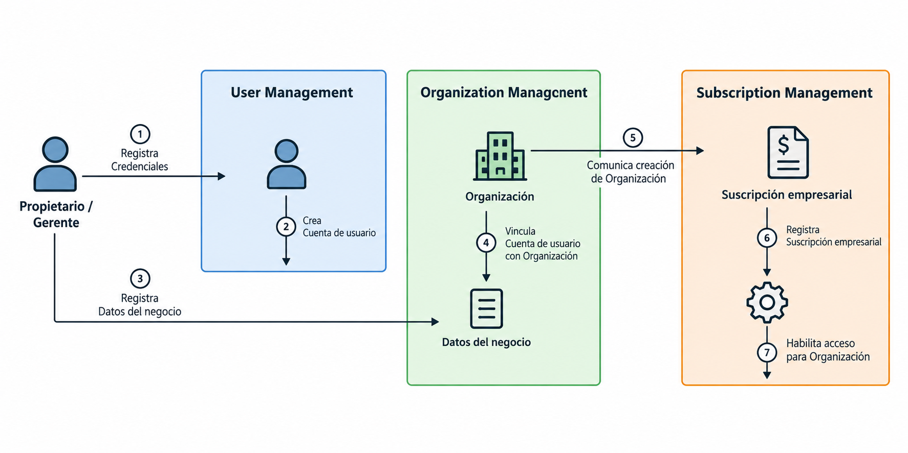
<figcaption style="font-size:0.9em;color:#555;margin-top:0.4em"><em>Notación utilizada en los Domain Message Flows.</em></figcaption>
</figure>

**Escenario 1 — Vinculación de dispositivo FreshSense con una zona de conservación.**

El flujo inicia cuando un encargado selecciona un dispositivo FreshSense y una zona de conservación registrada en su negocio. **User Management** permite verificar que el usuario posee los permisos requeridos para realizar la configuración, mientras que **Organization Management** permite identificar el negocio al cual pertenece.

Posteriormente, **Sensor Management** valida que el dispositivo pueda ser vinculado y registra la relación entre el dispositivo y la zona seleccionada. Si el dispositivo ya posee una asociación incompatible, la operación es rechazada para evitar que las futuras mediciones sean relacionadas simultáneamente con zonas diferentes.

Una vez completada la vinculación, las mediciones enviadas por el dispositivo pueden identificarse utilizando la zona correspondiente, permitiendo que **IoT Monitoring & Alerting** procese correctamente la telemetría recibida.

<figure id="fig-dmfm1" style="margin:1.5em 0;text-align:center">
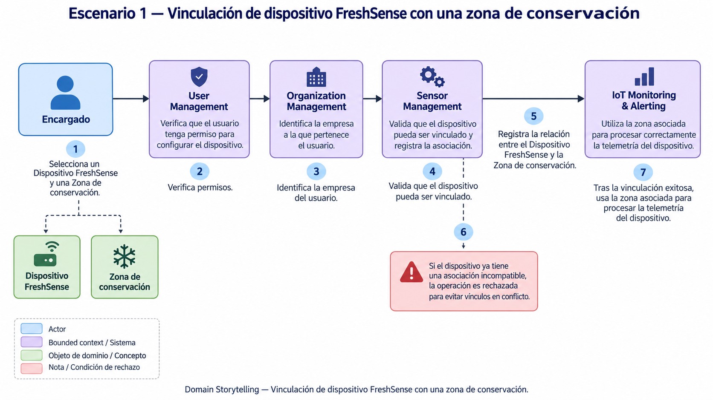
<figcaption style="font-size:0.9em;color:#555;margin-top:0.4em"><em>Domain Storytelling — Vinculación de dispositivo FreshSense con una zona de conservación.</em></figcaption>
</figure>

**Escenario 2 — Lectura del dispositivo IoT y generación de una alerta.**

El flujo comienza cuando el **Dispositivo FreshSense** obtiene una medición de temperatura y humedad y la transmite al sistema. **IoT Monitoring & Alerting** recibe la telemetría y consulta a **Sensor Management** para validar el dispositivo e identificar la zona de conservación con la que se encuentra asociado.

Con esta información, **IoT Monitoring & Alerting** evalúa las mediciones frente a los rangos establecidos. Cuando se detecta una desviación, consulta a **Inventory Management** para identificar los productos o lotes almacenados en la zona afectada. A continuación, registra la incidencia y genera una alerta dirigida a los responsables definidos para ese tipo de situación.

El servicio de procesamiento de notificaciones recibe la alerta, identifica a los responsables configurados y gestiona su distribución. Si el proveedor externo presenta una falla, la notificación permanece pendiente para un intento posterior.

Este flujo permite detectar oportunamente condiciones de temperatura o humedad que puedan comprometer productos perecibles y relacionar una incidencia ambiental con el inventario potencialmente afectado.

<figure id="fig-dmfm2" style="margin:1.5em 0;text-align:center">
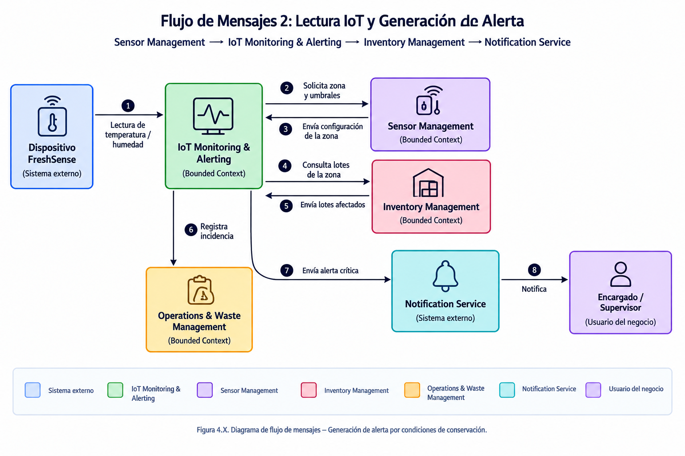
<figcaption style="font-size:0.9em;color:#555;margin-top:0.4em"><em>Domain Storytelling — Lectura IoT, evaluación de condiciones y generación de alerta.</em></figcaption>
</figure>

**Escenario 3 — Registro de merma y generación de reporte.**

El flujo inicia cuando un encargado identifica que un producto o lote debe ser retirado del inventario debido a una causa como vencimiento, deterioro o condiciones inadecuadas de conservación. **Inventory Management** actualiza las existencias correspondientes al producto o lote.

La operación es comunicada a **Operations & Waste Management**, que registra la merma junto con la causa indicada y la información necesaria para representar la pérdida producida. Posteriormente, **Report Management** utiliza la información histórica de inventario y mermas para consolidar indicadores relacionados con cantidades descartadas, pérdidas económicas y rotación.

Finalmente, el propietario o gerente puede solicitar el reporte correspondiente para analizar las principales causas de pérdida y apoyar decisiones relacionadas con compras, rotación y reposición de inventario.

<figure id="fig-dmfm3" style="margin:1.5em 0;text-align:center">
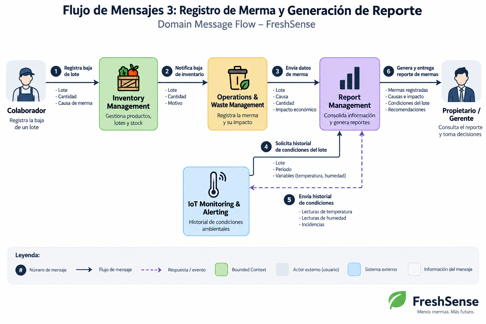
<figcaption style="font-size:0.9em;color:#555;margin-top:0.4em"><em>Domain Storytelling — Registro de merma y generación de reporte.</em></figcaption>
</figure>

Los tres escenarios permiten comprobar que los bounded contexts colaboran mediante responsabilidades claramente diferenciadas. **User Management** y **Organization Management** permiten establecer el ámbito empresarial y los permisos necesarios; **Sensor Management** e **IoT Monitoring & Alerting** administran la asociación de dispositivos y el procesamiento de telemetría; mientras que **Inventory Management**, **Operations & Waste Management** y **Report Management** gestionan las existencias, las mermas y la información utilizada para la toma de decisiones.

De esta manera, los Domain Message Flows permiten validar los límites definidos durante el Candidate Context Discovery y sirven como entrada para el diseño detallado de los Bounded Context Canvases y el Context Mapping.

### 4.2.4. Bounded Context Canvases

A partir de los bounded contexts identificados durante el Candidate Context Discovery y validados mediante los Domain Message Flows, se desarrollaron los Bounded Context Canvases de FreshSense.

Cada canvas permite detallar el propósito del contexto, su clasificación estratégica, los roles de dominio involucrados, las principales reglas de negocio, el lenguaje ubicuo, sus capabilities y las dependencias que mantiene con otros bounded contexts o sistemas externos.

El análisis se realizó de forma iterativa considerando los límites y responsabilidades de cada contexto, con el objetivo de reducir el acoplamiento, evitar la duplicación de reglas de negocio y mantener una separación clara entre las diferentes capacidades del dominio.

#### User Management

El bounded context **User Management** concentra las responsabilidades relacionadas con identidad y acceso a FreshSense, manteniendo separadas las credenciales y permisos de los usuarios de las reglas propias de la organización y de la operación del negocio.

<figure id="fig-canvas-user-management" style="margin:1.5em 0;text-align:center">
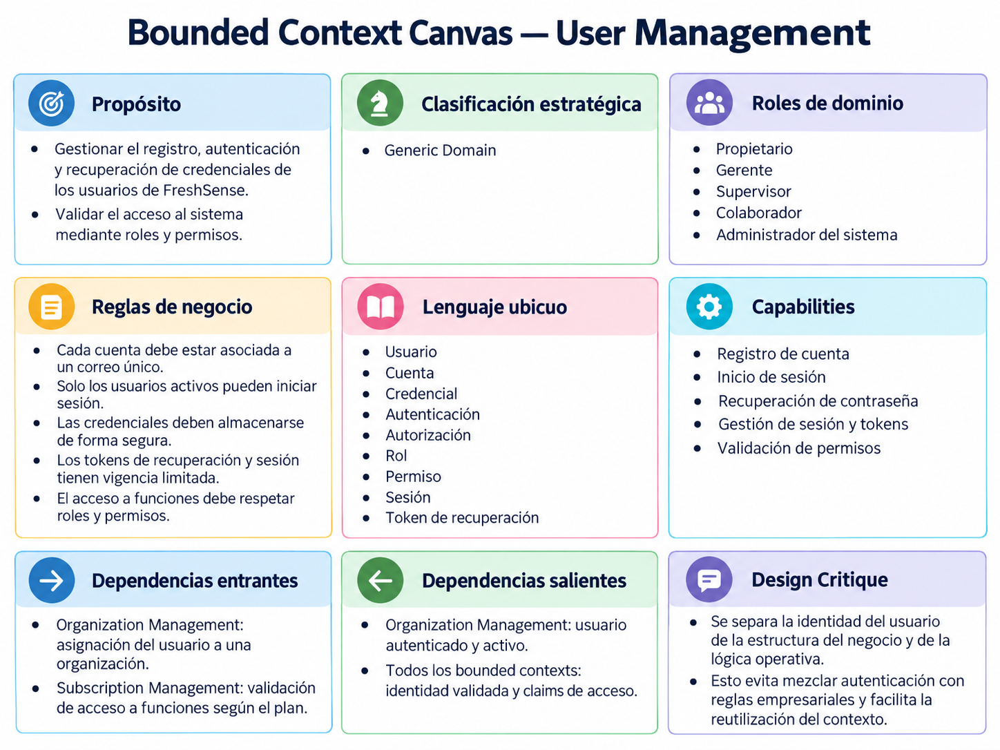
<figcaption style="font-size:0.9em;color:#555;margin-top:0.4em"><em>Bounded Context Canvas — User Management.</em></figcaption>
</figure>

#### Organization Management

El bounded context **Organization Management** representa el negocio sobre el cual opera FreshSense, incluyendo la información de la organización, sus colaboradores y la relación de los usuarios con el negocio al que pertenecen.

<figure id="fig-canvas-organization-management" style="margin:1.5em 0;text-align:center">
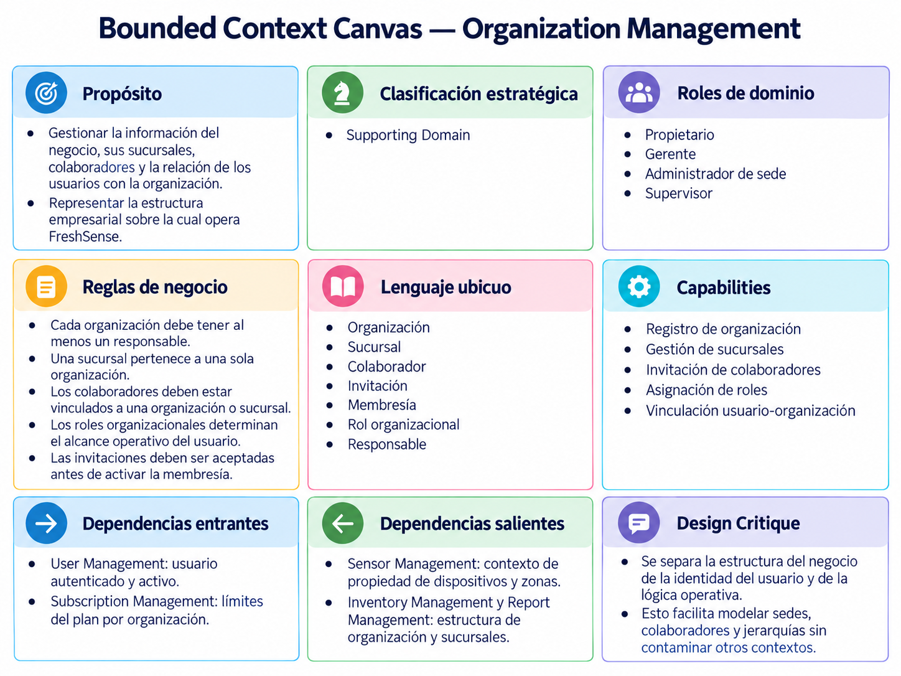
<figcaption style="font-size:0.9em;color:#555;margin-top:0.4em"><em>Bounded Context Canvas — Organization Management.</em></figcaption>
</figure>

#### Subscription Management

El bounded context **Subscription Management** administra las suscripciones empresariales de FreshSense, su vigencia, los procesos de facturación y las funcionalidades disponibles de acuerdo con el plan comercial contratado por cada organización.

<figure id="fig-canvas-subscription-management" style="margin:1.5em 0;text-align:center">
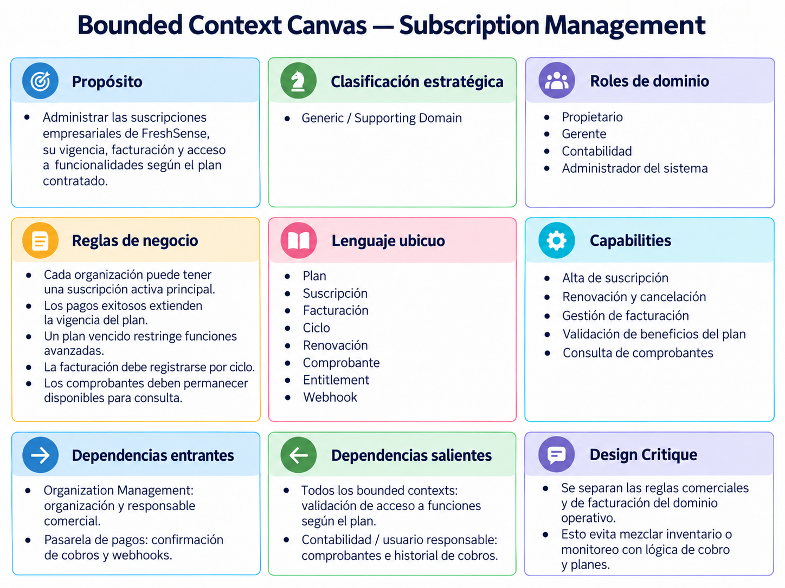
<figcaption style="font-size:0.9em;color:#555;margin-top:0.4em"><em>Bounded Context Canvas — Subscription Management.</em></figcaption>
</figure>

#### Sensor Management

El bounded context **Sensor Management** gestiona los dispositivos FreshSense y su relación con las zonas de conservación del negocio, asegurando que cada dispositivo se encuentre correctamente asociado con la zona desde la cual genera sus mediciones.

<figure id="fig-canvas-sensor-management" style="margin:1.5em 0;text-align:center">
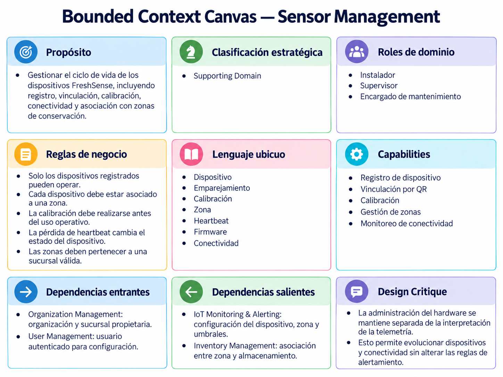
<figcaption style="font-size:0.9em;color:#555;margin-top:0.4em"><em>Bounded Context Canvas — Sensor Management.</em></figcaption>
</figure>

#### Inventory Management

El bounded context **Inventory Management** administra los productos e insumos perecibles, sus lotes, cantidades disponibles, categorías, vencimientos y ubicación dentro de las zonas de conservación del negocio.

<figure id="fig-canvas-inventory-management" style="margin:1.5em 0;text-align:center">
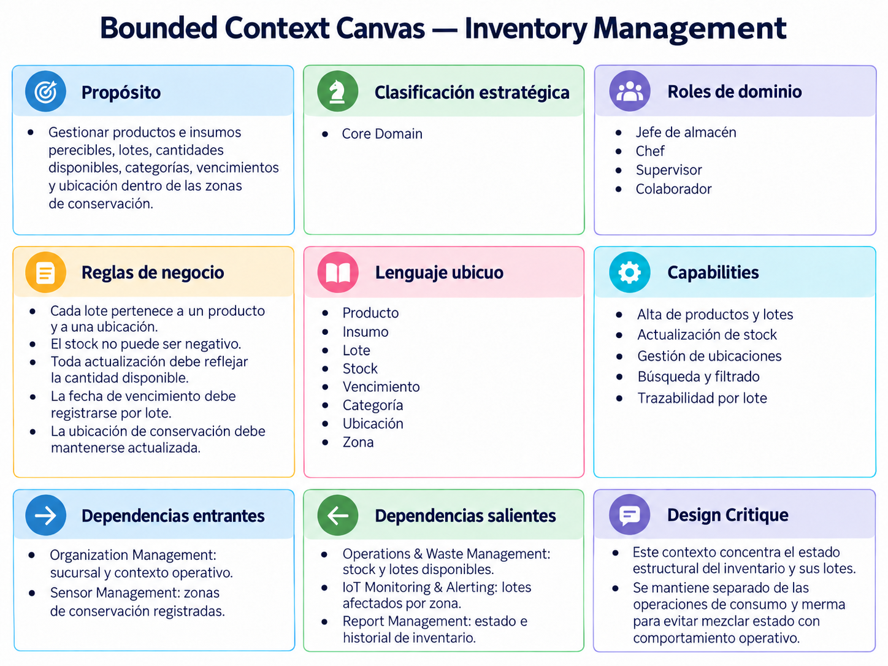
<figcaption style="font-size:0.9em;color:#555;margin-top:0.4em"><em>Bounded Context Canvas — Inventory Management.</em></figcaption>
</figure>

#### Operations & Waste Management

El bounded context **Operations & Waste Management** representa las operaciones que modifican las existencias durante la actividad diaria del negocio y el registro de productos descartados o considerados merma, incluyendo la causa asociada con cada pérdida.

<figure id="fig-canvas-operations-waste-management" style="margin:1.5em 0;text-align:center">
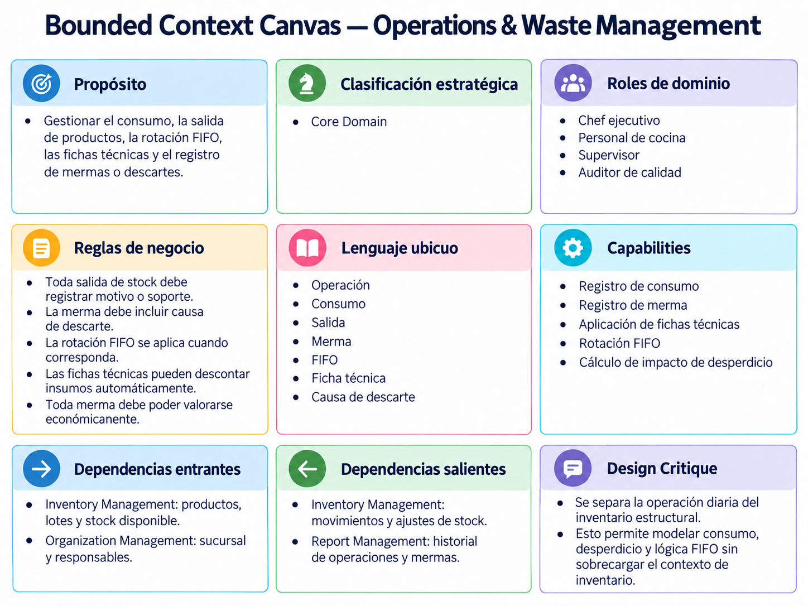
<figcaption style="font-size:0.9em;color:#555;margin-top:0.4em"><em>Bounded Context Canvas — Operations & Waste Management.</em></figcaption>
</figure>

#### IoT Monitoring & Alerting

El bounded context **IoT Monitoring & Alerting** procesa las lecturas provenientes de los dispositivos FreshSense, evalúa las condiciones ambientales frente a los umbrales configurados, identifica incidencias y genera alertas cuando existe un riesgo para la conservación de los productos.

<figure id="fig-canvas-iot-monitoring-alerting" style="margin:1.5em 0;text-align:center">
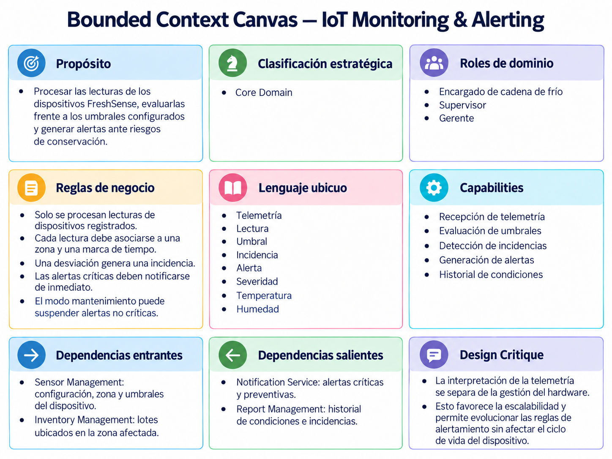
<figcaption style="font-size:0.9em;color:#555;margin-top:0.4em"><em>Bounded Context Canvas — IoT Monitoring & Alerting.</em></figcaption>
</figure>

#### Report Management

El bounded context **Report Management** consolida la información histórica generada por los diferentes contextos de FreshSense para elaborar reportes relacionados con inventario, mermas, pérdidas económicas, rotación e información utilizada para apoyar decisiones de reposición.

<figure id="fig-canvas-report-management" style="margin:1.5em 0;text-align:center">
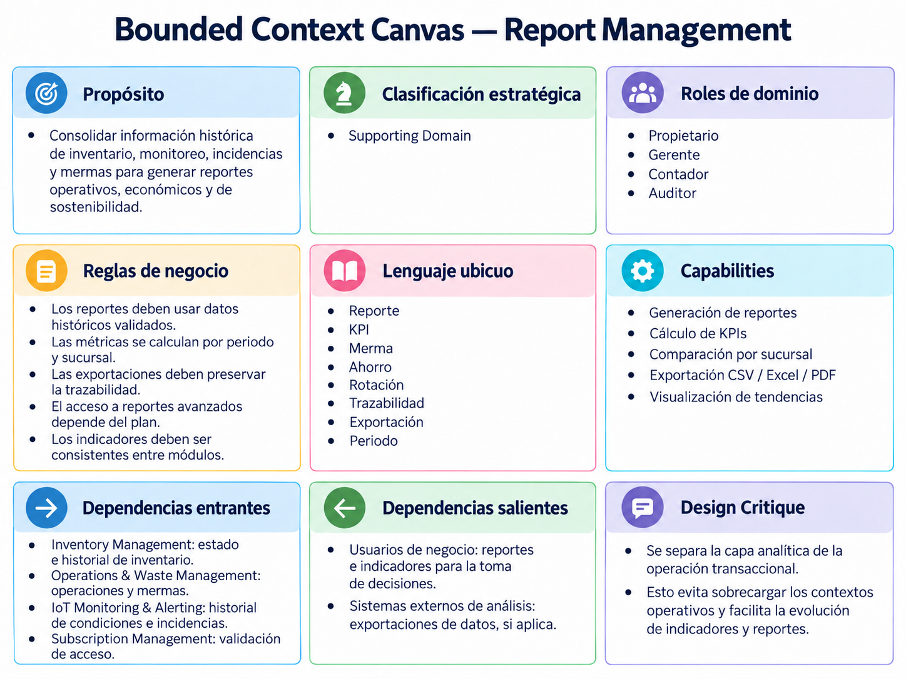
<figcaption style="font-size:0.9em;color:#555;margin-top:0.4em"><em>Bounded Context Canvas — Report Management.</em></figcaption>
</figure>

En conjunto, los Bounded Context Canvases permiten precisar las responsabilidades internas de cada contexto y visualizar las dependencias necesarias para la colaboración entre ellos. Esta definición sirve como base para establecer posteriormente las relaciones estructurales que se representan en el Context Mapping de FreshSense.

### 4.2.5. Context Mapping

En esta sección se analiza la relación entre los bounded contexts identificados para FreshSense y se proponen distintas alternativas de Context Mapping. El objetivo es evaluar diferentes formas de distribuir las responsabilidades del dominio, reducir dependencias innecesarias y mantener aisladas las capacidades principales de la solución.

Para el análisis se consideran los ocho bounded contexts definidos previamente: **User Management**, **Organization Management**, **Subscription Management**, **Sensor Management**, **Inventory Management**, **Operations & Waste Management**, **IoT Monitoring & Alerting** y **Report Management**.

Durante el proceso se evaluaron alternativas relacionadas con la agrupación o separación de responsabilidades, especialmente en aquellas áreas donde existe una colaboración estrecha, como la gestión de dispositivos y el monitoreo IoT, así como la gestión del inventario y las operaciones que modifican sus existencias.

Asimismo, se consideraron patrones de relación de Domain-Driven Design como **Customer/Supplier**, **Anti-corruption Layer**, **Conformist** y **Shared Kernel**, buscando mantener una comunicación clara entre bounded contexts sin introducir dependencias innecesarias.

#### Opción 1 — Contextos completamente separados

La primera alternativa mantiene los ocho bounded contexts como unidades independientes, estableciendo relaciones explícitas entre ellos.

En esta propuesta:

- **User Management** proporciona la identidad autenticada y la información necesaria para validar los permisos de los usuarios.
- **Organization Management** proporciona la información del negocio y sus colaboradores a los contextos que necesitan determinar el ámbito organizacional de una operación.
- **Subscription Management** administra independientemente la vigencia de la suscripción, pagos y facturación.
- **Sensor Management** administra los dispositivos y su vinculación con las zonas de conservación, proporcionando dicha información a **IoT Monitoring & Alerting**.
- **Inventory Management** mantiene la información de productos, lotes, cantidades, vencimientos y ubicación utilizada por **Operations & Waste Management**, **IoT Monitoring & Alerting** y **Report Management**.
- **Operations & Waste Management** registra movimientos que afectan las existencias y las mermas, proporcionando su historial a **Report Management**.
- **IoT Monitoring & Alerting** procesa las mediciones de temperatura y humedad y proporciona el historial de condiciones, incidencias y alertas a **Report Management**.
- **Report Management** consolida la información histórica recibida para elaborar reportes y análisis.

Esta alternativa presenta como principal ventaja una separación clara de responsabilidades y una alta independencia entre los contextos. Sin embargo, incrementa la cantidad de comunicaciones necesarias y puede generar mayor complejidad de integración entre módulos que colaboran frecuentemente.

<figure id="fig-cmo1" style="margin:1.5em 0;text-align:center">
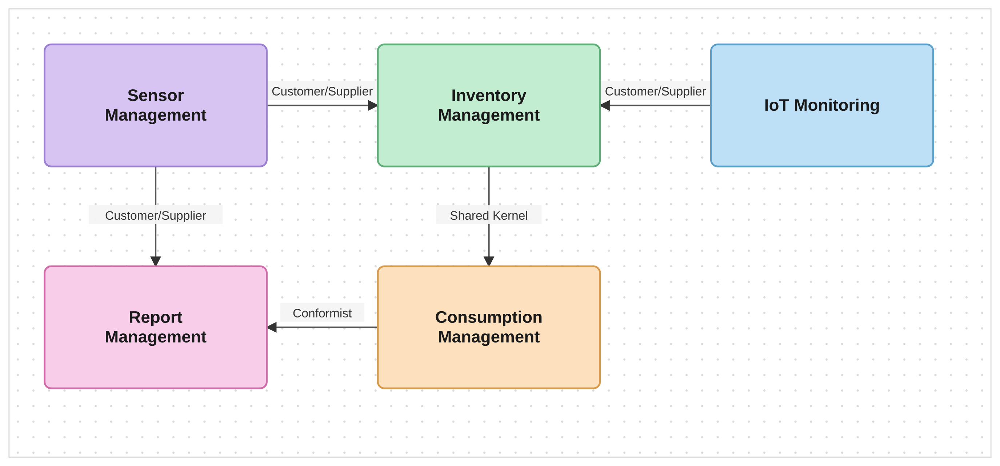
<figcaption style="font-size:0.9em;color:#555;margin-top:0.4em"><em>Opción 1 — ocho bounded contexts completamente separados.</em></figcaption>
</figure>

#### Opción 2 — Integración de gestión de sensores y monitoreo IoT

La segunda alternativa propone fusionar **Sensor Management** e **IoT Monitoring & Alerting** en un único bounded context.

Esta decisión permitiría concentrar en un solo contexto la vinculación de dispositivos con zonas, la recepción de telemetría, la evaluación de los rangos configurados y la generación de alertas. De esta manera, se reduciría la comunicación entre ambos módulos y se simplificaría el flujo de procesamiento de las mediciones.

Sin embargo, esta alternativa combina dos responsabilidades diferentes: por un lado, la administración y asociación de los dispositivos físicos y, por otro, la interpretación de las mediciones y aplicación de las reglas relacionadas con las condiciones de conservación.

La principal desventaja es que el contexto resultante tendría una responsabilidad demasiado amplia. Además, cambios relacionados con los dispositivos podrían afectar directamente las reglas utilizadas para procesar la telemetría y generar alertas.

Por esta razón, aunque la alternativa reduce la cantidad de comunicaciones entre contextos, incrementa el acoplamiento entre la gestión del dispositivo IoT y las reglas centrales de monitoreo.

<figure id="fig-cmo2" style="margin:1.5em 0;text-align:center">
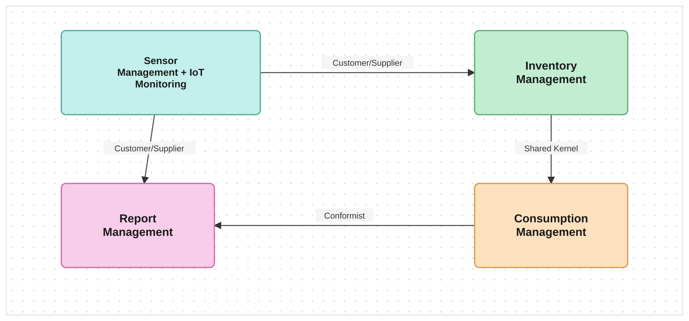
<figcaption style="font-size:0.9em;color:#555;margin-top:0.4em"><em>Opción 2 — Sensor Management e IoT Monitoring & Alerting integrados.</em></figcaption>
</figure>

#### Opción 3 — Separación de Core Domains y relaciones controladas

La tercera alternativa mantiene los ocho bounded contexts separados, pero define relaciones explícitas utilizando patrones de Domain-Driven Design para reducir el acoplamiento entre ellos.

En esta propuesta se establecen las siguientes relaciones principales:

- **User Management → Organization Management — Customer/Supplier:** User Management proporciona la identidad y permisos del usuario, mientras Organization Management utiliza esta información para relacionarlo con el negocio correspondiente.

- **Organization Management → Sensor Management — Customer/Supplier:** Organization Management proporciona la identidad del negocio necesaria para gestionar sus dispositivos y zonas de conservación.

- **Organization Management → Inventory Management — Customer/Supplier:** Inventory Management utiliza la información del negocio para asociar productos, lotes e inventario con la organización correspondiente.

- **Organization Management → Subscription Management — Customer/Supplier:** Subscription Management utiliza la identidad del negocio para administrar la vigencia de la suscripción, pagos y facturación.

- **Sensor Management → IoT Monitoring & Alerting — Anti-corruption Layer:** IoT Monitoring & Alerting utiliza una capa de traducción para recibir la identificación del dispositivo y la zona asociada sin depender directamente de los detalles internos utilizados por Sensor Management.

- **Inventory Management ↔ Operations & Waste Management — Shared Kernel:** ambos contextos comparten únicamente conceptos esenciales como `ProductId`, `LotId`, `Quantity` y referencias de inventario. Este conjunto reducido permite mantener consistencia cuando una operación modifica las existencias o registra una merma.

- **Inventory Management → IoT Monitoring & Alerting — Customer/Supplier:** IoT Monitoring & Alerting utiliza la ubicación de productos y lotes para determinar qué elementos podrían encontrarse afectados cuando se detecta una desviación en una zona de conservación.

- **Inventory Management → Report Management — Conformist:** Report Management consume la información histórica disponible sobre productos, lotes y movimientos utilizando el modelo publicado por Inventory Management.

- **Operations & Waste Management → Report Management — Conformist:** Report Management utiliza los movimientos y registros de merma para calcular indicadores relacionados con pérdidas y rotación.

- **IoT Monitoring & Alerting → Report Management — Conformist:** Report Management consume el historial de mediciones, incidencias y alertas para complementar los análisis relacionados con las condiciones de conservación.

Esta alternativa mantiene separados los contextos principales de FreshSense, pero establece mecanismos controlados de colaboración. De esta manera, las capacidades centrales relacionadas con inventario, monitoreo y reducción de mermas pueden evolucionar sin quedar fuertemente acopladas a las funciones de autenticación, organización, suscripción o facturación.

<figure id="fig-cmo3" style="margin:1.5em 0;text-align:center">

<figcaption style="font-size:0.9em;color:#555;margin-top:0.4em"><em>Opción 3 — bounded contexts separados mediante patrones DDD.</em></figcaption>
</figure>

#### Elección de la alternativa

Se seleccionó la **Opción 3**, ya que proporciona un equilibrio adecuado entre separación de responsabilidades, mantenibilidad y capacidad de evolución del sistema.

La solución mantiene como capacidades centrales **Inventory Management**, **Operations & Waste Management** e **IoT Monitoring & Alerting**, ya que estos contextos concentran las funcionalidades directamente relacionadas con la propuesta de valor de FreshSense: controlar productos perecibles, monitorear sus condiciones de conservación y reducir las pérdidas producidas por deterioro o merma.

Asimismo, mantener **Sensor Management** separado de **IoT Monitoring & Alerting** permite desacoplar la administración de los dispositivos de las reglas encargadas de interpretar sus mediciones. El uso de una **Anti-corruption Layer** evita que cambios en la representación de los dispositivos se propaguen hacia las reglas centrales del dominio.

La relación de **Shared Kernel** entre Inventory Management y Operations & Waste Management se limita a conceptos esenciales asociados con productos, lotes y cantidades, evitando compartir reglas de negocio completas entre ambos contextos.

Por otro lado, **Report Management** se mantiene como un contexto independiente encargado de utilizar información generada por los contextos operativos para producir análisis de mermas, pérdidas, rotación e información útil para la reposición de inventario.

Finalmente, **User Management**, **Organization Management** y **Subscription Management** proporcionan capacidades de soporte necesarias para el funcionamiento empresarial de FreshSense, manteniendo sus reglas separadas de los contextos centrales del dominio.

El siguiente Context Map consolidado representa la estructura seleccionada y las relaciones existentes entre los ocho bounded contexts de FreshSense.

<figure id="fig-cmap" style="margin:1.5em 0;text-align:center">

<figcaption style="font-size:0.9em;color:#555;margin-top:0.4em"><em>Context Map consolidado — ocho bounded contexts de FreshSense.</em></figcaption>
</figure>

## 4.3. Software Architecture

La arquitectura de software de FreshSense se representa utilizando el modelo C4, permitiendo describir progresivamente la solución desde una perspectiva general del ecosistema hasta la distribución de sus principales elementos de software.

A partir de las decisiones obtenidas mediante Attribute-Driven Design y de los bounded contexts identificados mediante Domain-Driven Design, la arquitectura busca mantener una separación clara entre las capacidades del negocio, los componentes responsables del procesamiento IoT y las integraciones con servicios externos.

En las siguientes secciones se presentan el System Landscape Diagram, el Context Level Diagram, el Container Level Diagram y el Deployment Diagram de FreshSense.

### 4.3.1. Software Architecture System Landscape Diagram

El System Landscape Diagram presenta una vista general del ecosistema en el que opera FreshSense. En este nivel se representa la plataforma como un único sistema de software y se identifican los principales tipos de usuario y sistemas externos con los que mantiene interacción.

Los usuarios de FreshSense se agrupan en tres actores principales. El **Visitante interesado** representa a potenciales clientes pertenecientes a los segmentos de restaurantes pequeños y negocios de alimentos fríos, quienes pueden consultar la propuesta de valor de FreshSense y solicitar contacto o una demostración.

El **Propietario, Gerente o Administrador** representa a los responsables de la gestión del negocio. Este actor utiliza FreshSense para supervisar productos, inventario, zonas de conservación, dispositivos IoT, alertas, colaboradores, reportes y aspectos relacionados con la suscripción.

El **Encargado o Colaborador** representa a los usuarios que realizan actividades operativas dentro del negocio. Dependiendo de los permisos asignados, estos usuarios pueden registrar y actualizar productos, consultar información del inventario, registrar mermas y atender las alertas generadas por la plataforma.

FreshSense también interactúa con el **FreshSense IoT Device**, dispositivo físico instalado en las zonas de conservación del negocio. Este dispositivo obtiene mediciones de temperatura y humedad y las transmite hacia la plataforma para su almacenamiento y procesamiento.

Por otro lado, la plataforma se integra con un **Notification Provider**, utilizado para distribuir las alertas generadas por FreshSense hacia los responsables configurados. Esta integración se mantiene separada del dominio principal para permitir que una falla temporal del proveedor no provoque la pérdida de una alerta pendiente.

Finalmente, FreshSense interactúa con un **Payment Provider**, encargado de procesar los pagos asociados con las suscripciones empresariales. El proveedor comunica a FreshSense el resultado de las operaciones realizadas para que la plataforma pueda mantener actualizado el estado de la suscripción y la información de facturación correspondiente.

El siguiente diagrama representa estas relaciones dentro del ecosistema general de FreshSense.

<figure id="fig-system-landscape" style="margin:1.5em 0;text-align:center">
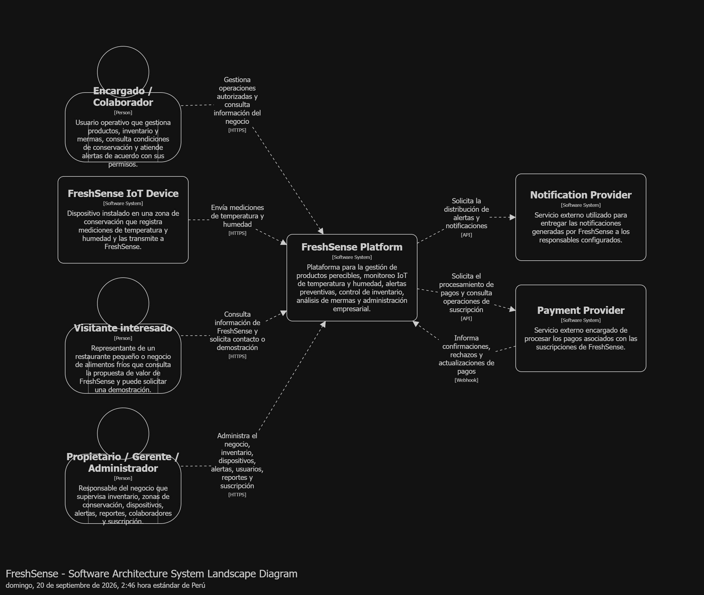
<figcaption style="font-size:0.9em;color:#555;margin-top:0.4em"><em>Software Architecture System Landscape Diagram — FreshSense.</em></figcaption>
</figure>

Esta vista permite identificar los límites generales de FreshSense antes de profundizar en su estructura interna. En el siguiente nivel se desarrolla el Software Architecture Context Level Diagram, donde se detallan las relaciones existentes entre FreshSense, sus usuarios y los sistemas externos que participan directamente en sus principales casos de uso.

### 4.3.2. Software Architecture Context Level Diagrams

El Software Architecture Context Level Diagram de FreshSense presenta el sistema como una única unidad de software y establece su límite respecto de los usuarios y sistemas externos con los que interactúa directamente.

Esta vista permite identificar las responsabilidades que pertenecen a FreshSense y aquellas que son delegadas a servicios externos, sin representar todavía los detalles internos de implementación, bounded contexts, containers o tecnologías específicas.

FreshSense posee tres tipos principales de actores humanos. El **Visitante interesado** interactúa con la plataforma para conocer la propuesta de valor de la solución y solicitar contacto o una demostración comercial. Este actor todavía no forma parte de una organización registrada dentro de FreshSense.

El **Propietario, Gerente o Administrador** representa al usuario responsable de la gestión del negocio. Este actor puede administrar información relacionada con productos, inventario, zonas de conservación, dispositivos FreshSense, alertas, colaboradores, roles, reportes y aspectos asociados con la suscripción del servicio.

El **Encargado o Colaborador** representa al personal que participa en las actividades operativas del negocio. Las acciones disponibles para este actor dependen de los roles y permisos configurados. Entre sus posibles responsabilidades se encuentran registrar y actualizar productos, consultar el inventario, revisar las condiciones de conservación, registrar mermas y atender alertas.

Además de los actores humanos, FreshSense interactúa directamente con el **FreshSense IoT Device**. Cada dispositivo se encuentra asociado con una zona de conservación y registra mediciones de temperatura y humedad. Estas mediciones son enviadas hacia FreshSense para ser almacenadas y posteriormente utilizadas en el análisis de las condiciones de conservación.

Cuando una medición se encuentra fuera de los rangos definidos, FreshSense puede generar una alerta. La distribución de dicha alerta se realiza mediante un **Notification Provider** externo. FreshSense determina la información que debe ser comunicada y los responsables correspondientes, mientras que el proveedor externo se encarga de efectuar la entrega de la notificación.

Finalmente, el sistema se integra con un **Payment Provider** para procesar las operaciones relacionadas con las suscripciones. FreshSense envía las solicitudes necesarias al proveedor y recibe posteriormente información relacionada con confirmaciones, rechazos o actualizaciones de las transacciones. Esta información es utilizada para mantener consistente el estado de la suscripción y la facturación del negocio.

El siguiente diagrama representa el límite del sistema FreshSense y sus interacciones directas con usuarios y sistemas externos.

<figure id="fig-c4-context" style="margin:1.5em 0;text-align:center">
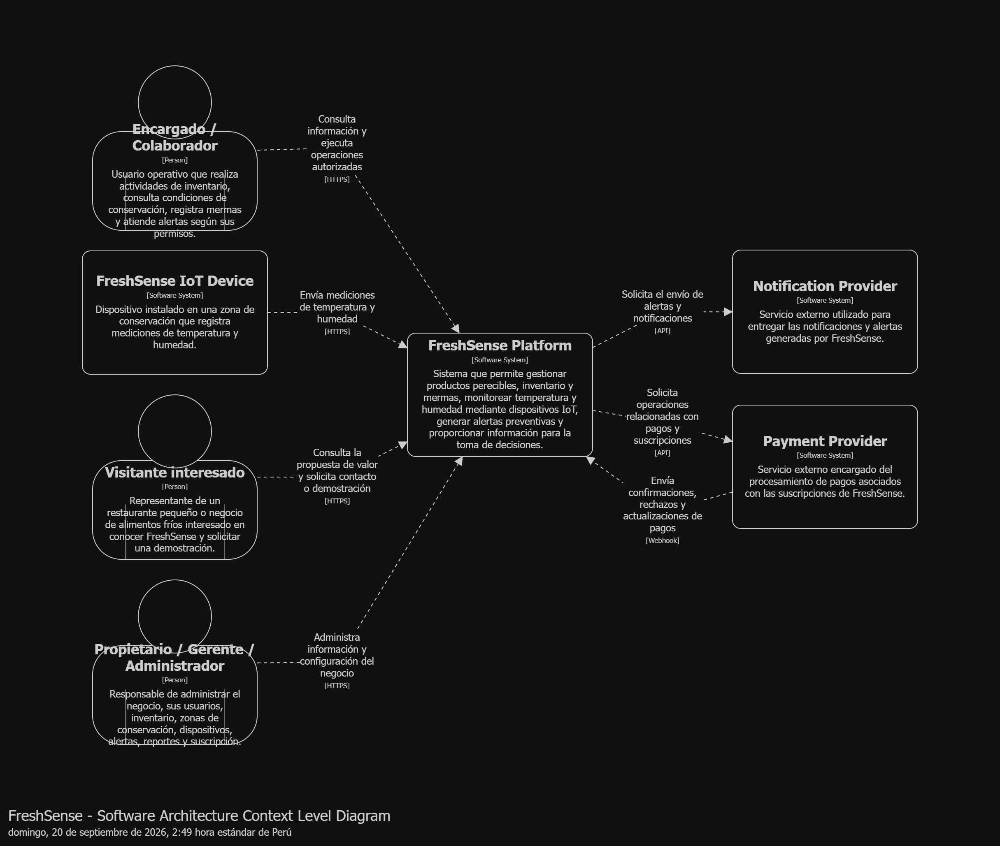
<figcaption style="font-size:0.9em;color:#555;margin-top:0.4em"><em>Software Architecture Context Level Diagram — FreshSense.</em></figcaption>
</figure>

El Context Level Diagram establece que las responsabilidades relacionadas con inventario, monitoreo, alertas, usuarios, reportes y suscripciones pertenecen al límite de **FreshSense Platform**, mientras que la adquisición física de las mediciones, la entrega final de las notificaciones y el procesamiento externo de los pagos corresponden a sistemas independientes.

En el siguiente nivel de la arquitectura se descompone FreshSense Platform en sus principales containers, permitiendo identificar cómo se distribuyen estas responsabilidades y qué mecanismos de comunicación se utilizan entre los diferentes elementos de software.

### 4.3.3. Software Architecture Container Level Diagrams

El Software Architecture Container Level Diagram profundiza en la estructura interna de **FreshSense Platform**, mostrando las principales unidades de software desplegables, sus responsabilidades, tecnologías y mecanismos de comunicación.

La arquitectura propuesta toma como base las decisiones obtenidas mediante Attribute-Driven Design. El dominio principal se implementa mediante un **Modular Monolith**, mientras que las capacidades que presentan necesidades particulares de integración o procesamiento asíncrono, como la ingesta IoT y la distribución de notificaciones, se mantienen como containers especializados.

La solución está compuesta por los siguientes containers principales:

| Container | Tecnología | Responsabilidad |
|---|---|---|
| **Landing Page** | HTML, CSS, JavaScript | Presenta la propuesta de valor de FreshSense y permite que los potenciales clientes soliciten contacto o una demostración. |
| **Web Application** | Angular 19, Angular Material | Proporciona la interfaz utilizada por propietarios, administradores y colaboradores para interactuar con las funcionalidades de FreshSense. |
| **Backend API** | Spring Boot, Java 24, REST, OpenAPI | Implementa las reglas del negocio y organiza el dominio mediante los ocho bounded contexts definidos para FreshSense. |
| **IoT Ingestion Service** | Spring Boot, Java 24 | Recibe, autentica y valida las mediciones de temperatura y humedad provenientes de los dispositivos FreshSense antes de incorporarlas al flujo de procesamiento. |
| **Message Broker** | RabbitMQ | Permite la comunicación asíncrona entre productores y consumidores de telemetría y alertas, reduciendo el acoplamiento entre componentes. |
| **Notification Worker** | Spring Boot, Java 24 | Procesa los eventos de notificación y administra los intentos de envío cuando existen fallas temporales del proveedor externo. |
| **Operational Database** | MySQL | Mantiene la información persistente de usuarios, organizaciones, suscripciones, dispositivos, zonas, inventario, mediciones, alertas, mermas y demás información transaccional. |
| **Distributed Cache** | Redis | Mantiene temporalmente resultados de consultas frecuentes para reducir el procesamiento repetitivo y mejorar el rendimiento de la aplicación. |

El **Backend API** constituye el núcleo de la aplicación y se implementa siguiendo un enfoque de **Modular Monolith**. Internamente se encuentra dividido de acuerdo con los ocho bounded contexts establecidos durante el diseño estratégico:

- **User Management**
- **Organization Management**
- **Subscription Management**
- **Sensor Management**
- **Inventory Management**
- **Operations & Waste Management**
- **IoT Monitoring & Alerting**
- **Report Management**

Estos contextos mantienen límites lógicos y responsabilidades diferenciadas dentro del mismo container, reduciendo la complejidad operacional inicial sin perder la separación definida mediante Domain-Driven Design.

La comunicación entre la **Web Application** y el **Backend API** utiliza operaciones REST sobre HTTPS. Este mecanismo se utiliza para las funcionalidades tradicionales de consulta y modificación de información, como inventario, usuarios, dispositivos, zonas, mermas, reportes y suscripciones.

El procesamiento de telemetría sigue un flujo diferente. El **FreshSense IoT Device**, considerado un sistema externo al límite de FreshSense Platform, envía mediciones de temperatura y humedad hacia el **IoT Ingestion Service**. Este servicio valida la identidad del dispositivo y la estructura de la medición antes de publicar la información aceptada en el **Message Broker**.

El **Message Broker** permite desacoplar al productor de telemetría de los componentes responsables de su procesamiento. El módulo **IoT Monitoring & Alerting**, implementado dentro del Backend API, consume los eventos correspondientes, registra las mediciones y evalúa sus valores frente a los rangos configurados para cada zona de conservación.

Cuando se identifica una condición fuera de rango, el Backend API genera un evento de alerta y lo publica nuevamente en el Message Broker. El **Notification Worker** consume dicho evento y solicita al **Notification Provider** externo la entrega de la notificación. Si el proveedor presenta una falla temporal, el Worker puede mantener la notificación pendiente y aplicar mecanismos de reintento.

La información transaccional del sistema se mantiene en la **Operational Database**, implementada utilizando MySQL. Este almacenamiento representa la fuente persistente de información utilizada por los bounded contexts.

Para aquellas consultas que presentan una elevada frecuencia de uso, FreshSense incorpora un **Distributed Cache** implementado mediante Redis. La utilización del caché no sustituye a la base de datos como fuente de verdad; cuando la información relacionada cambia, el Backend API debe actualizar o invalidar las entradas temporales correspondientes.

Finalmente, **Subscription Management**, dentro del Backend API, se comunica con el **Payment Provider** externo para procesar las operaciones relacionadas con la suscripción. Las confirmaciones o rechazos enviados posteriormente por el proveedor son procesados de manera idempotente para evitar que una misma notificación produzca múltiples modificaciones sobre la suscripción.

El siguiente diagrama representa la distribución de estas responsabilidades y las principales relaciones entre los containers y sistemas externos de FreshSense.

<figure id="fig-c4-container" style="margin:1.5em 0;text-align:center">
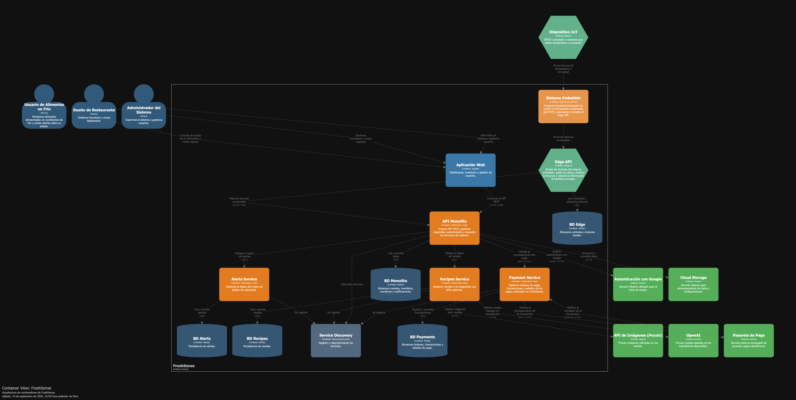
<figcaption style="font-size:0.9em;color:#555;margin-top:0.4em"><em>Software Architecture Container Level Diagram — FreshSense.</em></figcaption>
</figure>

Esta organización permite mantener las funcionalidades centrales del dominio dentro de una estructura modular, mientras que las responsabilidades con características técnicas diferentes, como la ingesta de telemetría y el procesamiento de notificaciones, pueden escalar y evolucionar de manera independiente.

El siguiente nivel describe cómo estos containers son desplegados sobre la infraestructura física y cloud utilizada por FreshSense.

### 4.3.4. Software Architecture Deployment Diagrams

El Software Architecture Deployment Diagram representa la distribución física y lógica de los principales elementos de FreshSense sobre los diferentes entornos de ejecución utilizados por la solución.

La arquitectura se distribuye principalmente entre los **dispositivos utilizados por los usuarios**, el **entorno IoT instalado en las zonas de conservación** y la **infraestructura cloud** donde se ejecutan los servicios principales de FreshSense.

En el entorno del usuario, propietarios, gerentes, administradores y colaboradores acceden a FreshSense mediante un navegador web desde computadoras, tablets o dispositivos móviles. Desde estos dispositivos se carga la aplicación web y se realizan las operaciones correspondientes según los permisos asignados al usuario.

En las zonas de conservación se encuentra instalado el **FreshSense IoT Device**, compuesto por el hardware de sensores y el sistema embebido responsable de obtener mediciones de **temperatura y humedad**. El dispositivo mantiene una relación con la zona de conservación configurada y transmite periódicamente las mediciones hacia la infraestructura backend de FreshSense utilizando una conexión segura.

La infraestructura cloud aloja los principales elementos de software de la plataforma. La **Web Application** proporciona la interfaz utilizada por los usuarios, mientras que el **Backend API** implementa las principales capacidades del dominio siguiendo la organización definida mediante los bounded contexts de FreshSense.

La recepción de las mediciones provenientes de los dispositivos IoT se realiza mediante el componente encargado de la **ingesta de telemetría**, que autentica el dispositivo, valida la información recibida y permite incorporarla al flujo de procesamiento de FreshSense.

Para los procesos que requieren comunicación asíncrona, como el procesamiento de telemetría y la generación de notificaciones, la arquitectura puede utilizar un mecanismo de mensajería que permita desacoplar los componentes productores de los consumidores correspondientes.

La información persistente de la plataforma se mantiene en la **base de datos operacional**, mientras que las consultas utilizadas frecuentemente pueden apoyarse en un mecanismo de **caché distribuida** para reducir el procesamiento repetitivo. La base de datos continúa siendo la fuente principal de información y el caché funciona únicamente como mecanismo de optimización.

Asimismo, la infraestructura se comunica con servicios externos encargados de la entrega de notificaciones y del procesamiento de pagos relacionados con las suscripciones de FreshSense.

Las comunicaciones entre los usuarios y la plataforma, así como entre FreshSense y los servicios externos, utilizan conexiones seguras mediante HTTPS. Los dispositivos IoT utilizan credenciales independientes para autenticar el envío de telemetría hacia la plataforma.

El siguiente diagrama representa la distribución de los principales elementos de FreshSense en sus respectivos entornos de ejecución.

<figure id="fig-c4d" style="margin:1.5em 0;text-align:center">
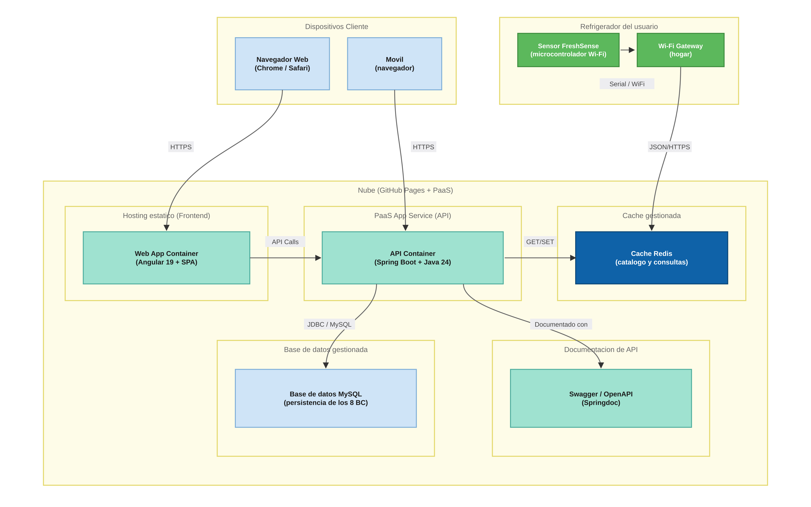
<figcaption style="font-size:0.9em;color:#555;margin-top:0.4em"><em>Software Architecture Deployment Diagram — FreshSense.</em></figcaption>
</figure>

Esta distribución permite separar el entorno físico encargado de obtener las condiciones de conservación, los dispositivos utilizados por los usuarios y la infraestructura encargada del procesamiento, almacenamiento e integración de la información. De esta manera, FreshSense puede evolucionar sus componentes de software sin depender directamente del hardware instalado y puede escalar los recursos de infraestructura de acuerdo con el crecimiento de la plataforma.

# Capítulo V: Tactical-Level Software Design

## 5.X. Bounded Context: <Bounded Context Name>

### 5.X.1. Domain Layer

### 5.X.2. Interface Layer

### 5.X.3. Application Layer

### 5.X.4. Infrastructure Layer

### 5.X.6. Bounded Context Software Architecture Component Level Diagrams

### 5.X.7. Bounded Context Software Architecture Code Level Diagrams

#### 5.X.7.1. Bounded Context Domain Layer Class Diagrams

#### 5.X.7.2. Bounded Context Database Design Diagram

# Capítulo VI: Solution UX Design

## 6.1. Style Guidelines

### 6.1.1. General Style Guidelines

### 6.1.2. Web, Mobile & Devices Style Guidelines

## 6.2. Information Architecture

### 6.2.2. Labeling Systems

### 6.2.3. Searching Systems

### 6.2.4. SEO Tags and Meta Tags

### 6.2.5. Navigation Systems

## 6.3. Landing Page UI Design

### 6.3.1. Landing Page Wireframe

### 6.3.2. Landing Page Mock-up

## 6.4. Applications UX/UI Design

### 6.4.1. Applications Wireframes

### 6.4.2. Applications Wireflow Diagrams

### 6.4.3. Applications Mock-ups

### 6.4.4. Applications User Flow Diagrams

## 6.5. Applications Prototyping

# Capítulo VII: Product Implementation, Validation & Deployment

## 7.1. Software Configuration Management

### 7.1.1. Software Development Environment Configuration

### 7.1.2. Source Code Management

### 7.1.3. Source Code Style Guide & Conventions

### 7.1.4. Software Deployment Configuration

## 7.2. Solution Implementation

### 7.2.X. Sprint n

#### 7.2.X.1. Sprint Planning n

#### 7.2.X.2. Sprint Backlog n

#### 7.2.X.3. Development Evidence for Sprint Review

#### 7.2.X.4. Testing Suite Evidence for Sprint Review

#### 7.2.X.5. Execution Evidence for Sprint Review

#### 7.2.X.6. Services Documentation Evidence for Sprint Review

#### 7.2.X.7. Software Deployment Evidence for Sprint Review

#### 7.2.X.8. Team Collaboration Insights during Sprint

## 7.3. Validation Interviews

### 7.3.1. Diseño de Entrevistas

### 7.3.2. Registro de Entrevistas

### 7.3.3. Evaluaciones según heurísticas

## 7.4. Video About-the-Product

# Conclusiones

# Conclusiones y recomendaciones

# Video About-the-Team

# Bibliografía

# Anexos
