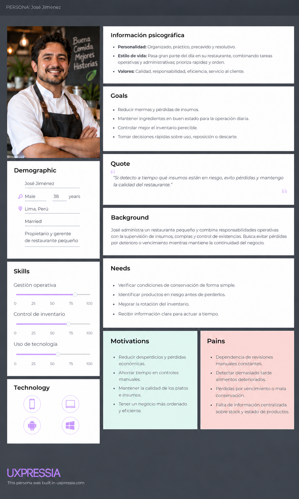
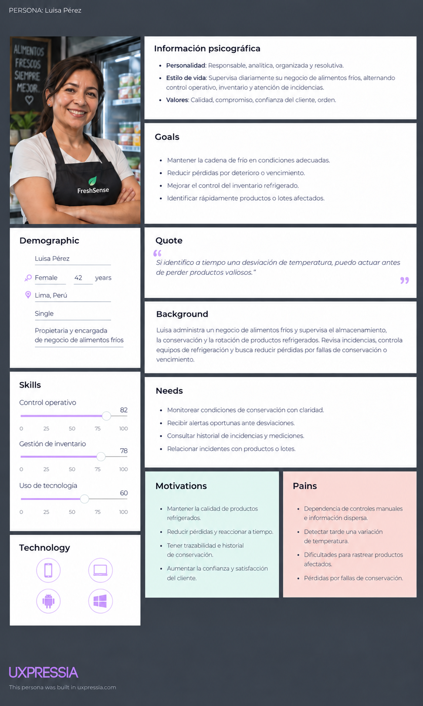
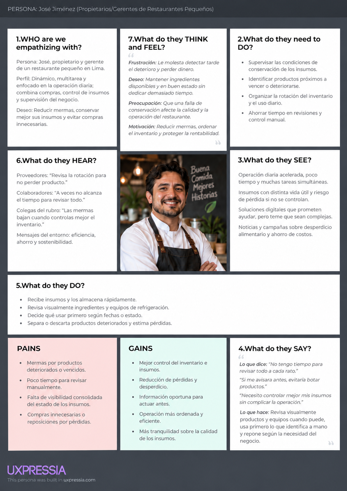
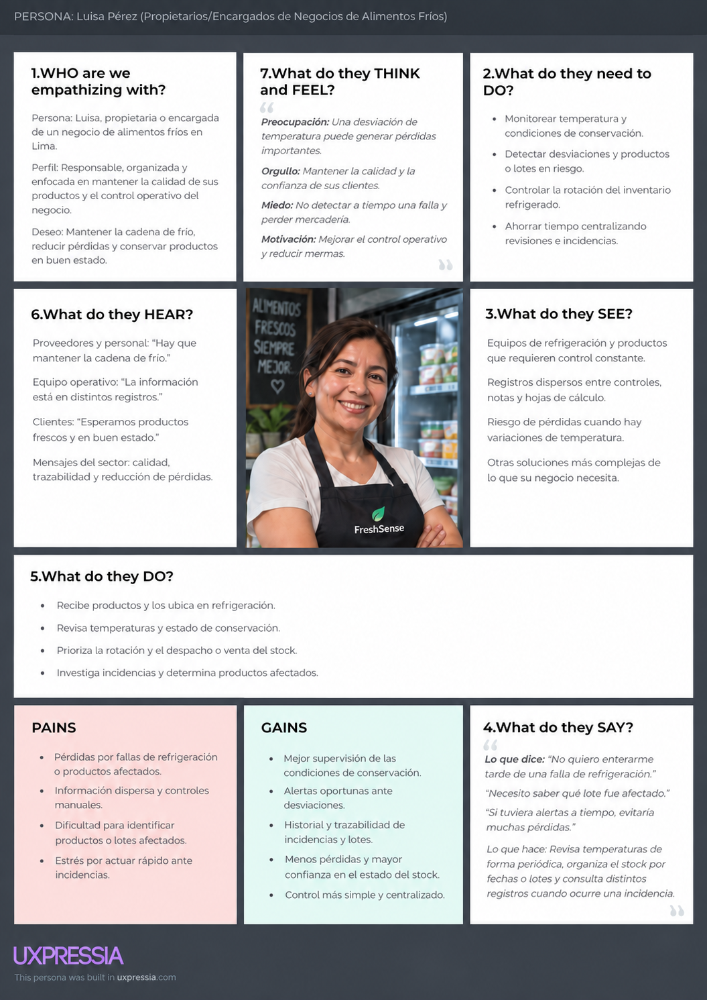
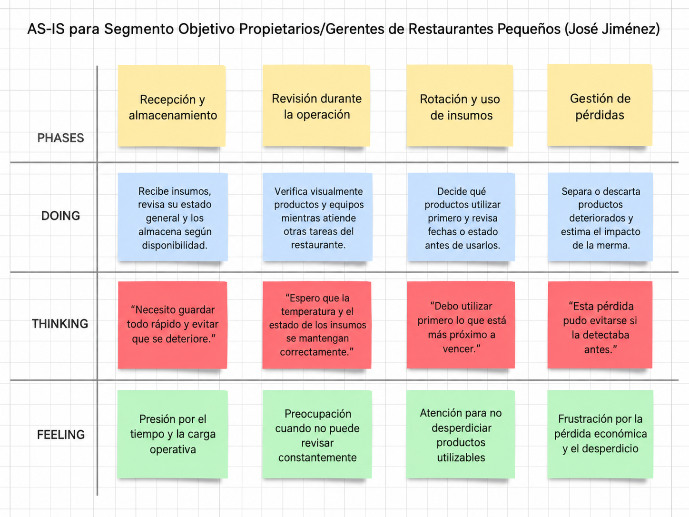
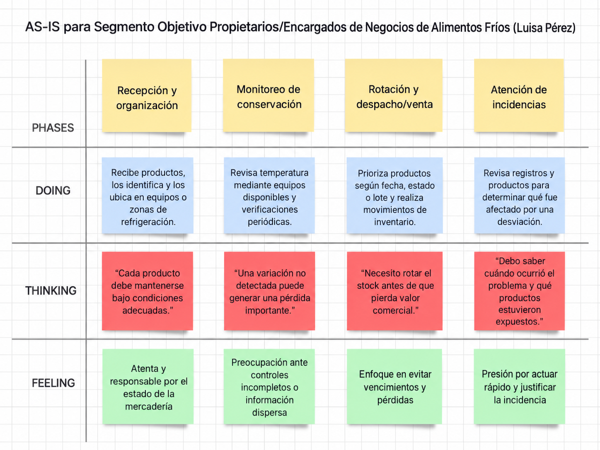

# report-G4

# Universidad Peruana de Ciencias Aplicadas

### Facultad de Ingeniería
### Carrera: Ingeniería de Software

**9.º ciclo**

**Nombre del curso:** Arquitecturas de Software Emergentes
**Sección:** 9075
**Código del curso:** : 1ASI0728 
**Periodo:** 202620  

**Nombre del profesor:** Wilder Aurelio Vega Calero

 

# *Informe de Trabajo Final*

 

**Nombre del Startup:** FreshEat  
**Nombre del Producto:** FreshSense

 

### Relación de Integrantes

| Apellidos y Nombres | Código |
|:-------------------:|:------:|
| Tuesta Marin, Romina Alejandra | U202211706 |

 

**Septiembre 2026**

# Registro de Versiones del Informe

| Versión | Fecha | Autor | Descripción de modificación |
|:------:|:-----:|:-----|:----------------------------|
| 1.0 | 08/09/2026 | Romina Tuesta Marin | Cargó archivos y actualizó la descripción de la Startup |

# Project Report Collaboration Insights

**AV1:**

# Tabla de contenidos

- [Student Outcome](#student-outcome)

- [Capítulo I: Introducción](#capítulo-i-introducción)
  - [1.1. Startup Profile](#11-startup-profile)
    - [1.1.1. Descripción de la Startup](#111-descripción-de-la-startup)
    - [1.1.2. Perfiles de integrantes del equipo](#112-perfiles-de-integrantes-del-equipo)
  - [1.2. Solution Profile](#12-solution-profile)
    - [1.2.1. Antecedentes y problemática](#121-antecedentes-y-problemática)
    - [1.2.2. Lean UX Process](#122-lean-ux-process)
      - [1.2.2.1. Lean UX Problem Statements](#1221-lean-ux-problem-statements)
      - [1.2.2.2. Lean UX Assumptions](#1222-lean-ux-assumptions)
      - [1.2.2.3. Lean UX Hypothesis Statements](#1223-lean-ux-hypothesis-statements)
      - [1.2.2.4. Lean UX Canvas](#1224-lean-ux-canvas)
  - [1.3. Segmentos objetivo](#13-segmentos-objetivo)

- [Capítulo II: Requirements Elicitation & Analysis](#capítulo-ii-requirements-elicitation--analysis)
  - [2.1. Competidores](#21-competidores)
    - [2.1.1. Análisis competitivo](#211-análisis-competitivo)
    - [2.1.2. Estrategias y tácticas frente a competidores](#212-estrategias-y-tácticas-frente-a-competidores)
  - [2.2. Entrevistas](#22-entrevistas)
    - [2.2.1. Diseño de entrevistas](#221-diseño-de-entrevistas)
    - [2.2.2. Registro de entrevistas](#222-registro-de-entrevistas)
    - [2.2.3. Análisis de entrevistas](#223-análisis-de-entrevistas)
  - [2.3. Needfinding](#23-needfinding)
    - [2.3.1. User Personas](#231-user-personas)
    - [2.3.2. User Task Matrix](#232-user-task-matrix)
    - [2.3.3. Empathy Mapping](#233-empathy-mapping)
    - [2.3.4. As-is Scenario Mapping](#234-as-is-scenario-mapping)
  - [2.4. Ubiquitous Language](#24-ubiquitous-language)

- [Capítulo III: Requirements Specification](#capítulo-iii-requirements-specification)
  - [3.1. To-Be Scenario Mapping](#31-to-be-scenario-mapping)
  - [3.2. User Stories](#32-user-stories)
  - [3.3. Impact Mapping](#33-impact-mapping)
  - [3.4. Product Backlog](#34-product-backlog)

- [Capítulo IV: Strategic-Level Software Design](#capítulo-iv-strategic-level-software-design)
  - [4.1. Strategic-Level Attribute-Driven Design](#41-strategic-level-attribute-driven-design)
    - [4.1.1. Design Purpose](#411-design-purpose)
    - [4.1.2. Attribute-Driven Design Inputs](#412-attribute-driven-design-inputs)
      - [4.1.2.1. Primary Functionality (Primary User Stories)](#4121-primary-functionality-primary-user-stories)
      - [4.1.2.2. Quality Attribute Scenarios](#4122-quality-attribute-scenarios)
      - [4.1.2.3. Constraints](#4123-constraints)
    - [4.1.3. Architectural Drivers Backlog](#413-architectural-drivers-backlog)
    - [4.1.4. Architectural Design Decisions](#414-architectural-design-decisions)
    - [4.1.5. Quality Attribute Scenario Refinements](#415-quality-attribute-scenario-refinements)
  - [4.2. Strategic-Level Domain-Driven Design](#42-strategic-level-domain-driven-design)
    - [4.2.1. EventStorming](#421-eventstorming)
    - [4.2.2. Candidate Context Discovery](#422-candidate-context-discovery)
    - [4.2.3. Domain Message Flows Modeling](#423-domain-message-flows-modeling)
    - [4.2.4. Bounded Context Canvases](#424-bounded-context-canvases)
    - [4.2.5. Context Mapping](#425-context-mapping)
  - [4.3. Software Architecture](#43-software-architecture)
    - [4.3.1. Software Architecture System Landscape Diagram](#431-software-architecture-system-landscape-diagram)
    - [4.3.2. Software Architecture Context Level Diagrams](#432-software-architecture-context-level-diagrams)
    - [4.3.3. Software Architecture Container Level Diagrams](#433-software-architecture-container-level-diagrams)
    - [4.3.4. Software Architecture Deployment Diagrams](#434-software-architecture-deployment-diagrams)

- [Capítulo V: Tactical-Level Software Design](#capítulo-v-tactical-level-software-design)
  - [5.X. Bounded Context: &lt;Bounded Context Name&gt;](#5x-bounded-context-bounded-context-name)
    - [5.X.1. Domain Layer](#5x1-domain-layer)
    - [5.X.2. Interface Layer](#5x2-interface-layer)
    - [5.X.3. Application Layer](#5x3-application-layer)
    - [5.X.4. Infrastructure Layer](#5x4-infrastructure-layer)
    - [5.X.6. Bounded Context Software Architecture Component Level Diagrams](#5x6-bounded-context-software-architecture-component-level-diagrams)
    - [5.X.7. Bounded Context Software Architecture Code Level Diagrams](#5x7-bounded-context-software-architecture-code-level-diagrams)
      - [5.X.7.1. Bounded Context Domain Layer Class Diagrams](#5x71-bounded-context-domain-layer-class-diagrams)
      - [5.X.7.2. Bounded Context Database Design Diagram](#5x72-bounded-context-database-design-diagram)

- [Capítulo VI: Solution UX Design](#capítulo-vi-solution-ux-design)
  - [6.1. Style Guidelines](#61-style-guidelines)
    - [6.1.1. General Style Guidelines](#611-general-style-guidelines)
    - [6.1.2. Web, Mobile & Devices Style Guidelines](#612-web-mobile--devices-style-guidelines)
  - [6.2. Information Architecture](#62-information-architecture)
    - [6.2.2. Labeling Systems](#622-labeling-systems)
    - [6.2.3. Searching Systems](#623-searching-systems)
    - [6.2.4. SEO Tags and Meta Tags](#624-seo-tags-and-meta-tags)
    - [6.2.5. Navigation Systems](#625-navigation-systems)
  - [6.3. Landing Page UI Design](#63-landing-page-ui-design)
    - [6.3.1. Landing Page Wireframe](#631-landing-page-wireframe)
    - [6.3.2. Landing Page Mock-up](#632-landing-page-mock-up)
  - [6.4. Applications UX/UI Design](#64-applications-uxui-design)
    - [6.4.1. Applications Wireframes](#641-applications-wireframes)
    - [6.4.2. Applications Wireflow Diagrams](#642-applications-wireflow-diagrams)
    - [6.4.3. Applications Mock-ups](#643-applications-mock-ups)
    - [6.4.4. Applications User Flow Diagrams](#644-applications-user-flow-diagrams)
  - [6.5. Applications Prototyping](#65-applications-prototyping)

- [Capítulo VII: Product Implementation, Validation & Deployment](#capítulo-vii-product-implementation-validation--deployment)
  - [7.1. Software Configuration Management](#71-software-configuration-management)
    - [7.1.1. Software Development Environment Configuration](#711-software-development-environment-configuration)
    - [7.1.2. Source Code Management](#712-source-code-management)
    - [7.1.3. Source Code Style Guide & Conventions](#713-source-code-style-guide--conventions)
    - [7.1.4. Software Deployment Configuration](#714-software-deployment-configuration)
  - [7.2. Solution Implementation](#72-solution-implementation)
    - [7.2.X. Sprint n](#72x-sprint-n)
      - [7.2.X.1. Sprint Planning n](#72x1-sprint-planning-n)
      - [7.2.X.2. Sprint Backlog n](#72x2-sprint-backlog-n)
      - [7.2.X.3. Development Evidence for Sprint Review](#72x3-development-evidence-for-sprint-review)
      - [7.2.X.4. Testing Suite Evidence for Sprint Review](#72x4-testing-suite-evidence-for-sprint-review)
      - [7.2.X.5. Execution Evidence for Sprint Review](#72x5-execution-evidence-for-sprint-review)
      - [7.2.X.6. Services Documentation Evidence for Sprint Review](#72x6-services-documentation-evidence-for-sprint-review)
      - [7.2.X.7. Software Deployment Evidence for Sprint Review](#72x7-software-deployment-evidence-for-sprint-review)
      - [7.2.X.8. Team Collaboration Insights during Sprint](#72x8-team-collaboration-insights-during-sprint)
  - [7.3. Validation Interviews](#73-validation-interviews)
    - [7.3.1. Diseño de Entrevistas](#731-diseño-de-entrevistas)
    - [7.3.2. Registro de Entrevistas](#732-registro-de-entrevistas)
    - [7.3.3. Evaluaciones según heurísticas](#733-evaluaciones-según-heurísticas)
  - [7.4. Video About-the-Product](#74-video-about-the-product)

- [Conclusiones](#conclusiones)
- [Conclusiones y recomendaciones](#conclusiones-y-recomendaciones)
- [Video About-the-Team](#video-about-the-team)
- [Bibliografía](#bibliografía)
- [Anexos](#anexos)

# Student Outcome

El curso contribuye al cumplimiento del Student Outcome ABET.

**ABET – EAC - Student Outcome 3**

Criterio: Capacidad de comunicarse efectivamente con un rango de audiencias.

| Criterio específico | Acciones realizadas | Conclusiones |
|:--------------------|:--------------------|:-------------|
| Comunica oralmente sus ideas y/o resultados con objetividad a público de diferentes especialidades y niveles jerarquicos, en el marco del desarrollo de un proyecto en ingeniería. | | |
| Comunica en forma escrita ideas y/o resultados con objetividad a público de diferentes especialidades y niveles jerarquicos, en el marco del desarrollo de un proyecto en ingeniería | | |

# Capítulo I: Introducción

## 1.1. Startup Profile

### 1.1.1. Descripción de la Startup

### 1.1.2. Perfiles de integrantes del equipo

## 1.2. Solution Profile

### 1.2.1. Antecedentes y problemática

El desperdicio de alimentos es un problema grave en el Perú tanto a nivel económico como ambiental. Según la información explicada en el II Foro Nacional de la Recuperación de Alimentos y Conmemoración del Día de Concienciación sobre la Pérdida y el Desperdicio de Alimentos en el Perú, realizado por la FOA (Organización de la Naciones Unidas para la Alimentación y la Agricultura) junto con MIDAGRI (Ministerio de Desarrollo Agrario y Riego) y PMA (Programa Mundial de Alimentos), en el país, 12.8 millones de toneladas de alimentos se pierden en la cadena de producción (FOA, 2024). Es un número muy preocupante considerando que el 51% de las familias peruanas está en situación de inseguridad alimentaria (Blas, 2022). A partir de ello, es claro que hay una relaciónestrecha entre el desperdicio de alimentos y la inseguridad alimentaria; el gobierno se está encargando de mitigar tal desperdicio mediante foros, proyectos, etc. Teniendo en cuenta este contexto, Enrique Román, representante asistente de FAO en Perú señala que los hogares peruanos representan el 16% en el desperdicio de alimentos (FAO, 2024), un porcentaje alarmante. Más aún, acorde a Alberto Huiman, doctor en Ciencias Ambientales, cada peruano genera un desperdicio de 67 kilogramos por año y los restaurantes es alrededor de 500 kilogramos por día. Esto complica gravemente la situación del país respecto a las pérdidas en el aspecto de alimentos.  

Para analizar con más detalle los antecedentes y problemáticas, se realizó con anticipación la técnica 5 ‘W’s & 2 ‘H’s:

## What? (¿Qué es?)

FreshSense es una aplicación web orientada a restaurantes y negocios de alimentos fríos que permite monitorear y gestionar el inventario de productos perecibles. Mediante alertas y notificaciones, ayuda a detectar oportunamente condiciones que pueden ocasionar el deterioro de los alimentos, facilitando decisiones para reducir mermas y pérdidas económicas.

#### Why? (¿Por qué?)

La falta de información precisa y oportuna sobre las condiciones de conservación de los alimentos dificulta detectar su deterioro antes de que se convierta en una pérdida. Esto puede generar desperdicio de productos, costos de reposición y una reducción de la rentabilidad del negocio.

#### Where? (¿Dónde?)

FreshSense está orientada a restaurantes y negocios de alimentos fríos, principalmente en espacios donde se almacenan productos perecibles, como refrigeradores, congeladores, cámaras de frío y almacenes.

#### When? (¿Cuándo?)

El problema ocurre durante el almacenamiento y conservación de los productos, especialmente cuando permanecen durante periodos prolongados sin un monitoreo adecuado de sus condiciones. FreshSense permite realizar un seguimiento continuo y recibir alertas para tomar decisiones oportunas.

#### Who? (¿Quién?)

Los principales usuarios de FreshSense son los propietarios, administradores y encargados de restaurantes, así como los responsables de negocios de alimentos fríos que necesitan controlar la conservación de sus productos, reducir mermas y proteger la rentabilidad del negocio.

#### How? (¿Cómo?)

FreshSense busca facilitar la gestión y conservación de los productos mediante:

* Registro y gestión del inventario de alimentos.
* Monitoreo de condiciones de conservación mediante sensores.
* Alertas ante condiciones que puedan afectar los productos.
* Notificaciones sobre productos próximos a deteriorarse o vencer.
* Reportes sobre pérdidas, rotación y estado del inventario.
* Sugerencias para aprovechar productos antes de que representen una pérdida económica.
* Acceso a la información desde diferentes dispositivos.

#### How much? (¿Cuánto?)

El desperdicio y deterioro de alimentos representa una pérdida económica para los negocios, ya que implica desechar productos que fueron adquiridos para su comercialización o utilización. FreshSense busca reducir estas pérdidas mediante el monitoreo y gestión preventiva del inventario.

El modelo de negocio considera:

* Suscripción mensual o anual para acceder a funcionalidades avanzadas.
* Venta del dispositivo sensor como pago único.
* Funcionalidades premium orientadas al análisis del inventario y las pérdidas económicas.

### 1.2.2. Lean UX Process

#### 1.2.2.1. Lean UX Problem Statements

Los restaurantes y negocios de alimentos fríos pueden sufrir pérdidas económicas debido al deterioro de productos perecibles que no es detectado oportunamente. La falta de monitoreo continuo de las condiciones de conservación dificulta tomar decisiones preventivas sobre el inventario, generando mermas, costos de reposición y reducción de la rentabilidad.

La gestión manual del inventario y las condiciones de conservación también dificulta conocer en tiempo real qué productos presentan mayor riesgo de deterioro y cuáles requieren atención prioritaria.

**Creemos que** reducir el desperdicio de alimentos permitirá a los negocios disminuir sus pérdidas económicas y mejorar su rentabilidad. **Sabremos que esto es cierto cuando** se observe una reducción medible de las pérdidas asociadas al deterioro de productos durante el periodo de evaluación.

**Creemos que** las alertas sobre condiciones de conservación y productos próximos a deteriorarse ayudarán a los usuarios a tomar decisiones oportunas. **Sabremos que esto es cierto cuando** los usuarios utilicen las alertas para realizar acciones preventivas sobre los productos identificados.

**Creemos que** permitir el acceso a la aplicación desde diferentes dispositivos facilitará el monitoreo del inventario durante la operación diaria. **Sabremos que esto es cierto cuando** los usuarios consulten regularmente el estado de sus productos desde al menos dos tipos de dispositivos.

**Creemos que** los reportes de pérdidas y rotación de inventario ayudarán a los administradores a identificar oportunidades para reducir mermas. **Sabremos que esto es cierto cuando** los usuarios consulten estos reportes para tomar decisiones relacionadas con su inventario.

#### 1.2.2.2. Lean UX Assumptions

##### Business Assumptions

* Creemos que nuestros usuarios necesitan una solución que les permita monitorear las condiciones de conservación de sus productos y gestionar su inventario para reducir pérdidas económicas. 

*  Estas necesidades pueden resolverse mediante una aplicación que centralice el inventario, las alertas de conservación y los reportes de pérdidas en una interfaz sencilla y accesible.

*  Nuestros clientes iniciales son restaurantes y negocios de alimentos fríos que manejan productos perecibles y buscan reducir mermas y proteger la rentabilidad de sus operaciones.

* El principal valor que el cliente requiere de FreshSense es conocer oportunamente el estado de sus productos para tomar decisiones antes de que estos representen una pérdida económica.

* Como beneficios adicionales, el cliente podrá acceder a reportes de inventario, análisis de pérdidas, alertas preventivas y recomendaciones para aprovechar productos próximos a deteriorarse.

* Adquiriremos clientes mediante una landing page, demostraciones del producto, marketing digital y estrategias de venta directa orientadas a los segmentos objetivo.

* Generaremos ingresos mediante la venta del dispositivo sensor y suscripciones para acceder a funcionalidades avanzadas.

* Nuestra competencia incluye métodos manuales de control de inventario, hojas de cálculo y sistemas genéricos de gestión de inventario.
  
* Nos diferenciaremos mediante una solución especializada en la conservación de productos perecibles, que combine monitoreo, alertas y gestión del inventario.

* Nuestros principales riesgos son la resistencia al cambio tecnológico, la preferencia por métodos manuales, el costo percibido de la solución y la dificultad para incorporar el sistema en las actividades diarias del negocio.

* Reduciremos estos riesgos mediante una interfaz sencilla, procesos de registro rápidos, funcionalidades enfocadas en las necesidades principales del usuario y una implementación que requiera la menor cantidad posible de cambios en su rutina.

* Sabremos que hemos tenido éxito cuando los negocios usuarios reduzcan sus pérdidas asociadas al deterioro de alimentos y utilicen regularmente la aplicación para gestionar su inventario.

##### Business Outcomes

* Reducir las pérdidas económicas ocasionadas por el deterioro de alimentos.
* Disminuir la merma de productos perecibles.
* Mejorar la rentabilidad de los negocios mediante una gestión eficiente del inventario.
* Lograr la adopción y retención de usuarios mediante una solución simple y útil.
* Generar ingresos recurrentes mediante la venta del dispositivo y suscripción premium.
* Validar un modelo de negocio escalable para restaurantes y negocios de alimentos fríos.

##### User Assumptions

###### ¿Quiénes serán nuestros usuarios?

**Nuestros usuarios principales son:**

* Propietarios y administradores de restaurantes que necesitan controlar sus insumos perecibles y reducir pérdidas económicas.
* Propietarios y encargados de negocios de alimentos fríos que necesitan monitorear la conservación de sus productos y reducir mermas.

###### ¿Dónde encaja nuestro producto en su vida o trabajo?

Para los restaurantes, FreshSense se integra en la gestión diaria de insumos, permitiendo conocer el estado de los productos, recibir alertas y tomar decisiones para evitar pérdidas.

Para los negocios de alimentos fríos, FreshSense se integra en el proceso de almacenamiento y conservación, proporcionando información sobre las condiciones de los productos y alertando ante situaciones que puedan generar pérdidas.

###### ¿Qué problemas tiene nuestro producto y cómo se pueden resolver?

**Problemas:**

* El control del inventario y conservación puede realizarse mediante inspecciones manuales o registros poco actualizados.
* Los usuarios pueden no detectar oportunamente condiciones que afectan la conservación de sus productos.
* El deterioro de alimentos genera merma, costos de reposición y reducción de la rentabilidad.
* El monitoreo manual consume tiempo durante las actividades operativas del negocio.

**Soluciones:**

* Implementar monitoreo de las condiciones de conservación.
* Generar alertas ante condiciones que puedan afectar los productos.
* Mostrar información del inventario de forma clara y accesible.
* Generar reportes que permitan identificar pérdidas y oportunidades de mejora.
* Facilitar decisiones preventivas para reducir la merma.

###### ¿Cómo y cuándo es usado nuestro producto?

FreshSense es utilizada por propietarios, administradores y encargados durante las actividades de almacenamiento, conservación y gestión del inventario. Los usuarios pueden consultar el estado de sus productos, recibir alertas y revisar información sobre pérdidas y rotación durante la jornada operativa.

###### ¿Qué características son importantes?

* Interfaz clara, sencilla y fácil de utilizar.
* Monitoreo de las condiciones de conservación.
* Alertas oportunas ante situaciones de riesgo.
* Gestión rápida del inventario.
* Reportes de pérdidas y rotación.
* Acceso desde diferentes dispositivos.

###### ¿Cómo debe verse y comportarse nuestro producto?

FreshSense debe presentar una interfaz profesional, clara y orientada a la consulta rápida de información crítica. La navegación debe permitir acceder fácilmente al estado del inventario, alertas y reportes sin requerir múltiples pasos.

La aplicación debe estar disponible durante la jornada operativa del negocio y permitir consultas desde dispositivos móviles y computadoras.

##### User Outcomes

* Reducción de pérdidas económicas por deterioro de alimentos.
* Reducción de productos desperdiciados o descartados.
* Mayor frecuencia de monitoreo del inventario.
* Identificación oportuna de productos en riesgo.
* Mejor planificación de compras y reposición.
* Mayor control sobre las condiciones de conservación.
* Mejora de la rentabilidad mediante la reducción de mermas.

##### Features Assumptions

**Desde la cuenta de un restaurante:**

* Registrar alimentos e ingredientes, incluyendo cantidad, fecha de vencimiento y costo.
* Recibir alertas sobre productos próximos a deteriorarse.
* Consultar las condiciones de conservación de los productos.
* Recibir sugerencias para aprovechar productos próximos a deteriorarse.
* Generar reportes de rotación y pérdidas.

**Desde la cuenta de un negocio de alimentos fríos:**

* Registrar productos y cantidades disponibles.
* Monitorear las condiciones de conservación.
* Recibir alertas ante cambios que puedan afectar los productos.
* Identificar productos próximos a deteriorarse o vencer.
* Consultar reportes sobre pérdidas, rotación y estado del inventario.

#### 1.2.2.3. Lean UX Hypothesis Statements

**Creemos que** los restaurantes y negocios de alimentos fríos necesitan una solución que les permita monitorear sus productos y detectar oportunamente condiciones que puedan generar pérdidas económicas.

**Creemos que** las alertas de deterioro y las sugerencias de comercialización ayudarán a los negocios a reducir la merma de productos.

**Creemos que** la carga rápida del inventario facilitará la adopción de la aplicación sin alterar significativamente las actividades diarias de los usuarios.

**Creemos que** los reportes de pérdidas y rotación ayudarán a los administradores a identificar oportunidades para reducir costos y mejorar la rentabilidad.

**Creemos que** una aplicación accesible desde diferentes dispositivos facilitará el monitoreo del inventario durante la operación diaria.

**Sabremos que estas hipótesis son válidas cuando** los usuarios utilicen regularmente las funcionalidades de monitoreo, alertas y reportes, y se observe una reducción medible de las pérdidas económicas asociadas al deterioro de alimentos.

#### 1.2.2.4. Lean UX Canvas

A continuación se presenta el Lean UX Canvas:

## 1.3. Segmentos objetivo

Para el proyecto FreshSense se han seleccionado dos segmentos principales de usuarios a los cuales la solución aporta un valor adaptado a sus necesidades específicas:

##### Propietarios y Gerentes de Restaurantes Pequeños

**Edad:** 28 a 50 años

**Perfil:** Emprendedores que administran restaurantes pequeños y gestionan insumos perecibles para la preparación de alimentos.

**Estilo de vida:** Dinámico y enfocado en las operaciones diarias, atención al cliente y control del negocio.

**Uso de tecnología:** Frecuente, principalmente mediante dispositivos móviles y computadoras para realizar consultas rápidas.

**Necesidad principal:** Controlar y conservar adecuadamente los insumos perecibles para reducir desperdicios, pérdidas económicas y costos innecesarios.

**Beneficios buscados:** Alertas sobre productos en riesgo de deterioro, monitoreo de las condiciones de conservación, gestión del inventario y reportes que permitan identificar pérdidas y mejorar la rentabilidad.

##### Propietarios y Encargados de Negocios de Alimentos Fríos

**Edad:** 30 a 55 años

**Perfil:** Emprendedores y encargados de negocios dedicados al almacenamiento, conservación y comercialización de productos que requieren cadena de frío.

**Estilo de vida:** Ocupado y enfocado en la operación diaria, supervisión de productos, atención al cliente y gestión del inventario.

**Uso de tecnología:** Moderado a frecuente, con disposición a utilizar herramientas que faciliten el monitoreo y control de sus productos.

**Necesidad principal:** Mantener las condiciones adecuadas de conservación para reducir el deterioro de productos, las mermas y las pérdidas económicas.

**Beneficios buscados:** Monitoreo de las condiciones de conservación, alertas ante posibles riesgos, información sobre el estado del inventario y reportes que permitan identificar pérdidas y mejorar la rentabilidad del negocio.

# Capítulo II: Requirements Elicitation & Analysis

## 2.1. Competidores

El análisis de competidores de FreshSense se enfoca en soluciones relacionadas con el monitoreo de cadena de frío, control de condiciones ambientales, trazabilidad y supervisión de productos alimenticios perecibles. El análisis se realiza considerando los dos segmentos objetivo definidos para el proyecto:

- **Segmento 1: Propietarios y Gerentes de Restaurantes Pequeños.**
- **Segmento 2: Propietarios y Encargados de Negocios de Alimentos Fríos.**

Debido a que los competidores identificados poseen un alcance empresarial y logístico mayor que el planteado inicialmente para FreshSense, se consideran principalmente **competidores indirectos y referentes tecnológicos**. Las soluciones seleccionadas son:

- **Sensitech**
- **Tive**
- **Roambee**

Estas soluciones presentan similitudes con FreshSense en el monitoreo de variables ambientales, generación de alertas y visualización de información mediante plataformas digitales. Sin embargo, se diferencian por su nivel de especialización, mercados atendidos, alcance internacional y complejidad tecnológica.

### 2.1.1. Análisis competitivo

El objetivo de este análisis es responder la siguiente pregunta:

> **¿Cómo puede FreshSense diferenciarse de las soluciones existentes de monitoreo de cadena de frío mediante una propuesta accesible y especializada para pequeños restaurantes y negocios de alimentos fríos, orientada a reducir pérdidas por deterioro y facilitar el control de conservación e inventario?**

Los competidores seleccionados representan alternativas consolidadas dentro del mercado de monitoreo de condiciones y visibilidad de cadena de suministro.

#### Competitive Analysis Landscape

| Criterio | FreshSense | Sensitech | Tive | Roambee |
|---|---|---|---|---|
| **Tipo de competidor** | Startup analizada | Indirecto / referente | Indirecto / referente | Indirecto / referente |
| **Overview** | Solución IoT enfocada en el monitoreo de productos perecibles mediante dispositivos que recopilan temperatura y humedad y transmiten información hacia una plataforma digital. | Empresa especializada en visibilidad y monitoreo de cadena de frío, con soluciones para almacenamiento y transporte de productos sensibles. | Plataforma de visibilidad logística en tiempo real que combina rastreadores IoT con una plataforma cloud para monitorear envíos. | Plataforma de visibilidad de cadena de suministro que combina dispositivos IoT, sensores, conectividad y análisis para monitorear mercancías y activos. |
| **Ventaja competitiva** | Propuesta enfocada específicamente en empresas que trabajan con alimentos perecibles, con una arquitectura simplificada basada en dispositivos IoT, monitoreo de lotes, alertas y trazabilidad. | Amplio portafolio especializado en cadena de frío, experiencia empresarial y soluciones para almacenamiento y transporte. | Amplia capacidad de monitoreo multimodal y dispositivos capaces de medir múltiples variables en tiempo real. | Integración de monitoreo de condiciones, ubicación, analítica y visibilidad logística en una misma plataforma. |
| **Valor ofrecido al cliente** | Centralizar información sobre condiciones de conservación, dispositivos, lotes y alertas para detectar desviaciones y reducir pérdidas por deterioro. | Proteger la integridad de productos mediante monitoreo continuo, alertas y visibilidad de extremo a extremo. | Detectar desviaciones durante el transporte en tiempo real para actuar antes de que el producto resulte comprometido. | Proporcionar información en tiempo real y señales relacionadas con condiciones y ubicación para mejorar la toma de decisiones logísticas. |
| **Mercado objetivo** | Propietarios/Gerentes de Restaurantes Pequeños; Propietarios/Encargados de Negocios de Alimentos Fríos. | Alimentos, ciencias de la vida, industria y organizaciones con cadenas de suministro sensibles a temperatura. | Alimentos y bebidas, productos perecibles, farmacéutica, ciencias de la vida, bienes de alto valor y operadores logísticos. | Empresas de logística, alimentos y bebidas, farmacéutica, manufactura y organizaciones con cadenas de suministro complejas. |
| **Estrategia de marketing** | Marketing B2B orientado a demostrar reducción de pérdidas, control de condiciones y facilidad de monitoreo. | Demostraciones comerciales, contenido especializado, casos de uso e información dirigida a industrias reguladas y cadenas de frío. | Demostraciones, pruebas de producto, contenido especializado y comunicación centrada en visibilidad logística y prevención de pérdidas. | Demostraciones, pruebas del servicio, contenido sobre supply chain y comunicación orientada a visibilidad y analítica logística. |
| **Productos y servicios** | Dispositivo IoT con ESP32 + DHT22, Edge API, plataforma Web/Mobile, monitoreo de temperatura y humedad, lotes, dispositivos, alertas, trazabilidad y reportes. | SensiWatch Platform, TempTale, ColdStream Site y distintos sensores/registradores para monitoreo estacionario y en tránsito. | Plataforma Tive, trackers Solo Lite, Solo 5G, Solo Pro, sensores, alertas, reportes e integraciones. | Plataforma de visibilidad, dispositivos como BeeSense, monitoreo de temperatura, humedad, ubicación y eventos de transporte. |
| **Precios y costos** | Modelo previsto basado en dispositivo IoT y servicio digital. Los precios comerciales deben validarse posteriormente con los segmentos objetivo. | No publica una lista estándar de precios; el acceso comercial se gestiona mediante contacto y demostración. | Los precios de los trackers principales no se publican de forma general y dependen del volumen y contrato. La plataforma dispone de niveles Essential, Plus y Premium. | Utiliza modelos de suscripción y planes bajo demanda definidos mediante órdenes comerciales según cantidad de dispositivos, activos o envíos. |
| **Canales de distribución** | Landing Page, Web Application y Mobile Application. | Plataforma web, aplicación móvil y contacto comercial. | Plataforma web, integraciones/API y soluciones de seguimiento accesibles digitalmente. | Plataforma web, aplicación móvil, API y contacto comercial. |

### Sensitech

Sensitech ofrece soluciones de monitoreo de cadena de frío tanto para productos almacenados como transportados. Su sistema de monitoreo estacionario permite controlar temperatura y humedad en almacenes e instalaciones, consultar datos históricos y en tiempo real y generar alertas cuando las condiciones salen de los rangos establecidos.

También dispone de la plataforma SensiWatch, que proporciona visibilidad de extremo a extremo de la cadena de suministro y acceso a información desde dispositivos móviles.

#### SWOT - Sensitech

**Fortalezas**

- Amplio portafolio especializado en cadena de frío.
- Monitoreo estacionario y durante transporte.
- Soporte para temperatura, humedad y otras variables.
- Alertas y datos en tiempo real.
- Experiencia en sectores como alimentos y ciencias de la vida.
- Plataforma Web y aplicación móvil.

**Debilidades**

- Solución empresarial de mayor complejidad que puede requerir procesos de implementación y contratación más extensos.
- No ofrece precios públicos estándar para sus principales soluciones.
- Su amplio alcance puede resultar superior a las necesidades de empresas que requieren únicamente monitoreo básico de alimentos perecibles.

**Oportunidades**

- Crecimiento de la digitalización en cadenas de frío.
- Mayor necesidad de trazabilidad y reducción de pérdidas de productos sensibles.
- Incremento de requisitos de control y cumplimiento en cadenas logísticas.

**Amenazas**

- Aparición de soluciones IoT de menor costo.
- Empresas que desarrollen sistemas internos utilizando sensores y plataformas cloud.
- Competidores especializados en soluciones más simples para sectores específicos.

### Tive

Tive ofrece monitoreo de cadena de frío en tiempo real utilizando dispositivos capaces de recopilar información sobre temperatura, humedad, luz, impactos y ubicación.

Su plataforma permite supervisar envíos por transporte terrestre, marítimo, aéreo y ferroviario y generar alertas cuando las condiciones se encuentran fuera de los rangos establecidos.

#### SWOT - Tive

**Fortalezas**

- Monitoreo en tiempo real de múltiples variables.
- Seguimiento multimodal de envíos.
- Amplia cobertura de conectividad.
- Diversos modelos de trackers según el nivel de monitoreo requerido.
- Alertas automáticas e historial de los envíos.
- Integraciones mediante API y webhooks.

**Debilidades**

- Orientación principal hacia monitoreo de mercancías en tránsito.
- La oferta puede resultar más compleja para organizaciones que solo necesitan monitorear instalaciones o lotes específicos.
- Los precios de los dispositivos principales dependen de cotización y volumen.

**Oportunidades**

- Crecimiento del comercio y logística de productos sensibles.
- Mayor demanda de monitoreo en tiempo real.
- Integración con sistemas empresariales y plataformas logísticas.

**Amenazas**

- Competidores globales con soluciones equivalentes de seguimiento IoT.
- Reducción del costo de sensores y conectividad que facilita la entrada de nuevas soluciones.
- Desarrollo de plataformas de monitoreo propias por grandes operadores logísticos.

### Roambee

Roambee desarrolla soluciones de visibilidad de cadena de suministro mediante dispositivos IoT y servicios cloud.

Sus soluciones permiten monitorear condiciones como temperatura y humedad, además de eventos relacionados con ubicación y transporte. La plataforma genera alertas y señales para apoyar la toma de decisiones durante operaciones logísticas.

#### SWOT - Roambee

**Fortalezas**

- Combina monitoreo de condiciones y ubicación.
- Dispositivos con múltiples sensores.
- Plataforma orientada a visibilidad logística empresarial.
- Integración mediante API.
- Opciones de servicio y suscripción según necesidades de monitoreo.
- Capacidad para trabajar con operaciones logísticas de gran escala.

**Debilidades**

- Solución de mayor alcance y complejidad que un sistema enfocado únicamente en conservación de alimentos.
- Costos dependientes de contratos, dispositivos y volumen de operaciones.
- Su propuesta está orientada a supply chain visibility de forma amplia y no exclusivamente al sector de alimentos perecibles.

**Oportunidades**

- Mayor adopción de IoT en transporte y logística.
- Demanda creciente de información en tiempo real.
- Necesidad empresarial de reducir interrupciones y pérdidas en cadenas de suministro.

**Amenazas**

- Alta competencia en plataformas de supply chain visibility.
- Evolución rápida de sensores IoT y plataformas de análisis.
- Aparición de alternativas especializadas de menor costo.

### SWOT - FreshSense

**Fortalezas**

- Enfoque específico en productos alimenticios perecibles.
- Integración de dispositivos IoT con una plataforma digital.
- Monitoreo de temperatura y humedad.
- Gestión centralizada de dispositivos y lotes.
- Generación de alertas ante condiciones que requieren atención.
- Arquitectura preparada para Web y Mobile.
- Propuesta orientada a trazabilidad y reducción de pérdidas.

**Debilidades**

- Producto aún en etapa de desarrollo y validación.
- Menor cantidad de variables monitoreadas frente a competidores internacionales.
- Menor cobertura tecnológica y comercial.
- Dependencia inicial de sensores y conectividad del dispositivo.
- Modelo comercial y precios aún pendientes de validación con usuarios empresariales.

**Oportunidades**

- Digitalización de pequeños restaurantes y negocios dedicados al almacenamiento o comercialización de alimentos fríos.
- Necesidad de reducir pérdidas provocadas por una conservación inadecuada.
- Crecimiento de soluciones IoT accesibles.
- Posibilidad de adaptar la solución a necesidades específicas del mercado local.
- Incorporación futura de sensores adicionales y analítica avanzada.

**Amenazas**

- Presencia de competidores internacionales consolidados.
- Reducción de precios de soluciones comerciales existentes.
- Resistencia de algunas empresas a reemplazar procesos manuales.
- Entrada de nuevos proveedores de soluciones IoT.
- Dependencia de la correcta instalación y conectividad de los dispositivos.

### Conclusión del análisis competitivo

El análisis evidencia que FreshSense se desenvolvería en un mercado donde existen soluciones consolidadas con capacidades superiores en cobertura global, cantidad de sensores e infraestructura tecnológica.

Sensitech presenta una propuesta especialmente fuerte en monitoreo de cadena de frío tanto estacionario como en tránsito; Tive destaca por el seguimiento multimodal y la captura de múltiples variables en tiempo real; y Roambee ofrece una solución amplia de visibilidad y monitoreo de cadenas de suministro.

Frente a estos referentes, FreshSense no busca competir inicialmente por amplitud tecnológica. Su oportunidad de diferenciación se encuentra en adaptar el monitoreo de condiciones de conservación a una experiencia más simple y específica para **Propietarios/Gerentes de Restaurantes Pequeños** y **Propietarios/Encargados de Negocios de Alimentos Fríos**. La propuesta busca relacionar el estado de conservación con inventario, lotes, alertas e historial de condiciones, priorizando la reducción de mermas y pérdidas económicas.

### 2.1.2. Estrategias y tácticas frente a competidores

A partir del análisis competitivo, FreshSense plantea una estrategia de diferenciación basada en especialización, simplicidad y adaptación a los segmentos objetivo.

- **Especialización en alimentos perecibles:** orientar la experiencia y terminología a la conservación de insumos de restaurantes y productos almacenados o comercializados bajo refrigeración.

- **Implementación progresiva:** facilitar que el negocio pueda comenzar con un número reducido de dispositivos o zonas monitoreadas y ampliar posteriormente el alcance.

- **Experiencia simplificada:** concentrar la interacción en tareas relevantes para los segmentos, como verificar condiciones de conservación, controlar inventario o lotes, revisar incidencias y consultar historial.

- **Adaptación al contexto de pequeños negocios:** evitar replicar la complejidad de plataformas empresariales de gran escala y priorizar una solución comprensible para responsables que combinan tareas operativas y administrativas.

- **Modelo comercial flexible:** evaluar alternativas que combinen el dispositivo de monitoreo con el acceso al servicio digital, dejando la definición final de precios sujeta a validación con los segmentos objetivo.

- **Alertas orientadas a la acción:** priorizar avisos que permitan detectar desviaciones de conservación y actuar antes de que se produzcan pérdidas mayores.

- **Trazabilidad centralizada:** conservar el historial de condiciones e incidencias vinculadas con productos, inventario o lotes cuando corresponda al proceso del negocio.

- **Evolución tecnológica gradual:** mantener la posibilidad de incorporar nuevos sensores, capacidades de conectividad y funciones analíticas conforme evolucionen las necesidades de los usuarios.

Estas estrategias buscan que FreshSense se diferencie mediante una propuesta focalizada en los problemas operativos de conservación y desperdicio de alimentos de sus segmentos objetivo, en lugar de intentar replicar desde el inicio la amplitud funcional de plataformas internacionales consolidadas.

## 2.2. Entrevistas

Las entrevistas constituyen una fuente de información para comprender problemas, necesidades y prácticas relacionadas con la conservación de alimentos perecibles. Para esta versión del informe se conservan las **seis entrevistas realizadas durante la exploración inicial del dominio**, sin modificar la identidad, cargo, respuestas ni evidencia de los participantes.

Los entrevistados disponibles corresponden principalmente a responsables de logística, almacén, operaciones, calidad y cadena de frío. Por ello, sus hallazgos se utilizan como evidencia del problema transversal de conservación, monitoreo, lotes e incidencias. La interpretación de estos resultados se alinea con los segmentos objetivo definitivos del proyecto:

- **Segmento 1: Propietarios y Gerentes de Restaurantes Pequeños.**
- **Segmento 2: Propietarios y Encargados de Negocios de Alimentos Fríos.**

La evidencia disponible tiene una relación más directa con el segundo segmento. Para el primer segmento, los hallazgos se utilizan únicamente cuando describen necesidades transferibles al contexto de conservación de insumos perecibles; no se atribuyen a los entrevistados características propias de un restaurante que no hayan sido registradas.

### 2.2.1. Diseño de entrevistas

Las entrevistas realizadas fueron de tipo semiestructurado. La guía se orientó a conocer el contexto de trabajo de los participantes, los procesos actuales de conservación de productos perecibles, los problemas encontrados, las herramientas utilizadas y los criterios de adopción de una posible solución de monitoreo.

Las preguntas principales consideradas durante la investigación fueron las siguientes:

1. ¿Cuál es su cargo y qué responsabilidades tiene relacionadas con almacenamiento, conservación, calidad, transporte o comercialización de alimentos perecibles?
2. ¿Qué tipo de productos perecibles maneja y cuáles requieren mayor control de sus condiciones de conservación?
3. ¿Cómo monitorean actualmente variables como temperatura y humedad durante el almacenamiento o transporte?
4. ¿Qué problemas de conservación, deterioro o ruptura de la cadena de frío se presentan con mayor frecuencia?
5. ¿Qué consecuencias económicas, operativas o de calidad generan estas incidencias?
6. ¿Qué herramientas utilizan actualmente para controlar las condiciones de conservación: termómetros, sensores, registradores, hojas de cálculo, sistemas de inventario u otras?
7. ¿Con qué frecuencia revisan las condiciones de almacenamiento y qué información consideran más importante consultar?
8. ¿Qué tan útil sería recibir alertas automáticas cuando las condiciones se encuentren fuera de los límites establecidos?
9. ¿Cómo identifican y realizan actualmente el seguimiento de los lotes o grupos de productos?
10. Cuando ocurre una incidencia, ¿qué tan sencillo es identificar los productos o lotes que podrían haber sido afectados?
11. ¿Qué características debería tener una solución de monitoreo para que resulte útil y sencilla de implementar?
12. ¿Qué factores influirían más en una decisión de adopción: costo, precisión, facilidad de uso, instalación, trazabilidad, alertas, reportes, soporte u otros?

Además de las respuestas funcionales, el análisis considera características observables de los entrevistados como rol, responsabilidades, uso de herramientas digitales y principales frustraciones operativas, de modo que los hallazgos puedan alimentar los artefactos posteriores de Needfinding.

### 2.2.2. Registro de entrevistas

##### Entrevista 1

| Dato | Información |
| --- | --- |
| Nombre y apellidos | Carlos Mendoza Ruiz |
| Edad | 26 años |
| Distrito | Callao |
| Empresa / sector | Distribución refrigerada de alimentos |
| Cargo | Supervisor de Logística |
| Inicio de entrevista | 00:00 |
| Duración | 08:42 |
| Enlace | [Ver entrevista](URL) |

**Resumen:**  
Carlos Mendoza trabaja como supervisor de logística en una empresa dedicada a la distribución refrigerada de alimentos. Dentro de sus funciones supervisa el almacenamiento y transporte de productos como lácteos, carnes y alimentos congelados.

Explicó que actualmente realizan el control de temperatura mediante termómetros instalados en cámaras de refrigeración y registradores ubicados en algunas unidades de transporte. Parte de la información es revisada manualmente y posteriormente registrada en hojas de cálculo.

Señaló que uno de los principales problemas ocurre cuando existen variaciones de temperatura durante el transporte y estas se detectan recién al finalizar el recorrido. Este tipo de incidencias puede ocasionar revisión adicional de mercadería, retrasos y, en algunos casos, pérdida de productos.

Considera que recibir alertas automáticas sería especialmente útil para reaccionar antes de que una desviación genere un daño importante. Entre la información que considera prioritaria se encuentran la temperatura, humedad, ubicación del producto, identificación del lote y el historial de lecturas.

También indicó que una solución como FreshSense debería ser fácil de instalar, contar con información clara y permitir revisar rápidamente qué producto o lote fue afectado. Para una eventual adopción considera importantes la precisión de los sensores, el precio y la disponibilidad de soporte técnico.

##### Entrevista 2

| Dato | Información |
| --- | --- |
| Nombre y apellidos | Carlos Guimaraes |
| Edad | 27 años |
| Distrito | Villa El Salvador |
| Empresa / sector | Producción y almacenamiento de carnes y productos congelados |
| Cargo | Jefe de Almacén |
| Inicio de entrevista | 0:00 |
| Duración | 08:36 |
| Enlace | [Ver entrevista](https://drive.google.com/file/d/1Q8i84GD9mqFdKOLVYLR2PqdWQVT1MYik/view?usp=drive_link) |

**Resumen:**  
Carlos Guimaraes se desempeña como jefe de almacén en una empresa que trabaja con carnes y productos congelados. Dentro de sus funciones se encuentra supervisar el ingreso y salida de mercadería, verificar las condiciones de las cámaras frigoríficas y coordinar el movimiento de los diferentes lotes almacenados.

Explicó que los controles se realizan mediante termómetros instalados en las cámaras y verificaciones periódicas del personal. La identificación de lotes se gestiona mediante registros internos y etiquetas asociadas a cada ingreso de mercadería.

Indicó que los principales problemas pueden aparecer cuando existen fallas en los equipos de refrigeración o cuando las cámaras permanecen abiertas durante demasiado tiempo. Estas situaciones pueden ocasionar incrementos temporales de temperatura que deben ser identificados rápidamente.

Considera especialmente útil contar con alertas que indiquen cuándo una cámara o producto se encuentra fuera del rango permitido. También mencionó que sería importante identificar rápidamente qué lotes se encontraban almacenados durante una incidencia.

Para una posible implementación, considera relevantes el costo del sistema, la facilidad de instalación, la confiabilidad de las mediciones y la disponibilidad de soporte técnico.

##### Entrevista 3

| Dato | Información |
| --- | --- |
| Nombre y apellidos | Daniela Vargas Medina |
| Edad | 22 años |
| Distrito | Lurín |
| Empresa / sector | Comercialización y almacenamiento de frutas y vegetales |
| Cargo | Coordinadora de Operaciones |
| Inicio de entrevista | 00:00 |
| Duración | 09:04 |
| Enlace | [Ver entrevista](https://drive.google.com/file/d/1AqFpCV5FGpSXy3RIi9gN7BdsXJm4ywSU/view?usp=drive_link) |

**Resumen:**  
Daniela Vargas trabaja como coordinadora de operaciones en una empresa dedicada al almacenamiento y comercialización de frutas y vegetales. Sus responsabilidades incluyen coordinar el ingreso de productos, revisar el inventario disponible y supervisar las condiciones generales de almacenamiento.

Comentó que algunos controles de temperatura se realizan mediante equipos instalados en las cámaras, mientras que la revisión de humedad y estado de los productos depende en mayor medida de inspecciones realizadas por el personal.

Uno de los problemas que identifica es que diferentes productos requieren condiciones distintas de conservación y no siempre resulta sencillo mantener un seguimiento constante de todos los lotes almacenados.

Considera que una plataforma que permita visualizar lotes, condiciones ambientales e incidencias desde un mismo lugar ayudaría a mejorar el control de la operación. También considera útil contar con alertas configurables según el tipo de producto.

Entre las funcionalidades que considera importantes destacó el historial de mediciones, los reportes, la identificación de lotes afectados y una interfaz sencilla que pueda ser utilizada tanto por responsables de operaciones como por personal de calidad.

##### Entrevista 4

| Dato | Información |
| --- | --- |
| Nombre y apellidos | María Fernanda Rojas Díaz |
| Edad | 36 años |
| Distrito | Santa Anita |
| Empresa / sector | Producción y comercialización de productos lácteos |
| Cargo | Supervisora de Calidad |
| Inicio de entrevista | 00:00 |
| Duración | 09:18 |
| Enlace | [Ver entrevista](https://drive.google.com/file/d/1yaP9FCvV9rKo09GO2Eu2jYF9UUS8Ujob/view?usp=drive_link) |

**Resumen:**  
María Fernanda Rojas trabaja como supervisora de calidad en una empresa dedicada a la producción y comercialización de productos lácteos. Entre sus responsabilidades se encuentra verificar las condiciones de almacenamiento de productos terminados y coordinar controles relacionados con temperatura y calidad.

Comentó que actualmente utilizan termómetros digitales y realizan registros periódicos de temperatura en las áreas de almacenamiento. Parte de esta información es trasladada posteriormente a hojas de cálculo para mantener evidencia de los controles realizados.

Según indicó, uno de los principales problemas se presenta cuando una desviación ocurre entre dos controles manuales, debido a que puede pasar cierto tiempo antes de ser detectada. Esto puede generar revisiones adicionales del producto y, en algunos casos, la separación de lotes hasta confirmar que mantienen condiciones adecuadas.

Considera que contar con información disponible en tiempo real y recibir alertas automáticas facilitaría el trabajo del área de calidad. También considera importante poder revisar el historial de temperatura y humedad correspondiente a cada lote.

Entre los factores más relevantes para adoptar una solución de este tipo destacó la precisión de los sensores, la facilidad de uso, la generación de reportes y la posibilidad de acceder a información histórica.

##### Entrevista 5

| Dato | Información |
| --- | --- |
| Nombre y apellidos | Andrea Salazar Paredes |
| Edad | 29 años |
| Distrito | Ate |
| Empresa / sector | Operador logístico de productos refrigerados |
| Cargo | Coordinadora de Operaciones |
| Inicio de entrevista | 00:00 |
| Duración | 09:15 |
| Enlace | [Ver entrevista](https://drive.google.com/file/d/1iQW9Vu0lRPL9HhDX3PIfNHNQqrBESufE/view?usp=drive_link) |

**Resumen:**  
Andrea Salazar se desempeña como coordinadora de operaciones en una empresa que almacena y distribuye productos refrigerados para diferentes clientes del sector alimentario.

Indicó que la empresa trabaja con cámaras de refrigeración y vehículos acondicionados para mantener determinadas temperaturas. El control se realiza mediante sensores en algunos puntos de almacenamiento y verificaciones periódicas efectuadas por el personal.

Comentó que una dificultad importante es que la información de almacenamiento, transporte y lotes se encuentra distribuida entre diferentes registros. Cuando ocurre una incidencia, identificar cuándo sucedió y qué mercadería estuvo expuesta puede requerir revisar distintas fuentes de información.

Para ella, una plataforma centralizada que permita relacionar dispositivos, lotes e incidencias facilitaría considerablemente el trabajo operativo. Considera especialmente importantes las alertas en tiempo real y la posibilidad de consultar un historial de temperatura y humedad.

Señaló también que una solución tecnológica debería ser sencilla de utilizar por diferentes perfiles de empleados y ofrecer reportes que puedan ser revisados posteriormente. En una decisión de compra priorizaría la confiabilidad, facilidad de implementación y capacidad de generar alertas oportunas.

##### Entrevista 6

| Dato | Información |
| --- | --- |
| Nombre y apellidos | Javier Torres Castillo |
| Edad | 26 años |
| Distrito | San Luis |
| Empresa / sector | Distribución mayorista de alimentos perecibles |
| Cargo | Responsable de Cadena de Frío |
| Inicio de entrevista | 00:00 |
| Duración | 08:57 |
| Enlace | [Ver entrevista](https://drive.google.com/file/d/1_Jg-67dLuuAXt6bTV69x12lShay-IJ0v/view?usp=drive_link) |

**Resumen:**  
Javier Torres trabaja como responsable de cadena de frío en una empresa distribuidora de productos perecibles. Sus principales responsabilidades incluyen supervisar las condiciones de almacenamiento, coordinar despachos y verificar que los productos mantengan condiciones adecuadas durante su traslado.

Actualmente utilizan termómetros digitales y controles manuales realizados por el personal. Algunos vehículos disponen de dispositivos capaces de registrar temperatura, aunque señaló que no toda la información se encuentra disponible en una única plataforma.

Según su experiencia, las principales incidencias están relacionadas con variaciones de temperatura ocasionadas por aperturas prolongadas, problemas de refrigeración o retrasos durante la distribución. Estas situaciones pueden afectar la calidad de los productos y ocasionar devoluciones.

Considera que contar con alertas automáticas y un historial asociado a cada lote ayudaría a detectar problemas más rápidamente y facilitaría la identificación de responsabilidades frente a una incidencia.

Entre las características que considera indispensables mencionó facilidad de uso, precisión de las mediciones, disponibilidad de información histórica y generación de reportes. También considera importante que la solución pueda implementarse progresivamente, comenzando con determinados almacenes o vehículos antes de extenderse al resto de la operación.

### 2.2.3. Análisis de entrevistas

#### Hallazgos generales de la evidencia disponible

Los resultados registrados en las seis entrevistas muestran patrones consistentes relacionados con la conservación de alimentos perecibles. En los dos grupos originales de entrevistas, el **100 % de los participantes indicó realizar algún tipo de control de temperatura**, aunque parte del proceso continúa dependiendo de verificaciones manuales.

Asimismo, en ambos grupos originales el **100 % consideró útil recibir alertas automáticas** cuando las condiciones salen de los rangos establecidos y el **100 % consideró relevante relacionar las condiciones registradas con los lotes monitoreados** para facilitar la identificación de incidencias.

En el primer grupo de entrevistas, el **66.7 %** indicó utilizar sensores o registradores digitales en determinadas etapas, aunque la información no siempre se encuentra centralizada. En el segundo grupo, el **66.7 %** destacó la utilidad de disponer de reportes e historiales de mediciones.

De manera transversal, los principales problemas y necesidades identificados son:

- dependencia parcial de controles manuales;
- detección tardía de variaciones de temperatura;
- información distribuida entre diferentes registros;
- dificultad para identificar rápidamente productos o lotes afectados;
- necesidad de alertas oportunas;
- necesidad de consultar historial de condiciones;
- importancia de la facilidad de uso, precisión de las mediciones y reportes.

#### Interpretación para el Segmento 1: Propietarios y Gerentes de Restaurantes Pequeños

Las entrevistas disponibles no incluyen de manera directa a propietarios o gerentes de restaurantes pequeños. Por ello, para este segmento se utilizan únicamente los hallazgos que pueden trasladarse de forma razonable al manejo de insumos perecibles: controles manuales, necesidad de detectar desviaciones de conservación, importancia de actuar antes de que el producto se deteriore y necesidad de reducir pérdidas.

Con base en ello, la investigación disponible permite sustentar de manera preliminar necesidades relacionadas con la **supervisión de condiciones de conservación**, el **control de inventario perecible**, la **detección oportuna de productos en riesgo** y la **reducción de mermas**. Las características específicas del flujo operativo de un restaurante deben tratarse como hipótesis del arquetipo y no como respuestas directas de los entrevistados existentes.

#### Interpretación para el Segmento 2: Propietarios y Encargados de Negocios de Alimentos Fríos

La evidencia disponible presenta una relación directa con este segmento, ya que varios entrevistados son responsables de almacenes, operaciones, calidad o cadena de frío en negocios que manipulan alimentos refrigerados, congelados o perecibles.

Los hallazgos respaldan especialmente la necesidad de **monitorear temperatura y humedad**, **detectar desviaciones mediante alertas**, **relacionar incidencias con lotes o productos**, **consultar información histórica** y **centralizar datos que actualmente se encuentran distribuidos**. También se observa que la facilidad de implementación, la precisión de las mediciones y la disponibilidad de reportes son factores relevantes para la adopción.

#### Conclusión del análisis de entrevistas

La evidencia de entrevistas respalda el problema general que FreshSense busca abordar: la dificultad de mantener un control continuo y centralizado sobre las condiciones de conservación de alimentos perecibles.

Para el **Segmento 2**, el sustento es directo y permite identificar patrones de comportamiento y necesidades operativas. Para el **Segmento 1**, el sustento es indirecto y se utiliza como evidencia del problema transversal de conservación de insumos; por ello, los artefactos de Needfinding correspondientes se presentan como una aproximación preliminar alineada con la definición del segmento establecida en el Capítulo I.

## 2.3. Needfinding

El proceso de Needfinding organiza los hallazgos obtenidos durante la investigación para representar a los usuarios, las tareas que realizan en su contexto actual, sus principales preocupaciones y la forma en la que enfrentan el problema antes de utilizar FreshSense.

Los artefactos de esta sección se estructuran a partir de los dos segmentos objetivo definitivos:

- **Segmento 1: Propietarios y Gerentes de Restaurantes Pequeños.**
- **Segmento 2: Propietarios y Encargados de Negocios de Alimentos Fríos.**

La evidencia de entrevistas se utiliza como base para los aspectos relacionados con conservación, control, incidencias, inventario y pérdida de productos. Cuando un aspecto corresponde específicamente al entorno de restaurantes y no fue observado directamente en las entrevistas existentes, se mantiene como una hipótesis de diseño que deberá ser validada posteriormente.

### 2.3.1. User Personas

Se mantienen los nombres de los User Personas ya definidos por el equipo, pero se corrige su caracterización para que cada uno represente de manera consistente uno de los segmentos objetivo establecidos en el Capítulo I.

#### José Jiménez - Segmento 1: Propietarios y Gerentes de Restaurantes Pequeños

José Jiménez representa al propietario o gerente de un restaurante pequeño que combina responsabilidades administrativas con la supervisión de la operación diaria. Su interés principal es mantener disponibles los insumos necesarios para preparar los productos del negocio, conservarlos en condiciones adecuadas y evitar pérdidas por deterioro o vencimiento.

Dentro de su contexto de trabajo necesita revisar existencias, supervisar la conservación de ingredientes perecibles, organizar su rotación y actuar cuando identifica un producto que ya no se encuentra en condiciones adecuadas. Debido a que sus tareas se desarrollan en paralelo con la atención del negocio, valora mecanismos que reduzcan la dependencia de revisiones manuales y le permitan detectar riesgos de forma oportuna.

Sus principales objetivos son reducir mermas, mantener la calidad de los insumos, evitar compras innecesarias y disponer de información suficiente para tomar decisiones sobre uso, descarte o reposición de productos.

#### Luisa Pérez - Segmento 2: Propietarios y Encargados de Negocios de Alimentos Fríos

Luisa Pérez representa a la propietaria o encargada de un negocio que almacena o comercializa alimentos que requieren refrigeración o congelación. Su trabajo exige supervisar las condiciones de conservación, controlar el inventario disponible y reaccionar ante variaciones que puedan comprometer la calidad del producto.

Su principal preocupación es evitar pérdidas ocasionadas por fallas de refrigeración, productos próximos a vencer o incidencias que no sean detectadas a tiempo. Necesita identificar los productos o lotes afectados, mantener una rotación adecuada y contar con información histórica cuando debe revisar una incidencia.

Sus principales objetivos son mantener la cadena de frío, reducir mermas, conservar la calidad de los productos y mejorar el control operativo del negocio.

### 2.3.2. User Task Matrix

La siguiente matriz representa las tareas que los User Personas realizan para alcanzar sus objetivos **independientemente de la existencia de FreshSense**. Por ello, las tareas se expresan como actividades del negocio y no como funcionalidades de una aplicación.

Dado que la evidencia directa para el Segmento 1 es limitada, la matriz se presenta como una versión preliminar construida a partir de la definición de los segmentos y de los hallazgos transversales de las entrevistas.

| Tarea | José Jiménez - Frecuencia | José Jiménez - Importancia | Luisa Pérez - Frecuencia | Luisa Pérez - Importancia |
|---|---|---|---|---|
| Verificar las condiciones de conservación de los alimentos | Siempre | Muy alta | Siempre | Muy alta |
| Identificar productos próximos a vencer o deteriorarse | Casi siempre | Muy alta | Casi siempre | Muy alta |
| Registrar o revisar entradas y salidas de productos | Casi siempre | Alta | Siempre | Muy alta |
| Organizar la rotación del inventario | Casi siempre | Alta | Siempre | Muy alta |
| Revisar el funcionamiento de los equipos de refrigeración | Casi siempre | Muy alta | Siempre | Muy alta |
| Identificar productos o lotes afectados por una incidencia | A veces | Muy alta | Casi siempre | Muy alta |
| Revisar mermas y pérdidas de productos | A veces | Alta | Casi siempre | Alta |
| Planificar reposición o compra de productos | Casi siempre | Alta | Casi siempre | Alta |

El análisis muestra que ambos perfiles comparten tareas críticas relacionadas con la conservación, control de existencias y reducción de pérdidas. En José, estas tareas se integran con la operación diaria de un restaurante pequeño, donde los insumos se consumen continuamente para la preparación de alimentos. En Luisa, la prioridad se concentra en mantener condiciones estables de refrigeración, controlar la rotación y responder ante incidencias que puedan comprometer productos almacenados o comercializados.

La mayor coincidencia entre ambos perfiles se encuentra en la verificación de las condiciones de conservación y la detección oportuna de productos en riesgo. La principal diferencia está en que el segundo segmento requiere un énfasis mayor en el seguimiento de productos o lotes bajo cadena de frío.

### 2.3.3. Empathy Mapping

Los Empathy Maps se elaboran para representar la perspectiva de cada User Persona mediante sus preocupaciones, acciones, pensamientos, observaciones, pains y gains. La versión gráfica deberá elaborarse en la herramienta indicada para el curso y mantenerse consistente con las características definidas en esta sección.

#### Empathy Map - José Jiménez

El mapa de empatía de José refleja a un propietario o gerente de restaurante pequeño que necesita mantener la calidad de sus insumos mientras atiende múltiples responsabilidades operativas. Entre sus principales preocupaciones se encuentran el deterioro de alimentos, las pérdidas económicas, la falta de tiempo para revisar constantemente el inventario y la necesidad de disponer de ingredientes en condiciones adecuadas durante la jornada.

Como principales **pains** se consideran las revisiones manuales, el riesgo de descubrir demasiado tarde un producto deteriorado, las compras innecesarias y las mermas. Como **gains**, busca mayor control sobre sus insumos, reducción de pérdidas, información oportuna y una operación más ordenada.

#### Empathy Map - Luisa Pérez

El mapa de empatía de Luisa representa a una propietaria o encargada de un negocio de alimentos fríos que necesita garantizar condiciones adecuadas de refrigeración y conservar el valor comercial de sus productos.

Sus principales preocupaciones se relacionan con variaciones de temperatura, fallas de refrigeración, pérdida de mercadería y dificultad para determinar qué productos fueron afectados durante una incidencia. Como **pains** se consideran la dependencia de controles manuales, información dispersa y detección tardía de problemas. Como **gains**, busca una mejor supervisión de la conservación, trazabilidad de incidencias, reducción de mermas y mayor confianza sobre el estado de sus productos.

### 2.3.4. As-is Scenario Mapping

Los As-Is Scenario Maps representan cómo los usuarios realizan actualmente sus actividades antes de incorporar FreshSense. Para cada User Persona se consideran las filas **Phases, Doing, Thinking y Feeling**, con énfasis en los puntos de fricción existentes.

#### As-Is Scenario Map - José Jiménez

**Áreas negativas identificadas:** dependencia de revisiones manuales, dificultad para mantener seguimiento continuo, riesgo de detectar tarde el deterioro y poca visibilidad consolidada sobre las mermas.

#### As-Is Scenario Map - Luisa Pérez

**Áreas negativas identificadas:** información distribuida, controles manuales, detección tardía de desviaciones, dificultad para relacionar una incidencia con productos o lotes específicos.

## 2.4. Ubiquitous Language

El Ubiquitous Language de FreshSense reúne términos propios del dominio de conservación, manejo e inventario de alimentos perecibles. Se excluyen términos puramente técnicos de desarrollo de software para mantener un lenguaje común entre el equipo y los stakeholders del negocio.

| Ubiquitous Term | Definición |
|---|---|
| **Perishable Food** | Alimento cuya calidad o aptitud para consumo puede disminuir en un periodo relativamente corto si no se mantiene bajo condiciones adecuadas de conservación. |
| **Food Waste** | Pérdida o descarte de alimentos o insumos que ya no pueden ser utilizados o comercializados debido a vencimiento, deterioro, mala rotación o conservación inadecuada. |
| **Food Inventory** | Conjunto organizado de alimentos e insumos disponibles dentro del negocio, considerando cantidades, fechas, ubicación y estado. |
| **Food Condition** | Estado de conservación de un alimento o producto en función de su frescura, integridad y condiciones de almacenamiento. |
| **Expiration Date** | Fecha a partir de la cual un producto deja de encontrarse dentro del periodo establecido para su consumo o comercialización. |
| **Shelf Life** | Periodo durante el cual un alimento conserva las condiciones esperadas de calidad bajo condiciones adecuadas de almacenamiento. |
| **Cold Chain** | Conjunto de condiciones y actividades destinadas a mantener productos refrigerados o congelados dentro de rangos adecuados durante su almacenamiento, manipulación o traslado. |
| **Cold Storage** | Almacenamiento de productos en equipos o ambientes refrigerados o congelados para conservar sus condiciones. |
| **Temperature Excursion** | Situación en la que la temperatura de conservación se desvía del rango establecido durante un periodo determinado. |
| **Batch / Lot** | Grupo identificable de productos que comparten un origen, ingreso, producción o condición de manejo y que puede ser seguido de manera conjunta. |
| **Stock Rotation** | Práctica de organizar el uso, venta o despacho de productos para reducir vencimientos y pérdidas. |
| **FIFO (First In, First Out)** | Criterio de rotación mediante el cual los productos que ingresaron primero son utilizados, vendidos o despachados antes que los de ingreso posterior. |
| **Spoilage** | Deterioro de un alimento que provoca pérdida de calidad o impide su uso o comercialización. |
| **Merma** | Disminución del inventario utilizable o comercializable debido a deterioro, vencimiento, manipulación, conservación inadecuada u otras pérdidas operativas. |
| **Refrigeration Equipment** | Equipo utilizado por el negocio para mantener alimentos bajo condiciones de refrigeración o congelación. |
| **Conservation Condition** | Condición ambiental o de almacenamiento que influye en el mantenimiento adecuado del producto, como temperatura o humedad. |

# Capítulo III: Requirements Specification

## 3.1. To-Be Scenario Mapping

## 3.2. User Stories

## 3.3. Impact Mapping

## 3.4. Product Backlog

# Capítulo IV: Strategic-Level Software Design

## 4.1. Strategic-Level Attribute-Driven Design

### 4.1.1. Design Purpose

### 4.1.2. Attribute-Driven Design Inputs

#### 4.1.2.1. Primary Functionality (Primary User Stories)

#### 4.1.2.2. Quality Attribute Scenarios

#### 4.1.2.3. Constraints

### 4.1.3. Architectural Drivers Backlog

### 4.1.4. Architectural Design Decisions

### 4.1.5. Quality Attribute Scenario Refinements

## 4.2. Strategic-Level Domain-Driven Design

### 4.2.1. EventStorming

### 4.2.2. Candidate Context Discovery

### 4.2.3. Domain Message Flows Modeling

### 4.2.4. Bounded Context Canvases

### 4.2.5. Context Mapping

## 4.3. Software Architecture

### 4.3.1. Software Architecture System Landscape Diagram

### 4.3.2. Software Architecture Context Level Diagrams

### 4.3.3. Software Architecture Container Level Diagrams

### 4.3.4. Software Architecture Deployment Diagrams

# Capítulo V: Tactical-Level Software Design

## 5.X. Bounded Context: <Bounded Context Name>

### 5.X.1. Domain Layer

### 5.X.2. Interface Layer

### 5.X.3. Application Layer

### 5.X.4. Infrastructure Layer

### 5.X.6. Bounded Context Software Architecture Component Level Diagrams

### 5.X.7. Bounded Context Software Architecture Code Level Diagrams

#### 5.X.7.1. Bounded Context Domain Layer Class Diagrams

#### 5.X.7.2. Bounded Context Database Design Diagram

# Capítulo VI: Solution UX Design

## 6.1. Style Guidelines

### 6.1.1. General Style Guidelines

### 6.1.2. Web, Mobile & Devices Style Guidelines

## 6.2. Information Architecture

### 6.2.2. Labeling Systems

### 6.2.3. Searching Systems

### 6.2.4. SEO Tags and Meta Tags

### 6.2.5. Navigation Systems

## 6.3. Landing Page UI Design

### 6.3.1. Landing Page Wireframe

### 6.3.2. Landing Page Mock-up

## 6.4. Applications UX/UI Design

### 6.4.1. Applications Wireframes

### 6.4.2. Applications Wireflow Diagrams

### 6.4.3. Applications Mock-ups

### 6.4.4. Applications User Flow Diagrams

## 6.5. Applications Prototyping

# Capítulo VII: Product Implementation, Validation & Deployment

## 7.1. Software Configuration Management

### 7.1.1. Software Development Environment Configuration

### 7.1.2. Source Code Management

### 7.1.3. Source Code Style Guide & Conventions

### 7.1.4. Software Deployment Configuration

## 7.2. Solution Implementation

### 7.2.X. Sprint n

#### 7.2.X.1. Sprint Planning n

#### 7.2.X.2. Sprint Backlog n

#### 7.2.X.3. Development Evidence for Sprint Review

#### 7.2.X.4. Testing Suite Evidence for Sprint Review

#### 7.2.X.5. Execution Evidence for Sprint Review

#### 7.2.X.6. Services Documentation Evidence for Sprint Review

#### 7.2.X.7. Software Deployment Evidence for Sprint Review

#### 7.2.X.8. Team Collaboration Insights during Sprint

## 7.3. Validation Interviews

### 7.3.1. Diseño de Entrevistas

### 7.3.2. Registro de Entrevistas

### 7.3.3. Evaluaciones según heurísticas

## 7.4. Video About-the-Product

# Conclusiones

# Conclusiones y recomendaciones

# Video About-the-Team

# Bibliografía

# Anexos
