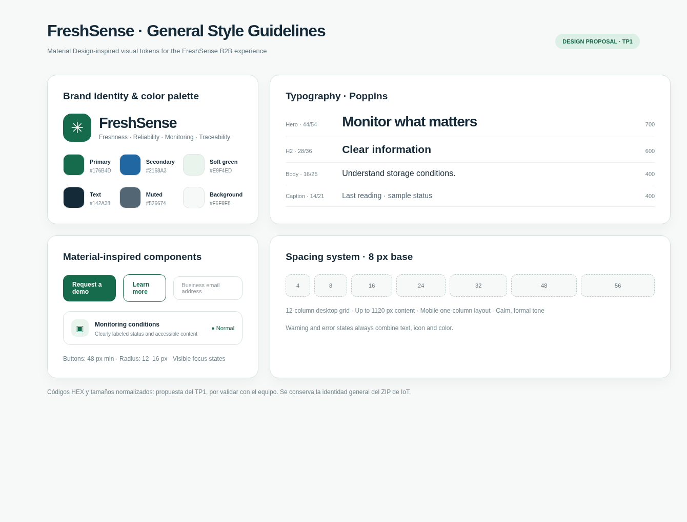
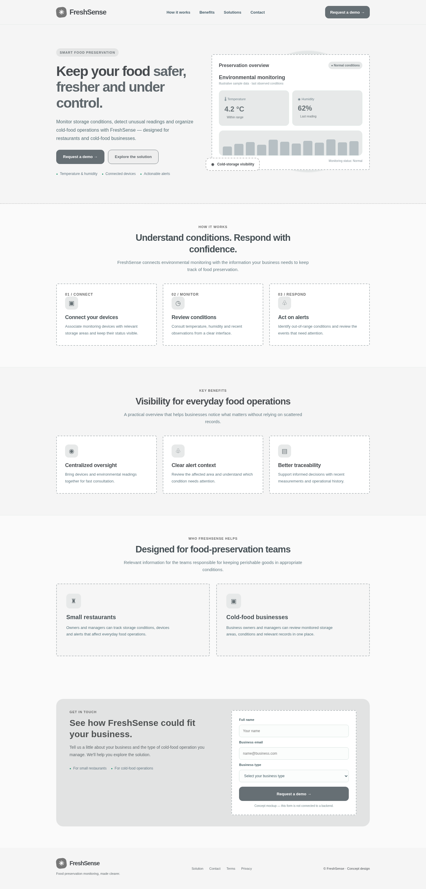
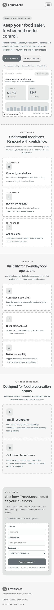
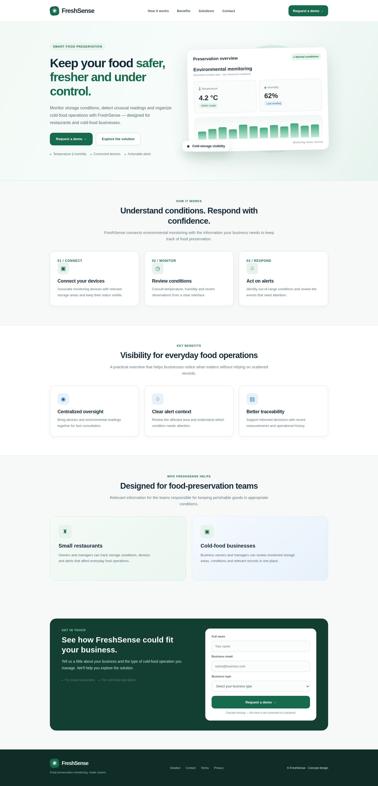
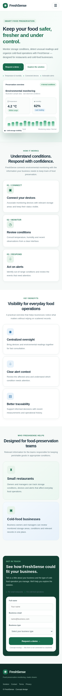

# Capítulo VI: Solution UX Design

La propuesta UX de **FreshSense** responde a las necesidades de sus segmentos objetivo: **propietarios y gerentes de restaurantes pequeños** y **propietarios y encargados de negocios de alimentos fríos**. El diseño busca facilitar la identificación de desviaciones en las condiciones de conservación, la consulta del estado de los dispositivos, la organización de productos perecibles y la toma de decisiones operativas. El Landing Page comunica la propuesta de valor, mientras que las experiencias web y móvil permiten acceder a las capacidades de gestión y monitoreo previstas para la solución.

La identidad visual utiliza la tipografía **Poppins**, una paleta de verde y azul con colores neutros, un sistema de espaciado basado en **8 px** y una cuadrícula de **12 columnas** para escritorio. El tono de comunicación es serio, formal, respetuoso y sereno. Los valores HEX, tokens tipográficos y criterios responsive presentados a continuación constituyen la especificación visual propuesta para FreshSense y deben consensuarse dentro del equipo antes de su implementación. El inglés es el idioma predeterminado de las interfaces del producto.

## 6.1. Style Guidelines

El Style Guide constituye la referencia compartida del equipo para Landing Page, Web Application y experiencias móviles. Está inspirado en **Material Design**: jerarquía clara, componentes consistentes, feedback de estado, affordances reconocibles, superficies coherentes y accesibilidad. La guía no implica que todos los componentes Material ya estén implementados. Sus decisiones se alinean con la arquitectura y con las capacidades de monitoreo de FreshSense.

### 6.1.1. General Style Guidelines

#### Branding e identidad

**Nombre del producto:** FreshSense. **Personalidad de marca:** fresca, confiable, profesional y centrada en prevención de riesgos para alimentos perecibles. **Promesa de producto:** apoyar la supervisión de las condiciones de conservación de los productos mediante monitoreo IoT, alertas y visibilidad de información relevante. Evitar reclamos no demostrados como “100% de conservación garantizada”.

La identidad combina formas suaves, superficies despejadas, iconos de sensores y conservación, y acentos verdes que evocan frescura. El azul apoya información de sistemas y monitoreo. Las ilustraciones de tecnología no deben reemplazar señales claras de estado ni ocultar contenido principal. Se proponen versiones monocromáticas y sobre fondo claro del identificador visual para aplicaciones del producto.

*Figura VI.1. Tablero de estilo con tokens, componentes y jerarquía visual propuestos. Los colores y medidas normalizados deben ser acordados por el equipo antes de implementarlos.*

**Uso del identificador:** conservar proporciones; disponer un área libre mínima equivalente a la altura del símbolo; no aplicar sombras fuertes, deformaciones o colores ajenos a la paleta; asegurar contraste suficiente sobre fondos claros u oscuros.

#### Typography

FreshSense utiliza **Poppins** para títulos, contenido de interfaz y componentes de navegación. Cuando la tipografía no esté disponible, se establece como alternativa `Arial, sans-serif`. La siguiente escala tipográfica define tamaños, pesos e interlineados para mantener una jerarquía legible en desktop y mobile.

| Estilo | Desktop: tamaño / interlineado | Mobile: tamaño / interlineado | Peso | Uso |
|---|---|---|---|---|
| Display / Hero | 44 / 54 px | 32 / 40 px | 700 | Promesa principal de valor |
| H1 | 36 / 44 px | 28 / 36 px | 700 | Título de la vista |
| H2 | 28 / 36 px | 24 / 32 px | 600 | Secciones del Landing |
| H3 | 20 / 28 px | 19 / 27 px | 600 | Tarjetas y subsecciones |
| Body | 16 / 25 px | 16 / 25 px | 400 | Contenido explicativo |
| Small | 14 / 21 px | 14 / 21 px | 400–500 | Ayudas y metadatos |
| Button | 15 / 22 px | 15 / 22 px | 600 | Etiquetas de acciones |

**Reglas:** texto alineado a la izquierda para párrafos; no presentar explicaciones largas en mayúsculas; limitar ancho de párrafo a aproximadamente 65–75 caracteres; respetar ampliación de texto y reflujo; no usar cuerpo menor de 14 px salvo metadatos secundarios justificables.

#### Colors

La paleta visual de FreshSense combina verde como color principal de marca, azul para información de monitoreo y tonos neutros que favorecen la lectura. Se especifican los siguientes tokens para garantizar la consistencia entre el Landing Page y las aplicaciones:

| Token | HEX propuesto | Función |
|---|---|---|
| `--color-primary` | `#176B4D` | Botones principales, enlaces activos, marca |
| `--color-primary-dark` | `#10543B` | Hover y superficies principales intensas |
| `--color-primary-soft` | `#E9F4ED` | Secciones de frescura, estado normal |
| `--color-secondary` | `#2168A3` | Información secundaria y monitoreo |
| `--color-secondary-soft` | `#E8F2FA` | Bloques informativos |
| `--color-text` | `#142A38` | Texto prioritario |
| `--color-text-muted` | `#526674` | Descripciones secundarias |
| `--color-surface` | `#FFFFFF` | Tarjetas, formularios, fondos claros |
| `--color-background` | `#F6F9F8` | Lienzo de página |
| `--color-border` | `#D6E3DF` | Contornos y separadores |
| `--color-warning` | `#946200` | Advertencia acompañada de texto e icono |
| `--color-error` | `#B3261E` | Error o condición crítica explicada |

La adopción de esta paleta requiere comprobar el contraste conforme a **WCAG AA**: al menos **4.5:1** para texto normal y **3:1** para texto grande y ciertos elementos gráficos o controles. Las alertas combinarán etiqueta, icono y color; por ejemplo: `Normal`, `Warning`, `Critical` y `Disconnected`.

#### Spacing, Grid & Layout

El sistema de espaciado de FreshSense establece una **unidad base de 8 px** y utiliza valores recurrentes de `4`, `8`, `16`, `24`, `32`, `48`, `56`, `64` y `72 px`. La cuadrícula desktop cuenta con **12 columnas**, una separación de referencia de **22 px** y un contenedor central máximo de **1120 px**. En móvil se prioriza una composición de una columna y márgenes de 16–20 px, evitando desplazamiento horizontal incluso en anchos de 320 px.

| Token | Valor | Regla de aplicación |
|---|---|---|
| `space-xs` | 4 px | Etiquetas y separaciones mínimas |
| `space-sm` | 8 px | Icono/texto y controles compactos |
| `space-md` | 16 px | Tarjetas y agrupación habitual |
| `space-lg` | 24 px | Separación entre bloques |
| `space-xl` | 32 px | Bloques de sección |
| `section-gap` | 56 px desktop / 40 px mobile | Distancia entre secciones |
| `hero-gap` | 72 px desktop / 48 px mobile | Encabezado de Landing |
| `radius-card` | 16 px | Tarjetas principales |
| `radius-control` | 12 px | Inputs, botones, chips |
| `elevation-card` | `0 10px 25px rgba(0,0,0,.08)` | Sombra ligera de superficie |

Las separaciones internas, los márgenes y los radios deberán utilizar los tokens establecidos para lograr consistencia entre secciones, formularios y tarjetas. Se evitarán valores arbitrarios que dificulten el mantenimiento del sistema visual.

#### Componentes y estados (Material Design)

| Componente | Apariencia / interacción | Estados y accesibilidad |
|---|---|---|
| Primary Button | Fondo verde, texto blanco, altura mínima 44–48 px | Hover, focus visible, disabled, loading; acción concreta |
| Secondary Button | Borde verde/azul, superficie clara | Identidad visual distinta de acción primaria |
| Input / Select | Etiqueta persistente, borde neutral, ayuda inferior | Focus, error descrito en texto, ARIA cuando aplique |
| Card | Superficie blanca, radio 16 px y jerarquía título–texto | Sin clic implícito; si es interactiva, foco y estado reconocibles |
| Status chip | Texto e icono más color semántico | No depender exclusivamente del color |
| Navigation | Horizontal en desktop y menú desplegable en móvil | Foco, estado actual y navegación por teclado |
| Alert / Snackbar | Mensaje breve, causa y acción disponible | No usar solo animación/color para urgencias |
| Form validation | Feedback cercano al campo afectado | `aria-invalid` y mensaje asociado cuando corresponda |

**Iconografía:** adoptar iconos lineales coherentes para termómetro, gota de humedad, sensores, lotes, advertencias y reportes. Mantener grosores homogéneos y nombre accesible cuando transmitan información. No usar emoji como único identificador de acciones operativas.

#### Tone of Voice

FreshSense adopta un tono **serio, formal, respetuoso y sereno**. Las frases explicarán qué ocurre y cuál es el siguiente paso, evitando alarmismo, tecnicismos innecesarios y promesas no demostradas. Los textos visibles del sistema se redactan inicialmente en inglés para la versión `en_US`.

| Situación | Ejemplo de microcopy (EN) | Principio |
|---|---|---|
| Desviación | `Temperature is outside the configured range.` | Describe el hecho, no el miedo |
| Dispositivo | `Device disconnected. Check its connection.` | Estado + siguiente acción |
| Confirmación | `Business details updated successfully.` | Feedback específico |
| Formulario | `Enter a valid business email address.` | Orientación útil |
| Sin resultados | `No matching devices. Try another filter.` | Recuperación sin culpar al usuario |

### 6.1.2. Web, Mobile & Devices Style Guidelines

#### Web / Desktop

La versión desktop del Landing Page muestra navegación principal, un Hero de lectura rápida, beneficios, explicación del funcionamiento, dos segmentos objetivo y una CTA a contacto/demostración. Se utiliza lectura en Z para el inicio y secuencias verticales para contenidos posteriores. En la aplicación web autenticada, priorizar datos operativos y estados verificables (temperatura, humedad, dispositivos, alertas, lotes). Las tablas necesitan títulos, encabezados, estados vacíos y filtros consistentes.

Como criterio responsive, se define una cuadrícula de 12 columnas para anchos desde `1024 px`; entre `600–1023 px`, la distribución puede organizarse en dos columnas cuando la información lo permita, y por debajo de `600 px` se utiliza preferentemente una columna. Estos puntos de quiebre son parámetros de diseño que deben verificarse durante las pruebas de interfaz.

#### Mobile Web / Native Mobile

En móvil, el Landing Page mantiene el mismo contenido y llamadas a la acción con navegación colapsada y tarjetas de una columna. El Hero debe explicar la propuesta de valor sin obligar a desplazamiento horizontal. La aplicación móvil prioriza la consulta rápida de alertas, lecturas, estado de dispositivos y lotes; los controles críticos deben tener área táctil adecuada (idealmente 48 × 48 dp). Las tarjetas no deben perder estado ni etiqueta cuando cambia la densidad.

#### Devices / IoT

FreshSense contempla un dispositivo IoT basado en **ESP32** y sensor **DHT22** para registrar temperatura y humedad en zonas de conservación. En el prototipo descrito no se considera una pantalla integrada; por ello, el estado del dispositivo se consulta desde las aplicaciones mediante campos como `Device ID`, `Connected/Disconnected`, `Temperature`, `Humidity`, `Last Reading` y `Monitoring Status`. Ante una desconexión, la interfaz debe mostrar la última lectura disponible junto con su fecha y hora, sin presentarla como una medición actual.

#### Internationalization & Inclusive Design

Se contemplan las localizaciones **`en_US`** (idioma por defecto) y **`es_419`**. No incrustar texto directamente en imágenes cuando deba traducirse; mantener longitud adaptable de etiquetas y fechas/locales. En experiencias web, utilizar etiquetas accesibles, atributos ARIA pertinentes, foco de teclado visible, texto alternativo, enlaces identificables y contraste verificable. Toda alerta tendrá icono o texto adicional al color. Las animaciones respetarán preferencias de movimiento reducido.

## 6.3. Landing Page UI Design

El Landing Page explica qué ofrece FreshSense a restaurantes pequeños y negocios de alimentos fríos. Alineado con las User Stories del capítulo de requisitos, la narrativa pasa de **problema → solución → funcionamiento → beneficios → público objetivo → contacto**. La acción principal propone solicitar una demostración o ponerse en contacto, sin afirmar que exista un flujo de compra o precios definitivos.

La estructura propuesta reúne un **Hero** con la promesa central del producto, una sección **How It Works**, un bloque de **Benefits**, contenido diferenciado por segmento y una sección **Contact** con llamada a la acción. La información comercial se mantiene alineada con el modelo de negocio: no se publicarán montos de planes que todavía no hayan sido definidos ni testimonios sin consentimiento y evidencia documentada. El énfasis está en facilitar el contacto con potenciales clientes empresariales.

### 6.3.1. Landing Page Wireframe

Los wireframes representan la **arquitectura de contenido sin decisiones visuales finales**: jerarquía, orden y ubicación de navegación, bloques, CTA y formulario. Se elaboran dos variantes, correspondientes a desktop y mobile, con las mismas secciones y diferente composición.

#### Wireframe — Desktop Web Browser

*Figura VI.2. Wireframe desktop propuesto. Muestra navegación superior, Hero, tres pasos de funcionamiento, beneficios, soluciones por segmento y contacto.*

#### Wireframe — Mobile Web Browser

*Figura VI.3. Wireframe móvil propuesto con lectura en una columna, CTA visible, menú compacto y formulario adaptado.*

**Justificación:** ambas variantes conservan el significado y orden de la información; cambian su agrupación y densidad según el ancho de pantalla. El objetivo es permitir a la persona reconocer el beneficio y encontrar un punto de contacto sin aprendizaje previo. Los diagramas complementan, pero no sustituyen, la validación de navegación con usuarios de los segmentos definidos.

### 6.3.2. Landing Page Mock-up

Los mockups materializan la identidad FreshSense sobre los wireframes: verde de marca, azul de monitoreo, tipografía Poppins, componentes con radios suaves, contraste y CTAs legibles. Se muestran estados normales e informativos sin métricas inventadas ni testimonios atribuidos a usuarios reales. Los renders están basados en HTML/CSS editable incluido en `Fuentes/landing/`.

#### Mock-up — Desktop Web Browser

*Figura VI.4. Mockup desktop de alta fidelidad con contenido empresarial alineado con el Capítulo IV.*

#### Mock-up — Mobile Web Browser

*Figura VI.5. Mockup móvil responsive con bloques secuenciales, navegación compacta y formulario adaptable.*

**Criterios de validación del diseño:** (a) propuesta de valor identificable en el Hero; (b) CTA principal y alternativa de contacto; (c) visibilidad de ambos segmentos objetivo; (d) misma arquitectura semántica en desktop y móvil; (e) ausencia de contenido no evidenciado (precios, cifras de reducción de mermas, testimonios); (f) contraste, foco y jerarquía; (g) consistencia de colores, tipografía y spacing; (h) contenido en inglés con soporte estructural para internacionalización.

**Alcance de los mockups:** estas vistas representan las decisiones de interfaz y el comportamiento visual esperado del Landing Page de FreshSense. Constituyen una referencia para las posteriores actividades de prototipado, implementación y validación con usuarios; no representan por sí solas resultados de entrevistas ni evidencia de software en ejecución.
